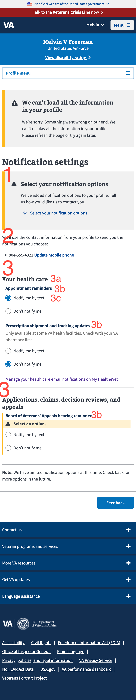

# API to Display notes

This documents describes how the screen at [va.gov/profile/notifications](https://va.gov/profile/notifications) is built from the API calls to VA Profile.

This page has a lot of items in flight. Many teams have requested additional notifications and additioanl features. It isn't possible for this to be comprehensive but does cover important features. 

<!-- TOC -->

- [API to Display notes](#api-to-display-notes)
  - [TL;DR](#tldr)
  - [UI With Markup](#ui-with-markup)
    - [Key](#key)
- [Features/Functionality of Interest](#featuresfunctionality-of-interest)
  - [Default Send](#default-send)
  - [Contact Information - Editing as a Subtask](#contact-information---editing-as-a-subtask)
  - [Health care filtering](#health-care-filtering)
  - [Prescription Shipping Filtering](#prescription-shipping-filtering)
- [Changes in flight](#changes-in-flight)
- [Appendix](#appendix)


<!-- /TOC -->

## TL;DR

- `1`, `2`, and `3` we control
- `4a` and `4b`, we don't control
- `4c` we partially control

## UI With Markup 

Below is a screenshot of the notification settings UI. 

[For the most up to date designs see our figma files](https://www.figma.com/design/e6JEtrwZCInKk9SjZktx2T/Profile---Notification-Settings?node-id=1-12888&node-type=CANVAS&t=OcxVvp5AEXhSbF73-0). 


### Key

1. `Notification Settings` heading is controlled by the team
2. The copy at the start of the page is controlled by the team
3. Contact information on File, the text is controlled by the team and the information is populated from the profile's contact information page. This is dynamic based on:
     1. If notification preferences with email as a channel are enabled
     2. If the user has an email or mobile phone on file - if they do not the language there varies 
4. This section is completely dynamic and NOT controlled by the team. The data and text is from the API call.
     1. The `4` corresponds to what VA Profile calls a `Communication Group`. For each commincation group there is a separate heading. The header of the group (`4a`) is the `name` of the `Communication Group`. Each `Communication Group` has a list of `Communication Items`.
          1. `4b` is an example of a `Communication Item` with the `name`: _Health appointment reminders_. `4d` is an example of a `Communication Item` with the `name`: _Prescription shipping notifications_. We iterate over the list of `Communication Items` and display how ever many come from the API. There are no transformations of the item names.
          2. communication items can have a `default send` value which we evaluate on the FE. This value is controlled by VA Profile and determines what the default behavior of the checkbox is. 
               1. Each `Communication Item` has associated `Communication Channels` of either `Text` or `Email`. Each communication item can have multiple channels associated with it. `4c`, the label paired with each respective channel, is controlled by our team, but we are expecting a value for text (0) or email (1) to come back from the API. Other channels in the future we would expect to have different values.

#### Stated differently 
- Each heading (eg. Health care, Payments, Board of Veterans'Appeals) = VA Profile Communication Group 
- Each communication permission = VA Profile Communication Item 
- Each checkbox is paired with text or email = VA Profile channel 

<details><summary>alternative screengrab</summary>
<p>


</p>
</details> 

# Features/Functionality of interest

## Default Send 
Each communication item can have a default send value which is a boolean that: 
- if true = the default behavior is to send these notifications to the veteran and the user would need to opt out of receiving the communication item
- if false = the user will need to opt in to receive those communication items
  
## Contact Information - Editing as a Subtask 
If no contact information is found an alert will appear on the page prompting the user to add a phone number or email. This alert will [pass the user into the edit-as-a-subtask flow](https://www.figma.com/design/zRlluj4zQgu4yNykyp3LjS/Profile---Editing-sub-task?node-id=0-1&node-type=CANVAS&t=dnVTJSuNXCX29TPu-0) prompting the user for ONE piece of contact information at a time. It will put the user back on the notification settings page once the user saves or if they cancel without saving.

## Health care filtering 
Healthcare Notifications only show if the user has *any* facilities. This means the user has to actually have health care for the health care section to display

The filter logic is located at <https://github.com/department-of-veterans-affairs/vets-website/blob/master/src/applications/personalization/profile/ducks/communicationPreferences.js#L353>


## Prescription Shipping Filtering
RX tracking notification is controlled by facility id. Not all facilities send RX shipment notifications. The allow-list is located at <https://github.com/department-of-veterans-affairs/vets-website/blob/master/src/applications/personalization/profile/constants.js#L65>


# Changes in flight 
Incorporating PHI/PII in the healthcare appointment reminders. [See the initiative brief](https://github.com/department-of-veterans-affairs/va.gov-team/blob/master/products/identity-personalization/profile/notification-preferences/mhv-notification-preferences-migration/appointmentReminderPHIandPII/README.md).

# Appendix 

<details><summary>prior to 2024</summary>
<p>

## TL;DR

- `1`, `2`, and `3c` we control
- `3a` and `3b`, we don't control

## UI Notes



### Key
1. `Notification` is controlled by the team
2. Contact information on File, the text is controlled by the team and the information is populated from the VAP contact information.
3. This section is completely dynamic. The data and text is from the API call. Each `3` is a `Communication Group`.  The header of the group (`3a`) is the `name` of the `Communication Group`. Each `Communication Group` has a list of `Communication Items`. `3b`are the `name` of a `Communication Item`. We iterate over the list of `Communication Items` and display how ever many come from the API, with no filtering. Each `Communication Item` has a `Communication Channel`. Current this is a list of 1 item, `text`. The label being display, `3c` is controlled by our team, but we are expecting a value for text to come back from the API.

### 3c. Options creation note

We create the radio button lists based on the following code.

```jsx
 options={[
          {
            label: `Notify me by ${channelTypes[channelType]}`,
            value: 'true',
            ariaLabel: `Notify me of ${itemName} by ${
              channelTypes[channelType]
            }`,
          },
          {
            label: `Don’t notify me`,
            value: 'false',
            ariaLabel: `Do not notify me of ${itemName} by ${
              channelTypes[channelType]
            }`,
          },
        ]}
```

</p>
</details> 


## API Call

Not sure if this is still accurate need to confirm 

> Sample call

``` API
GET /v0/profile/communication_preferences
```

```json
{
 "data": {
  "id": "",
  "type": "hashes",
  "attributes": {
   "communicationGroups": [{
    "id": 1,
    "name": "Applications, claims, decision reviews, and appeals",
    "description": null,
    "communicationItems": [{
     "id": 1,
     "name": "Board of Veterans' Appeals hearing reminder",
     "communicationChannels": [{
      "id": 1,
      "name": "Text",
      "description": "SMS Notification"
     }]
    }]
   }, {
    "id": 3,
    "name": "Your health care",
    "description": null,
    "communicationItems": [{
     "id": 3,
     "name": "Appointment reminders",
     "communicationChannels": [{
      "id": 1,
      "name": "Text",
      "description": "SMS Notification",
      "communicationPermission": {
       "id": 8596,
       "allowed": true
      }
     }]
    }, {
     "id": 4,
     "name": "Prescription shipment and tracking updates",
     "communicationChannels": [{
      "id": 1,
      "name": "Text",
      "description": "SMS Notification",
      "communicationPermission": {
       "id": 8361,
       "allowed": false
      }
     }]
    }]
   }]
  }
 }
}
```
