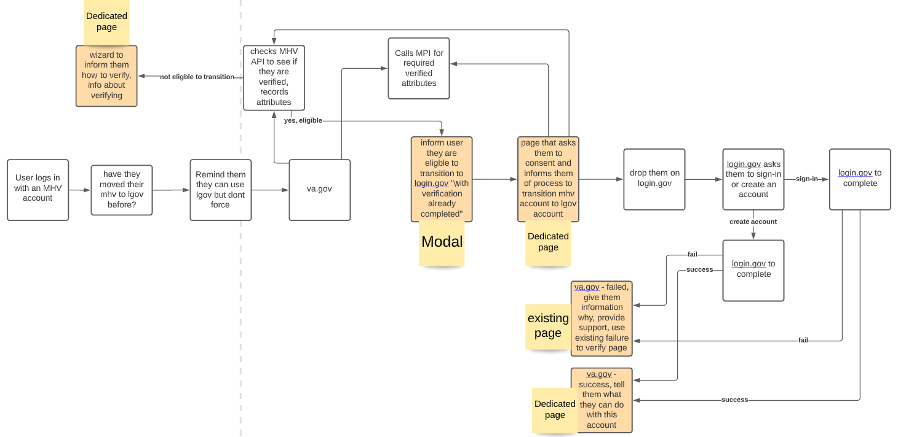

# MHV Inherited Proofing ADR

## Summary
The solution will enable veterans who have already completed the MHV in person verification process to automatically transition their verification information over to a login.gov account. This will work regardless of their login.gov account status. All other methods of verification for MHV accounts will not be eligible for the auto import of data into login.gov.

## Questions & Decisions
 1. A person should not be able to assume the verified identity of a person simply by clicking on a link in an email.
    - This will be accomplished by login.gov ensuring there is a valid login.gov session after the user clicks on the email link. If the user does not ahve a valid sesion (by checking the cookies in the browser), they will be redirected back to va.gov to create/validate the current MHV session, then back to login.gov where the user will then be asked to login with their login.gov account. Once these two actions are completed successfully then the user can proceed with the inherited proofing process.
2. If a user opens a new browser window after clicking on the email link from login.gov, how does login.gov know its still the same person that initiated the process.
   - 

-----------------------------------
### Notes

* The solution will enable veterans who have already completed the MHV in person verification process to automatically transition their verification information over to a login.gov account. This will work regardless of their login.gov account status. All other methods of verification for MHV accounts will not be eligible for the auto import of data into login.gov.

* Login.gov will consume the user data that is passed from va.gov (sourced from MPI) and process the information to ensure that a user is eligible to auto verify their login.gov account.

* Login.gov has reviewed and approved the MHV verification flow to be designated as IAL2 accounts.
* GSA accepts risk involved with MHV verification process
* API exists to call MHV regarding if a user is already identity proofed through MHV
  * Endpoint will return json blob of attributes which indicate if a user has conducted verification. The exact attributes have not been settled.
  * The API exists but will require iteration on which attributes are made available
* The VA will make the determination if the user data passed over from MHV qualifies the user to auto transition to a login.gov account
* VA.gov will have a button (inside a pop-up modal after successful MHV sign in) which informs the user they are eligible to transition to a login.gov account and not have to perform the full verification process.
  * <ins>**This modal and the content on it require research**</ins>
  * Verification process will happen as the user is returned from the ISAM and hold the user in place until the review of the users eligibility has been completed OR the modal has been dismissed (a cookie will store this data which may be refreshed to show the user again at a designated time)
* What does login.gov need to verify a user from va.gov within this flow?
  * Not currently known, will follow up with login.gov
* MFA will be required to be setup for all users who go through this flow.
* Login.gov will conduct a physicality check during the MFA setup process
* Will this flow be allowed to be initiated on MHV?
  * Initially it will not however we need to build the solution to allow for Veterans to be sent to a dedicated page which handles the account transition initiation.
* Will we allow idme verified accounts to go through this same flow?
  * Initially no because most of the idme verifications are knowledge based verifications. IAL2 does not permit knowledge only based verifications.
*  We will require a hook into the user to prop them with a message about the fact they logged in with their MHV account and also have a verified login.gov account.
   *  <ins>**Research may be required for this**</ins>
*  VA.gov will require a solution which allows login.gov to exchange tokens with va.gov to request user data from us.
*  Login.gov will interpret the "transition flow request" from vets-api via the calling of a specific authn context
*  Will a user be logged in with login.gov upon successfully transitioning their MHV account to a login.gov account?
   *  Yes
*  Once the user is directed to login.gov they will either login with an existing account or create a new one.
*  We will need a form based wizard which walks a user through their account verification options and recommendations.
   *  **<ins>This requires frontend mocking and research</ins>**

## Principals
* Minimize MHV engineer hours required to complete task
* Align with modern standards (use OIDC)

## Security
* We will not store any actual verification information (no docs or images) during this flow
* We will not store the users verification user data outside what is already recorded inside the accounts table for longer than 24 hours.
  * We already cache the user data which includes their SSN in a redis cache. This cache is deleted after 24 hours. This new flow does not change this storage requirement.
* We will attempt to only ask and receive non-sensitive data from MHV when we call the API to see if a user is eligible for the account transition.

## Metrics and Statistics
* initially we will need to track: 
  * how many accounts have attempted the transition
  * how many were successful
  * how many failed (and the reasons why)

## Diagram
(draft)

