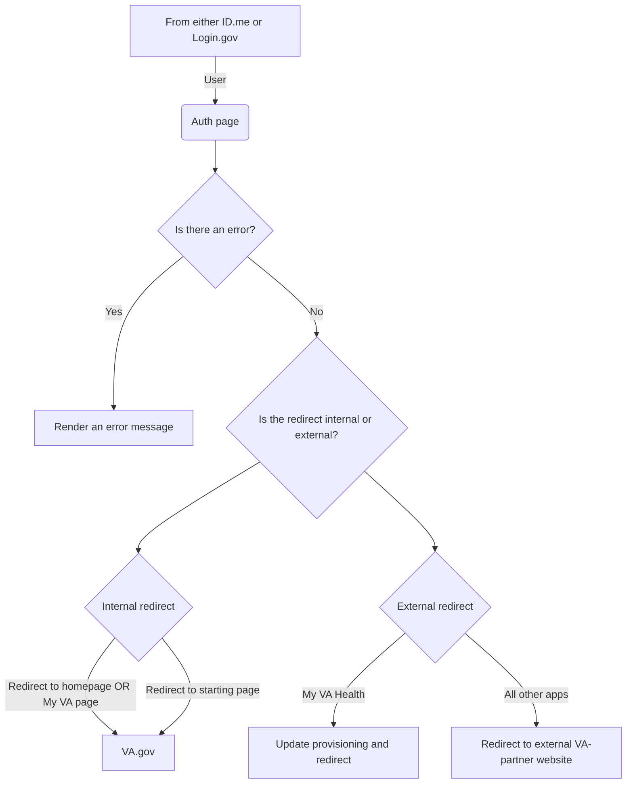

# Application: Auth

## Background

This is the page a user is directed to setup their session on VA.gov after they finish entering their credentials and multifactor authentication code.

## Purpose / Goals

The purpose or goal of the Auth application is to confirm a user is authenticated and redirect them to the appropriate page which can be either internal to VA.gov or external to a VA-partner site (My VA Health, VA Mobile: Health and Benefits App, etc)

- Authentication should be quick and easy-to-use
- I should be able to authenticate when using either LOA1/IAL1 (non-verified) or LOA3/IAL2 (verified) accounts
- I should be redirected to the page I started on
- I should be redirected to the `/my-va` page when I started on the homepage
- I should see an error page with actionable steps when I can't authenticate

## User flow(s)

### Success (internal)
TBD

### Success (external)

### Failure

### High-level user flow

## Engineering

- Main directory: `vets-website/src/applications/auth`

## Terminology

| **Word**    | **Definition**                                                                                                                     | **Reference** |
| ----------- | ---------------------------------------------------------------------------------------------------------------------------------- | ------------- |
| LOA         | Level of Assurance                                                                                                                 | NIST doc      |
| IAL         | Identity Authentication Level                                                                                                      | NIST doc      |

