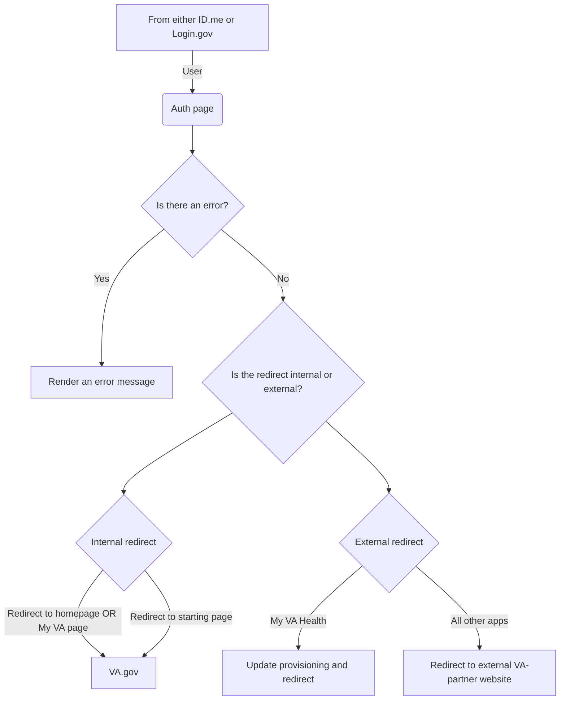

# Application: Auth

## Background

This is the page a user is directed to setup their session on VA.gov after they finish entering their credentials and multifactor authentication code.

## Purpose / Goals

The purpose or goal of the Auth application is to confirm a user is authenticated and redirect them to the appropriate page which can be either internal to VA.gov or external to a VA-partner site (My VA Health, VA Mobile: Health and Benefits App, etc)

- Authentication should be quick and easy-to-use
- I should be able to authenticate when using either LOA1/IAL1 (non-verified) or LOA3/IAL2 (verified) accounts
- I should be redirected to the page I started on
- I should be redirected to the `/my-va` page when I started on the homepage
- I should see an error page with actionable steps when I can't authenticate

## User flow(s)

### High-level user flow

**Success**
1. User lands on `/auth/login/callback`
2. We check the `auth` query parameter and it equals `success`
3. We attempt to validate the session through a series of different requirements
    1. First we check if its an OAuth request (we know if there is a `state` and `code` query parameter AND both are longer than 3 characters
    2. If it IS an OAuth request we validate the `state` and `code_verifier` from the original request
       1. Perform the token exchange according to the OAuth 2.0 specification with our API
    3. We double-check that the `auth` query parameter does not require `FORCE_NEEDED` which will reset the SSOe session
    4. We then check the `authReturnUrl` in session storage from the original pre-authentication request and store it in-memory for later
        1. If it is **EXTERNAL**, we skip calling the `/user` endpoint
        2. If it is **INTERNAL**, we call the `/user` endpoint
    5. The `handleAuthSuccess` function receives the response from the `/user` endpoint (*if any) and a `skipToRedirect` boolean
        1. Passes the `response` to AuthMetrics (used for Google Analytics)
        2. Conditionally calls the handle provisioning if the return URL points to My VA Health (aka Oracle Health)
        3. Conditionally sets up the profile session on VA.gov
        4. Then lastly performs the redirect

**Failure**
1. User lands on `/auth/login/callback`
2. We check the `auth` query parameter and it equals `fail`
3. We attempt to gracefully handle the authentication error
    1. First we check the `code` query parameter
    2. We then validate if the returned error code matches an error code we know about
    3. If it DOES NOT match, we give a default error of `007`
    4. If it DOES match, we continue to grab the appropriate error code and send it off to Sentry
4. Once the payload is sent to Sentry we generate `props` that contain the `code` (aka error code) and a `request_id` (aka request ID from where it failed in the API logs) to our `RenderError` component
5. The `RenderErrorContainer` conditionally renders error content based on the error code
   
### High-level technical diagram

## Engineering

- Main directory: `vets-website/src/applications/auth`

## Terminology

| **Word**    | **Definition**                                                                                                                     | **Reference** |
| ----------- | ---------------------------------------------------------------------------------------------------------------------------------- | ------------- |
| LOA         | Level of Assurance                                                                                                                 | NIST doc      |
| IAL         | Identity Authentication Level                                                                                                      | NIST doc      |

