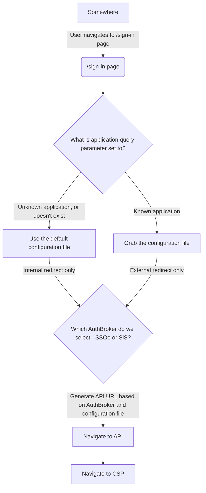

# Application: Login

## Background

This is the page a user is directed to sign into VA.gov depending on their use case (commonly referred to as the Unified Sign-in Page or USiP)

## Purpose / Goals

The purpose or goal of the Login application is to kick-off the authentication experience for various users and usecases

- Authentication should be quick and easy-to-use
- I should be able to select and use the credential provider to authenticate with
- I should be able to view content to help me troubleshoot my issues
- I should be able to sign in on any external application

## User flow(s)

### High-level user flow

**Unified Sign-in Page (USiP)**
1. User lands on the `/sign-in` page
2. We check a couple of different query parameters
  3. Does the `application` query parameter exist and what is it set to?
    1. Is the value of the application valid & known?
      1. If YES, grab the configuration for that application (external redirect)
      2. If NO, disregard the application value and use the default authentication (internal redirect)
  1. Does the `oauth` query parameter exist and what is it set to?
    1. Does the application allow OAuth to be its AuthBroker
      1. If YES, ensure the `oauth` query parameter is true
      2. If NO, ensure the `oauth` query parameter is not set to true

   
### High-level technical diagram

## Engineering

- Main directory: `vets-website/src/applications/login`

## Terminology

| **Word**    | **Definition**                                                                                                                     | **Reference** |
| ----------- | ---------------------------------------------------------------------------------------------------------------------------------- | ------------- |
| LOA         | Level of Assurance                                                                                                                 | NIST doc      |
| IAL         | Identity Authentication Level                                                                                                      | NIST doc      |
