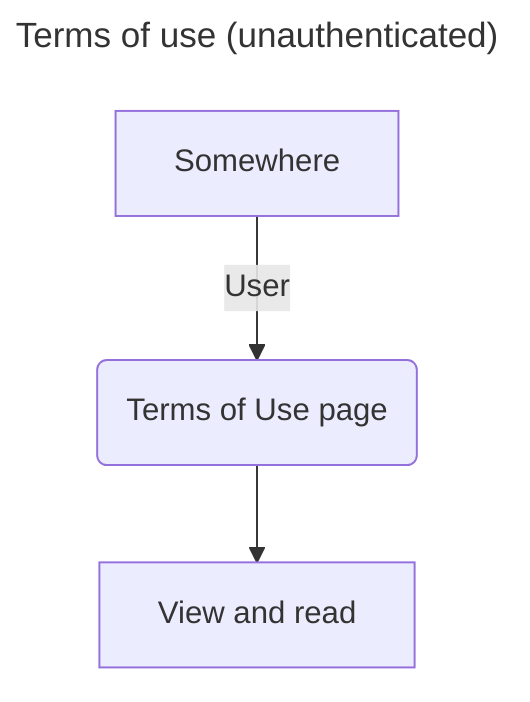
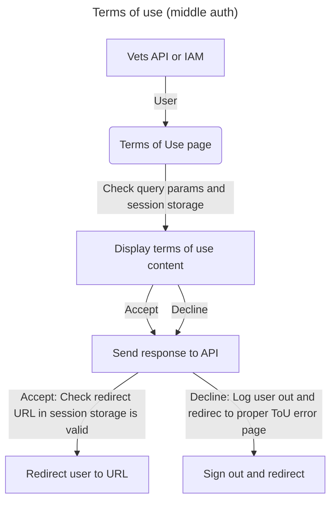
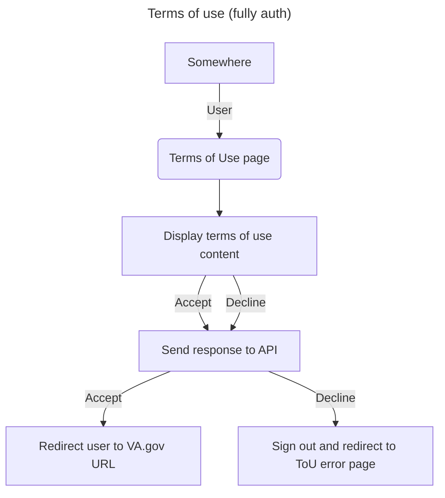
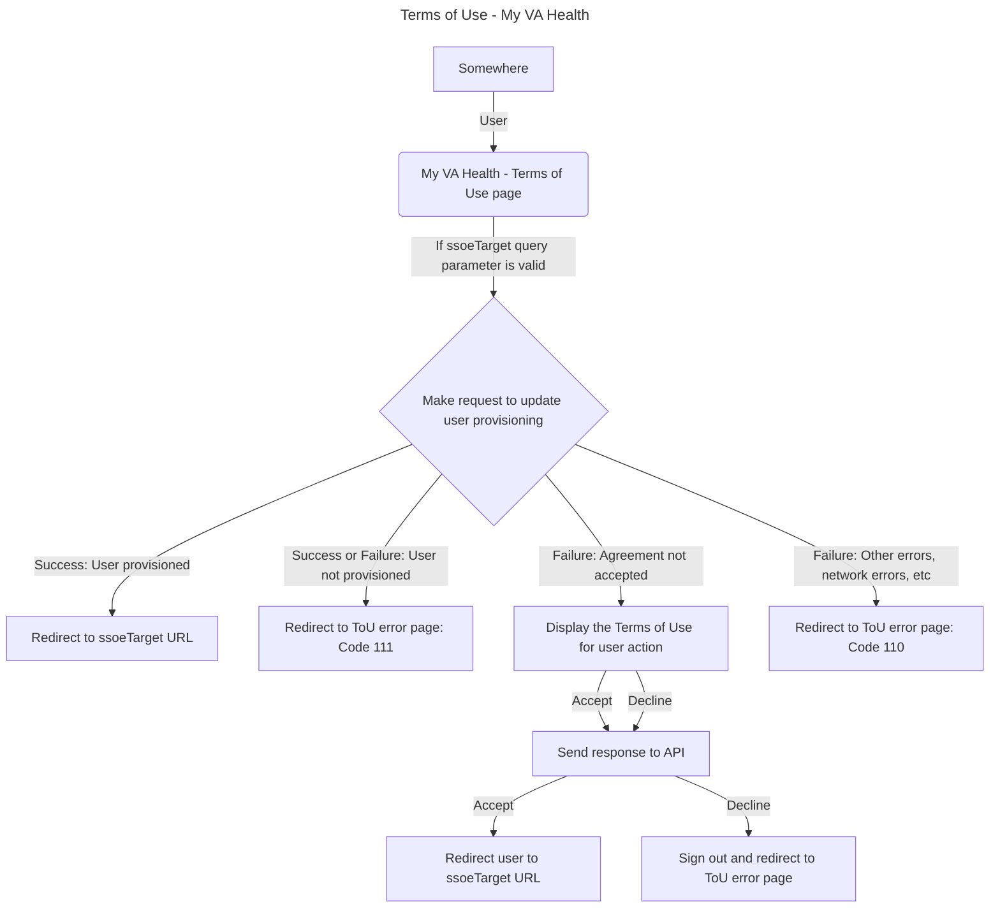

# Application: Terms of Use

## Background

In the past there was a shared terms and conditions hosted on My HealtheVet to faciliate a way to accept/deny terms and conditions as it pertains to health information.

## Purpose / Goals

The purpose or goal of the Terms of Use application is to provide a unified terms of use page where users can view, then accept or deny VA's online terms of use. This provides a binding-contract between VA users and the VA. 

> Note: This is now considered a System of Record (SoR)

**(Normal)**
- Terms of use actions - whether accepted or declined - should be shared across the entire VA ecosystem
- I should be able to view and read the terms of use unauthenticated
- I should be able to either accept or deny the terms of use
- I should be logged out and shown an error page if I deny VA's online terms of use
- I should be able deny VA's online terms of use when previously accepted

**(External redirect clients)**
- When navigating to my preferred external application (eg My HealtheVet, eBenefits), I am prompted to take action (accept or deny)
- I should have the same interaction when using the VA Mobile app and VA.gov (web)

**(My VA Health)**
- I should automatically be provisioned when navigating to My VA Health terms of use page
- I should be allowed to take action (accept or deny) if I have not accepted the agreement previously
- I should be shown an error page if any automatic account provision fails
- I should be shown an error page if I encounter any network or unknown errors

## User flow(s)
   
### High-level technical diagram

Terms of Use - (unauthenticated)

Terms of Use - (middle authenticated)

Terms of Use - (fully authenticated)

   

Terms of Use - My VA Health

## Engineering

- Main directory: `vets-website/src/applications/terms-of-use`

## Terminology

| **Word**    | **Definition**                                                                                                                     | **Reference** |
| ----------- | ---------------------------------------------------------------------------------------------------------------------------------- | ------------- |
| LOA         | Level of Assurance                                                                                                                 | NIST doc      |
| IAL         | Identity Authentication Level                                                                                                      | NIST doc      |
