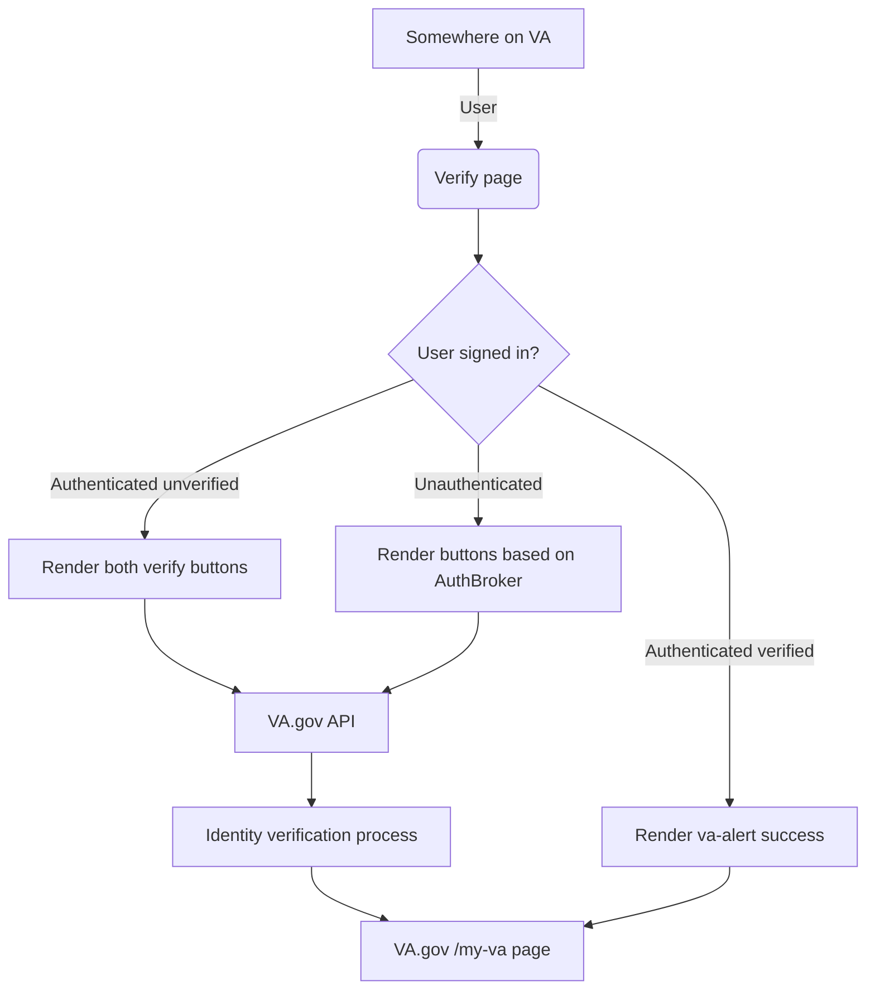

# Application: Verify

## Background

When users sign up for a modern credential (ID.me or Login.gov) they don’t automatically have their Identity-verified. Instead the user will be considered LOA1* from the Identity perspective

- LOA1/IAL1 = email is registered
- LOA2/IAL1 = email is registered + multi-factor authentication
- LOA3/IAL2 = email is registered + multi-factor authentication + they have proven their identity to the IdP

## Purpose / Goals

The purpose or goal of the Verify application is to get [VA.gov](http://VA.gov) users from LOA1 (unverified) to LOA3 (verified) in a quick, easy to perform way.

- Identity verification process should be frictionless on the [VA.gov](http://VA.gov) side
- I should be able to verify my identity with [Login.gov](http://Login.gov) or [ID.me](http://ID.me)

## User flow

1. User is navigated to/lands on the `/verify` page
2. We check if they are authenticated or not
3. Requirements for unauthenticated
    1. We present both verify buttons to the user [ID.me](http://ID.me) and [Login.gov](http://Login.gov)
    2. We enforce OAuth to kick start the identity verification process
4. Requirements for authenticated
    1. We present a single button if user is authenticated with [ID.me](http://ID.me) or [Login.gov](http://Login.gov) (they’re LOA1)
    2. We present both buttons if a user is authenticated with DS Logon
    3. The verify buttons are context-aware for the AuthBroker
        1. Button should know to switch between OAuth and SAML with the AuthBroker dependency (eg `user.profile.session.authBroker`)

## Engineering
- Main directory: `vets-website/src/applications/verify`

## Terminology

| **Word** | **Definition** | **Reference** |
| --- | --- | --- |
| LOA | Level of Assurance | NIST doc |
| IAL | Identity Authentication Level | NIST doc |
| IdP | Identity Provider (Login.gov or ID.me) |  |
| CSP | Credential Service Provider |  |
| Auth Broker | The Authentication Broker is the mechanism used to authenticate whether it be OAuth (Sign-in Service) or SAML (eAuth / IAM / SSOe) |  |
