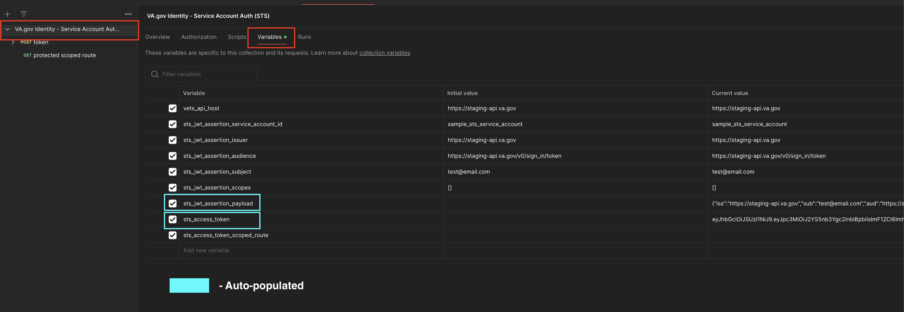
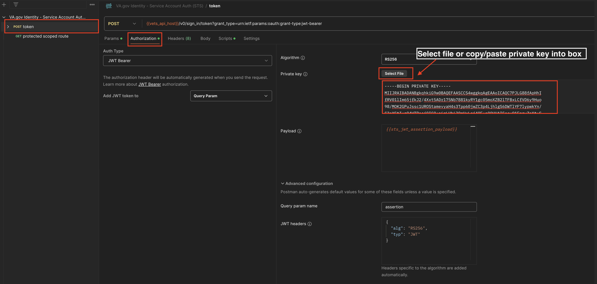

# Service Account Auth (STS) Postman Collection

## Overview

This documentation provides instructions for configuring and using a Postman collection to authenticate using a JWT Bearer assertion with a private key. The token endpoint accepts the JWT assertion as a query parameter (`assertion`) along with the grant type `urn:ietf:params:oauth:grant-type:jwt-bearer`.

The collection is available for download here: [VA.gov Identity - Service Account Auth (STS)](https://github.com/department-of-veterans-affairs/va.gov-team-sensitive/blob/f1c9526e8c04de099832441cd1778bba8a66e213/teams/vsp/teams/Identity/Product%20Documentation/Sign%20In%20Service/postman_collections/Service_Account_Auth.postman_collection.json)

## Prerequisites

1. **Private Key**: Ensure you have the private key available for signing the JWT.
2. **Service Account Config**: Ensure you have a service account config on the environment you are making the request to.
    1. Make sure you have the necessary info from your config to correctly create the JWT
      - [ ] `iss` -> `ServiceAccountConfig.access_token_audience`
      - [ ] `aud` -> The route you are making the request to (the token route) `https://staging-api.va.gov/v0/sign_in/token`
      - [ ] `service_account_id` -> `ServiceAccountConfig.service_account_id`
      - [ ] `sub` -> email of the user or some other identifier
      - [ ] `scopes` -> `ServiceAccountConfig.scopes`

## Step-by-Step Instructions

### 1. Import the Postman Collection

1. Download the Postman collection [VA.gov Identity - Service Account Auth (STS)](https://github.com/department-of-veterans-affairs/va.gov-team-sensitive/blob/f1c9526e8c04de099832441cd1778bba8a66e213/teams/vsp/teams/Identity/Product%20Documentation/Sign%20In%20Service/postman_collections/Service_Account_Auth.postman_collection.json)
2. Open Postman and import the collection by clicking on `Import` and selecting the downloaded file.

### 2. Configure Collection Variables

1. Click on the imported collection - `VA.gov Identity - Service Account Auth (STS)`
3. Navigate to the `Variables` tab.
4. Add the following variables and their respective values based on your service account configuration:
   - `vets_api_host`: The environment you are making the request to
   - `sts_jwt_assertion_service_account_id`: `ServiceAccountConfig.service_account_id`
   - `sts_jwt_assertion_issuer`: `ServiceAccountConfig.access_token_audience`
   - `sts_jwt_assertion_audience`: The route you are making the request to (the token route) `https://staging-api.va.gov/v0/sign_in/token`
   - `sts_jwt_assertion_subject`: email of the user or some other identifier
   - `sts_jwt_assertion_scopes`: `ServiceAccountConfig.scopes`

**NOTE:** `sts_jwt_assertion_payload` and `sts_access_token` are autopopulated based on the inputs of the above variables.

### 3. Set Up JWT Bearer Token Authentication

1. In the collection, click the `POST token` request.
2. Click on the `Authorization` tab.
3. Ensure `Auth Type` is `JWT Bearer`
4. Ensure `Algorithm` is `RS256`
5. Add your `Private key` by either selecting the file or copy/pasting it into the box.
4. Ensure `Payload` is set to `{{sts_jwt_assertion_payload}}`. This will be auto populated based on your variable inputs.
5. Under `Advanced configuration`:
    1. Ensure `Query param name` is set to `assertion`
    2. Ensure `JWT headers` is set to `{}`

### 4. Make `token` request

1. Make the `token` request by pressing `Send`
2. If successful, you will see an `access_token` in the response.
3. The `sts_access_token` variable will be automatically set to the token in the response

### 5. Make `protected scoped route` request

1. Set the `sts_access_token_scoped_route` to the route in your scopes you want to query
2. The `access_token` from the previous request will automatically be added to the `Authorization` header
3. Make the request to your scoped path
4. You should receive a successful response
