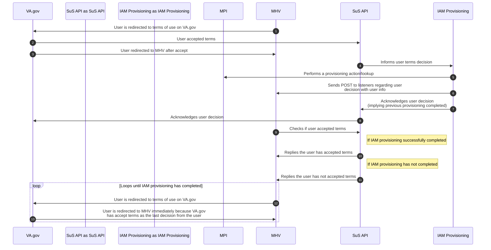

```mermaid
sequenceDiagram
  participant VA.gov as VA.gov
  participant SuS API as SuS API
  participant IAM Provisioning as IAM Provisioning
  participant MPI as MPI
  participant MHV as MHV

  autonumber
  MHV ->> VA.gov: User is redirected to terms of use on VA.gov
  VA.gov ->> SuS API: User accepted terms
  VA.gov ->> MHV: User redirected to MHV after accept
  SuS API ->> IAM Provisioning: Informs user terms decision
  IAM Provisioning ->> MPI: Performs a provisioning action/lookup
  IAM Provisioning ->> MHV: Sends POST to listeners regarding user<br/>decision with user info
  IAM Provisioning ->> SuS API: Acknowledges user decision<br/>(implying previous provisioning completed)
  SuS API ->> VA.gov: Acknowledges user decision
  MHV ->> SuS API: Checks if user accepted terms
  Note right of SuS API: If IAM provisioning successfully completed
  SuS API->> MHV: Replies the user has accepted terms
  Note right of SuS API: If IAM provisioning has not completed
  SuS API ->>MHV: Replies the user has not accepted terms
  loop Loops until IAM provisioning has completed
   MHV ->> VA.gov: User is redirected to terms of use on VA.gov
   VA.gov ->> MHV: User is redirected to MHV immediately because VA.gov<br>has accept terms as the last decision from the user
  end
```
