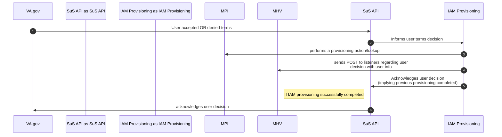

```mermaid
sequenceDiagram
  participant VA.gov as VA.gov
  participant SuS API as SuS API
  participant IAM Provisioning as IAM Provisioning
  participant MPI as MPI
  participant MHV as MHV

  autonumber
  VA.gov ->> SuS API: User accepted OR denied terms
  SuS API ->> IAM Provisioning: Informs user terms decision
  IAM Provisioning ->> MPI: performs a provisioning action/lookup
  IAM Provisioning ->> MHV: sends POST to listeners regarding user<br/>decision with user info
  IAM Provisioning ->> SuS API: Acknowledges user decision<br/>(implying previous provisioning completed)
  Note left of SuS API: If IAM provisioning successfully completed
  SuS API ->> VA.gov: acknowledges user decision
```
