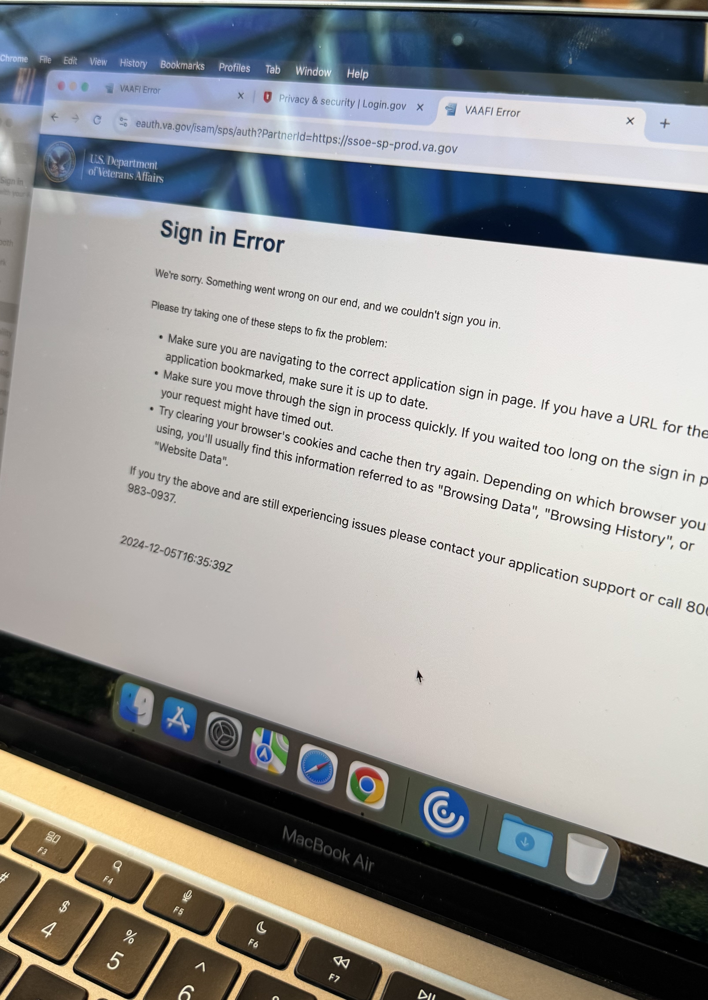
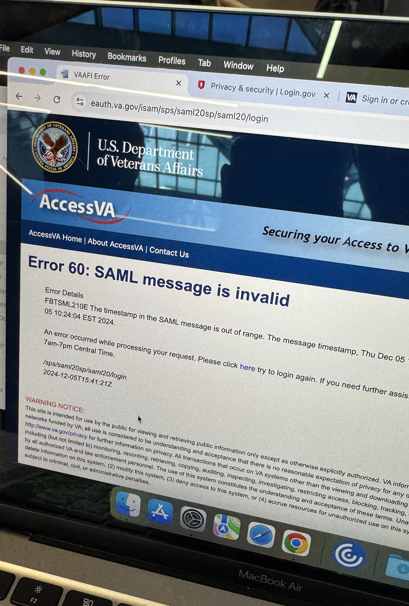
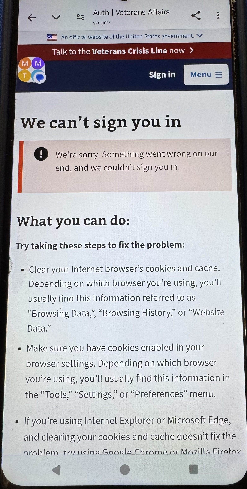

# DC VAMC, Dec 5 2024

* 14 new verified accounts (these notes only include a subset of these experiences, and are geared towards folks I specifically helped)
  * 10 with IDme  
  * 4 with LIG
* 13 add’l veterans helped in some way other than a new verified account  
  * including some that had questions about the transition  
  * 1 who’d “deleted MHV” upon prompt but then regretted it  
* 5 unsuccessful attempts to verify  
  * 2 couldn’t start verification  
    * 1 only had VHIC as ID  
    * 1 was a spouse caregiver for incapacitated veteran and didn’t have veteran’s email access handy.  
  * 1 had already gotten as far as LIG mail code on their own and was waiting for that to arrive  
  * 2 LIG issues with phone verification  
    * 1 with phone in spouses name. We sent a verification letter to finish process later as he did not want to attempt ID.me at that point  
* Time estimate is about 45 minutes to help each veteran verify

## Several unique caregiver type situations came up

* 1 veteran used spouse’s email for MHV, we set him up using his email for LIG  
* 1 veteran used spouse’s phone for MFA, but she was unreachable so we weren't able to connect his phone as MFA option. We decided to delete that LIG account before realizing there was a 24 hour wait period to set up again. We successfully set him up with a IDme fully in his control.  
* 1 veteran had accounts set up by his children, but he was not able to get in without them  
* We had a couple LIG phone verification issues, one of those opted to up set up IDme, one of those opted to wait for a mail verification code  
* One caregiving spouse for an incapacitated veteran. Veteran had email address, phone, and state ID, so we could have set them up if spouse had access to that email in the moment.

## Observations about veterans we talked with

* A couple of veterans expressed displeasure with the change  
  * 1 came back to ask detailed questions about the changes (after appointment) and left feeling more comfortable with it  
* Most were accepting of the sign in change, but wanted to be told what to do.  
  * I always first asked if they had a modern CSP and if not if they had a preference.  
  * To set up a new account, I explained LIG is government and IDme a private organization. None of the veterans I helped had a preference, they just wanted to be told what to do. I tended to direct folks to LIG, other volunteers tended to direct folks to IDme  
* Some already had a modern credential and didn’t realize it. They either didn’t use it or were locked out (forgot password)  
* Most were free with their PII and PHI, they weren’t worried who had it, and **additional account security wasn’t a major concern for them**  
  * Almost every one we helped wrote down their password  
  * Several veterans preferred I type in their password and social security number when it came to those steps  
* Some veterans preferred to drive the process, seeking help at various points, others preferred to have us drive, even handing off their phone as needed  
* The one veteran/former VA employee who deleted MHV CSP on the prompt, thought that she’d deleted her whole MHV account. It took a bit of explaining to get her to realize that wasn’t the case  
  * The house mental model (where MHV CSP is a boarded up door, and LIG/IDme is a new door) helped her understand.

## Process issue observations

* Lots of app switches and device switches during the verify process gave trouble to older, less technology inclined veterans \- they would have struggled or not been able to complete this without help  
  * Moving to phone and then back for ID images  
  * Understanding when they need to check text vs email  
  * Lots of scroll esp on phone, but also on laptop \- "continue" button at many steps was below the fold (both LIG and IDme). **Veterans who I had drive the process were often not sure what to do next, and needed me to point out the button or to scroll to find the button to go to the next step.**  
  * Several veterans clicked the “sign in” tab on LIG, before they realized or I pointed out the space to start typing their email address.  
  * **There are a ton of sign ins (and MFAs) through the process of setting up and verifying an account.** We know sign in can be a struggle for some veterans, so setting up a new account is a huge barrier for some folks.  
  * IDme photo verification has many more steps than LIG  
* Continually saw IAM errors either after setting up a new account or after verifiying  
  * Timeout error 111  
  * IAM error 60 “SAML message is invalid” [see image below](#Images-of-errors-encountered)
  * IAM “Sign in error” [see image below](#Images-of-errors-encountered)
  * VAgov “We can’t sign you in” error [see image below](#Images-of-errors-encountered)
    * This one only showed up for one veteran. After verified and set up, I had him try on his own to sign in. Saw this from his phone, then got this error again after trying to sign in using my computer, and finally got signed in by using an incognito tab on my computer.  
* Had the image step fail once with LIG. The phone/broswer/webpage kept crashing after taking the image of the back of the ID. We took pictures with the on-board camera separately and then uploaded photos instead. That worked.  
  * Also with images, we always used a shadow box or held paper over to stop glare

## Other thoughts

* I did try to allow veterans to drive the process to help them feel more empowered, but many did prefer I just did all the clicking through and even all typing.  
* I was the only volunteer who signed veterans up with LIG, all others were only using, or were on successful on IDme  
* Again, I still personally like the Login.gov ID verification step better \- there are fewer sub-steps, fewer clicks, and fewer places to get lost.  
* **Note\!\!\!** LIG requires 24 hours “rest period” after deleting account to start setting one up again. Even reading through the wall of text when confirming the delete, I missed that. Content should be reworked to make this more obvious.

## Images of errors encountered

