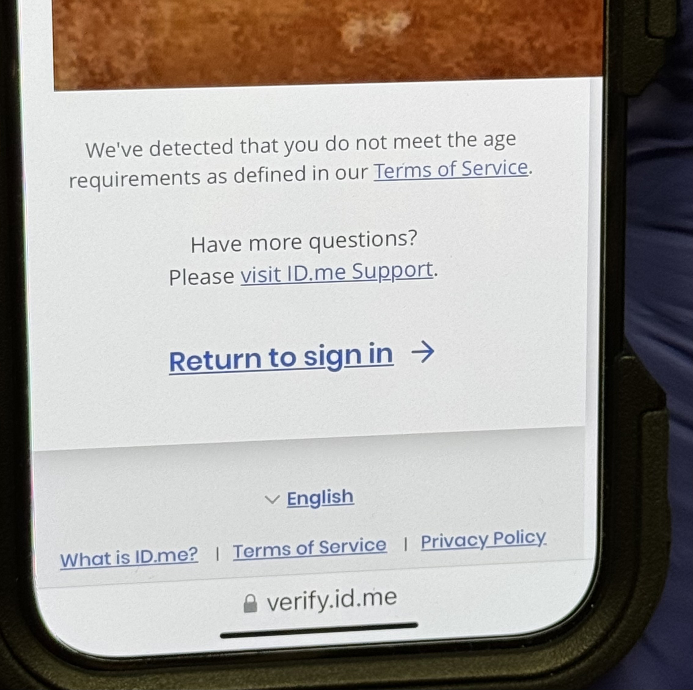
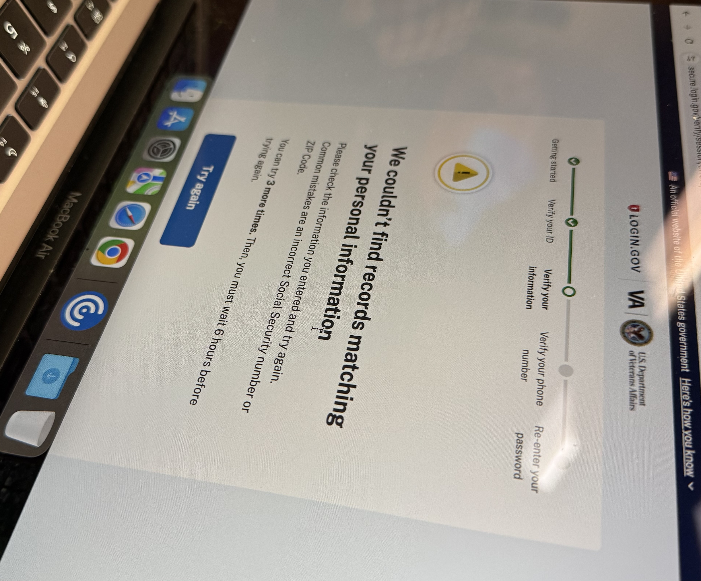
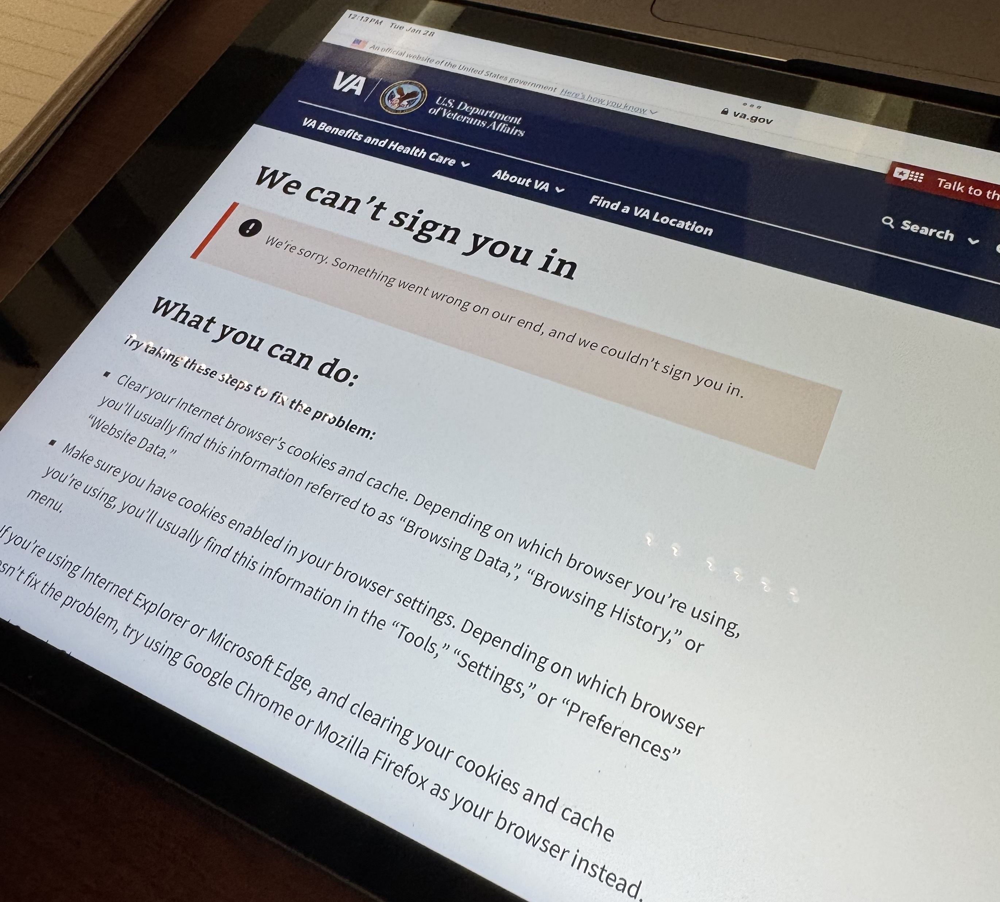

# Baltimore VAMC, Jan 28 2025

## Quick Stats
* I personally attempted to help 7 veterans
* I personally successfully helped 3 veterans verify Login.gov accounts - 1 had an account, the other 2 we started out by creating an account

## Observations about veterans I attempted to help
* Login.gov verification process - had an issue where the address wasn't accepted
   * Login.gov help (via Slack) offered the [USPS address lookup tool](https://tools.usps.com/zip-code-lookup.htm?byaddress)
   * We made one minor change in how we had typed it to how the tool said it should look and then it worked.
* Not successful with 4 veterans
   * 1 veteran didn't have email on phone and didn't want to sign into email on provided laptop
   * 1 veteran had an issue at setting up MFA step, but I didn't capture further details in my notes. I do recall a veteran without a cell phone who would have needed to mark down and use the generated codes to get set up. It might have been the case they didn't want to do that.
   * 1 caregiver didn't have the veteran's phone present to do the final phone verification step
      * Even though we got stuck there, she felt equipped after the walk through to do it at home
   * 1 we failed with both ID.me and Login.gov
      * ID.me saw an account registered for the veteran - but the email didn't look familiar to him (but most of it is stared out)
         * I thought we were going through a recovery process but it looped back around to saying there was already an account for him
      * Login.gov didn't accept his ID first time
         * After we got through that it wouldn't accept his phone number
         * He was moving tomorrow, so didn't want to do the mail option
      * After this, he was ready to give up, so we stopped the session

### Other cases that I heard but didn't directly help with 
   * 1 veteran had a duplicate account on ID.me, found that out after starting to set up a new account with current email
      * The ID.me account email he no longer has access to, it was a verified account
      * He remembers setting an 2nd email to that account that was his current email
      * They called the IDme help center, who reffered to recovery chat on the website.
      * After waiting ~30 minutes for an agent, was able to get the account reset
   * 1 caregiver was trying to set his father up with ID.me. The father was 100 and his only ID was a passport
      * After submitting the passport for ID verification step, an error returned that he didn't meet the age requirements - it appeared to be a "Y2K" type issue to me, where no one over 100 years old would be able to verify.
      * Volunteer showed the caregiver how to do a video call before they left, and he was going to try the later.

## Other notes
* It's possible that Baltimore has more difficult cases than DC VAMC events I went to, but I feel like a component might be nearness to the MHV removal - that these cases seemed a lot more difficult, with lower personal success rate, and several veterans mentionind that they had sought help before coming to this sign up event.
* I again used the house and door mental model, which was again well understood
* Still saw some VA or IAM errors.
   * 1 was after verification and signing back in, got the IAM timeout error. Even though we started on the /verify page. It may be that after first setting up the account, we were then outside of the that page having an adjusted time frame. The suggestion seems to be that after creating a new account, sign out and go back to the /verify page to begin the verification process.
* Another error
* Saw several CSP errors.
   * Login.gov with ID, phone number, and address verification.
   * ID.me with folks having an account already they either didn't know about or was otherwise not accessible to them.
   * images oof some errors

