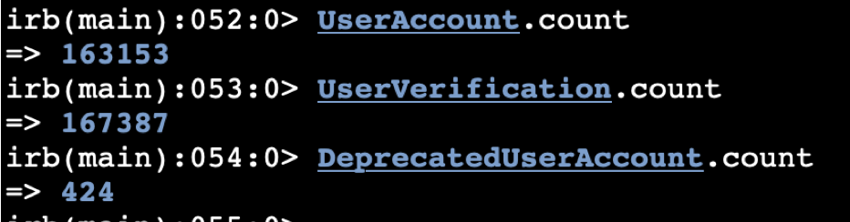
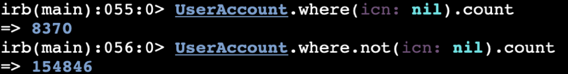
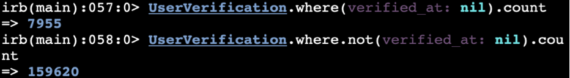
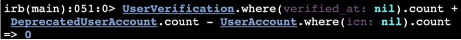
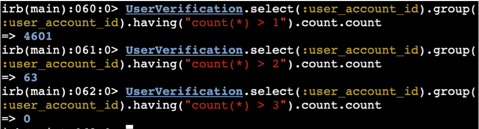
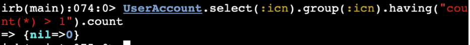
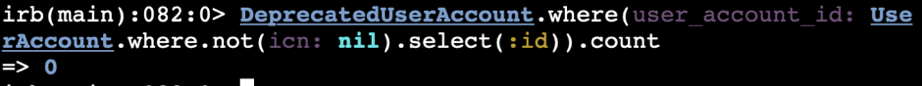
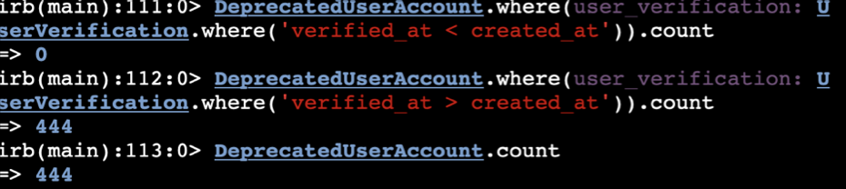

# User Accounts

## Confirm Data Consistency

* Tests of consistency and current proof at this state on production:
  * Current number of `UserAccount`, `UserVerification`, and `DeprecatedUserAccount` records (after roughly 24 hours of being live):

  * Non-verified and verified `UserAccounts`:

  * Non-verified and verified `UserVerifications`:

  * Confirm that all `UserAccount` records that do not have an `icn` (non-verified `UserAccounts`), match up with non-verified `UserVerifications` and `DeprecatedUserAccounts`:

  * Confirm that there are a modest number of `UserVerifications` that share a `UserAccount` (and no cases of more than 4 `UserVerifications`, or one per authentication type, per `UserAccount`). These represent verified `UserVerifications`that are correlated to verified `UserAccounts` amongst different credentials:

  * Confirm there are no non-verified `UserVerification` records that share the same `UserAccount`:

  * Confirm all `UserAccount` records have a unique `icn` (or `nil`):

  * Confirm there are no `DeprecatedUserAccounts` with a verified `UserAccount`:

  * Confirm there are no `DeprecatedUserAccounts` with a `UserVerification` that has a `verified_at` value earlier than its `created_at` value (`verified_at` before `created_at` is possible when a `UserVerification` is verified upon creation, where the `verified_at` field it set immediately before object creation). This case is important because a `DeprecatedUserAccount` should only be created when a `UserVerification` is first set up as non-verified, and set up with a non-verified `UserAccount`, then later is verified. This is a weird query so the inverse is also queried to prove that all `DeprecatedUserAccount` records exist with a `verified_at` value greater than `created_at`:
