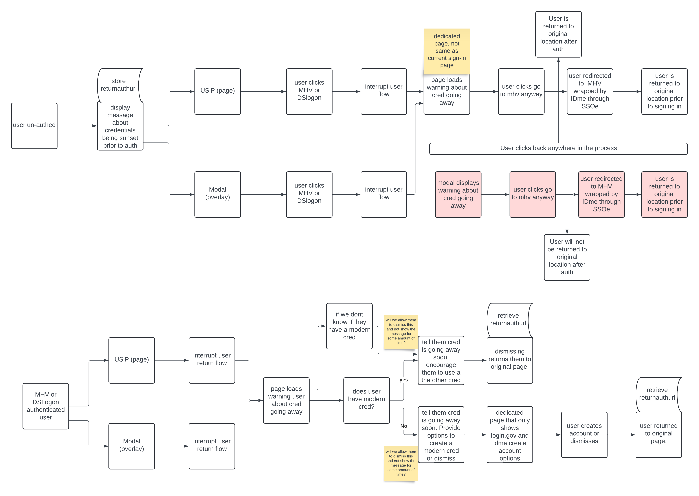

# Interstitial Spike

## Description

The purpose of this document is to record the technical analysis of what user interfaces (UI) can be served to users who need to migrate from their legacy DS Logon and My HealtheVet accounts to modern Login.gov or ID.me "verified" accounts.

> [Spike ticket - VI-300](https://jira.devops.va.gov/browse/VI-300)

## Technical Analysis

- **Can we interrupt the flow of users who have logged in with MyHealtheVet, but no further - identifiers?**

  - Unauthenticated
    - Possible: Yes
    - How: On button click in the sign in modal/page
  - Authenticated
    - Possible: Yes
    - How: Lookup in Redux `user.profile.signIn.serviceName`

- **Can we interrupt the flow of users who have logged in with DSLogon, but no further - identifiers?**

  - Unauthenticated
    - Possible: Yes
    - How: On button click in the sign in modal/page
  - Authenticated
    - Possible: Yes
    - How: Lookup in Redux `user.profile.signIn.serviceName`

- **Can we interrupt the flow of users who have logged in with MyHealtheVet AND who are known to have a Login.gov/ID.me account that they are not using?**

  - Unauthenticated
    - Possible: No
    - Why: No way to determine unauthenticated
  - Authenticated
    - Possible: Yes
    - How:
      - Option 1. Significant BE work would be required to determine if the user has a Login.gov/ID.me account associated (eg. creating new tables & associations)
      - Option 2. Significant BE work to utilize the ID.me wrapper to determine if an ID.me account is associated with the user.

- **Can we interrupt the flow of users who have logged in with DSLogon AND who are known to have a Login.gov/ID.me account that they are not using?**

  - Unauthenticated
    - Possible: No
    - Why: No way to determine unauthenticated
  - Authenticated
    - Authenticated
    - Possible: Yes
    - How:
      - Option 1. Significant BE work would be required to determine if the user has a Login.gov/ID.me account associated (eg. creating new tables & associations)
      - Option 2. Significant BE work to utilize the ID.me wrapper to determine if an ID.me account is associated with the user.

- **Can we interrupt the flow of users who have logged in with Login.gov and/or ID.me but who also have a MHV/DSL account?**

  - Unauthenticated
    - Possible: No
    - Why: No way to determine unauthenticated
  - Authenticated
    - Possible: Maybe
    - How:
      - Option 1. Significant BE work would be required to determine if the user has a Login.gov/ID.me account associated (eg. creating new tables & associations)
      - Option 2. Significant BE work to utilize the ID.me wrapper to determine if an ID.me account is associated with the user.

- **Are there differences in what we can serve when it is a modal vs a full page?**

  - Yes there are differences. I will be providing a recommendation instead of going through all the different issues with each option.

  - Recommendation(s):
    - After technical analysis, the best interstitial option would be to send the user to a **full page** rather than using a pop-up modal.
    - (Possible technical solution - rough draft)
      

- **Are there differences in what we can serve authenticated vs unauthenticated?**

  - Yes. Listed above.

- **Are there other options that are not listed above?**

  - Possibly yes there are different options that I am not aware of.

- **ID.me has a flow where the ID.me wrapper can identify specific statuses, can we use this at all?**
  - I will reach out to Identity Platform to find out the feasibility.
  - Answer: [Joe N.](@joeniquette) mentioned that this functionality has been asked before and would require additional work to make it possible/usable by the frontend. Likely this will only be allowed via an authenticated experience only.

## Details

Technical analysis completed 8/21/2024 by [Alex G.](@asg5704)
