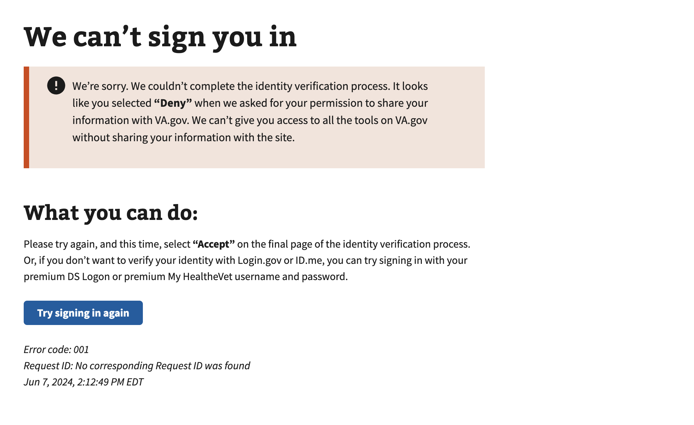

# Authorization Denied by User

## Error code
`001`

## Title
Authorization denied by user

## Why it happens
This error occurs when a user clicks the **"Deny"** button on the final page of the ID.me identity verification process when authorizing sharing information between VA.gov and ID.me.

## How to resolve the issue
1. Have the user clear their session cookies and cache
2. Have the user sign into VA.gov with their ID.me account again
3. Have the user complete the "identity verification" process on ID.me
    - If the user needs to start the process, have them navigate to https://www.va.gov/verify
4. Have the user review details and make sure they are correct
5. Have the user select the checkbox for the Fair Credit Reporting Act (FCRA), then select **"Yes"**
6. Have the user select **"Allow"** to shair the information that was just verified with the VA.
    - If the user selects **"Deny"** their access to VA.gov and it's related tools will be limited.

## Screenshot

  
View screenshot

  

## Content

[h1] We can't sign you in

[va-alert]

We’re sorry. We couldn’t complete the identity verification process. It looks like you selected “Deny” when we asked for your permission to share your information with VA.gov. We can’t give you access to all the tools on VA.gov without sharing your information with the site.

[h2] What you can do:

Please try again, and this time, select “Accept” on the final page of the identity verification process. Or, if you don’t want to verify your identity with Login.gov or ID.me, you can try signing in with your premium DS Logon or premium My HealtheVet username and password.

[button] Try signing in again
