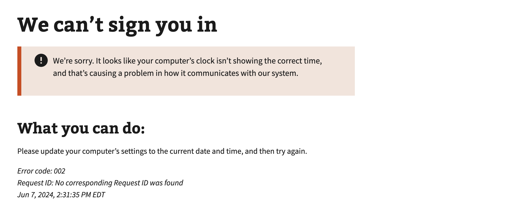

# User is auto-logged out aftering sign in

## Error code
`002`

## Title
User is auto-logged out after sign in | User's system time is not correct

## Why it happens
This can happen when a user's computer date and time is set manually to the incorrect local browsers time rather than automatically setting time in the users system settings. This causes a user to be signed out or enter into an authentication loop because the browser believes the session is expired because the local system time is past or too far behind the current time.

## How to resolve the issue
1. Have the user locate the Date and Time
    1. **Windows**
        1. Right-click on the time in the bottom-right of the screen and selected Adjust Date/Time (opens a new window)
        2. On the left-side of the window select the Date & time tab.
        3. Ensure a user has the Set time automatically enabled (On)
        4. Ensure a user has the Set time zone automatically enabled (On)
    2. **Mac**
        1. Click the Apple icon (top left)
        2. Select System Preferences
        3. Click the Date & Time
        4. Ensure a user has the Set date and time automatically enabled (checked)
2. Have the User attempt to Sign in again with their credential provider
3. User continues to sign in as normal

## Screenshot

  
View screenshot

  

## Content

[h1] We can't sign you in

[va-alert]

We’re sorry. It looks like your computer’s clock isn’t showing the correct time, and that’s causing a problem in how it communicates with our system.

[h2] What you can do:

Please update your computer’s settings to the current date and time, and then try again.
