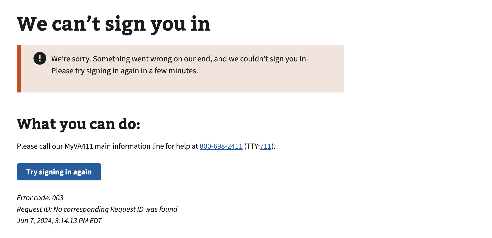

# API Server time is incorrect

## Error code
`003`

## Title
API Server time is incorrect

## Why it happens
This error occurs when the `tzinfo` (time zone information) on VA.gov's API server is misconfigured or missing.

## How to resolve the issue
This error code should be considered deprecated as this error has not occured in the past 1 year.

## Screenshot

  
View screenshot

  

## Content

[h1] We can't sign you in

[va-alert]

We’re sorry. Something went wrong on our end, and we couldn’t sign you in. Please try signing in again in a few minutes.

[h2] What you can do:

Please call our MyVA411 main information line for help at 800-698-2411 (TTY:711).
