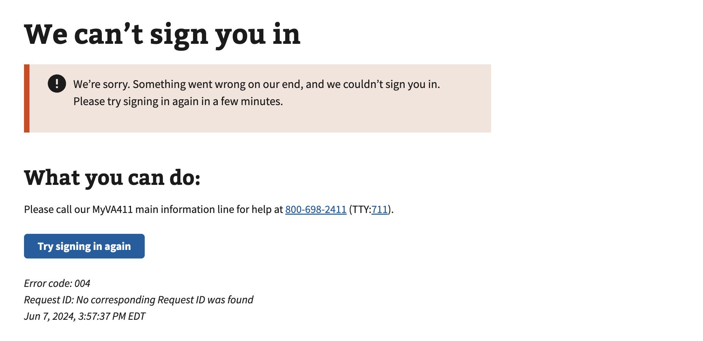

# MPI Mismatch

## Error code
`004`

## Title
MPI Mismatch

## Why it happens
An internal VA.gov user system lookup may not be available to confirm the user data matches the current session information. If the troubleshooting steps below do not resolve the issue then it is recommended that the user call the help desk to allow the MPI team to resolve the users error.

## How to resolve the issue

1. Ask the User to clear their cookies & cache
2. Try to Sign in again with their credential provider
3. If the above steps do not resolve the issue, create a ticket with the help desk

## Screenshot

  
View screenshot

  

## Content

[h1] We can't sign you in

[va-alert]

We’re sorry. Something went wrong on our end, and we couldn’t sign you in. Please try signing in again in a few minutes.

[h2] What you can do:

Please call our MyVA411 main information line for help at 800-698-2411 (TTY:711).
