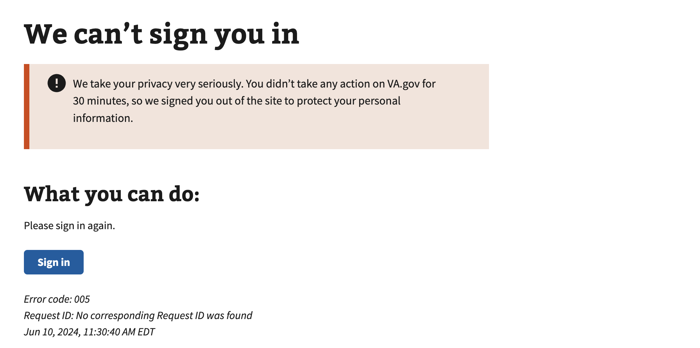
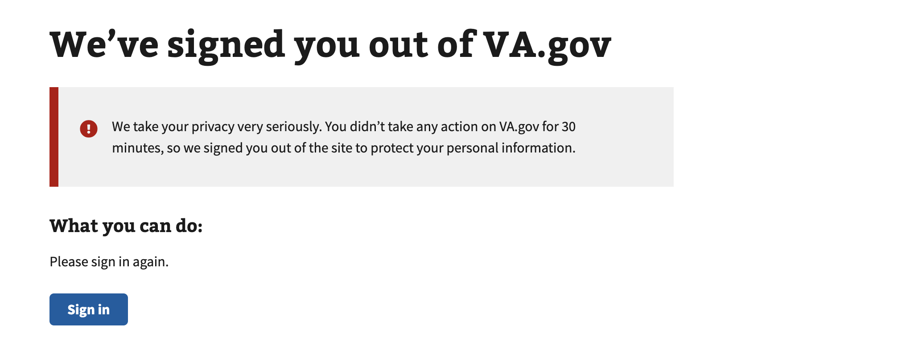

# Session Expired

## Error code
`005`

## Title
Session Timeout / Session Expired

## Why it happens
This usually occurs when a session was invalidated during the Sign in process or the user was inactive for a period of 30 minutes or more on VA.gov.

## How to resolve the issue

1. Ask the user to clear their cookies & cache
2. Ask the user to try to sign in again with their credential provider

## Screenshot

  
View screenshot #1

  

  
View screenshot #2

  

## Content

[h1] We can't sign you in

[va-alert]

We take your privacy very seriously. You didn’t take any action on VA.gov for 30 minutes, so we signed you out of the site to protect your personal information.

[h2] What you can do:

Please sign in again.

[button] Sign in
