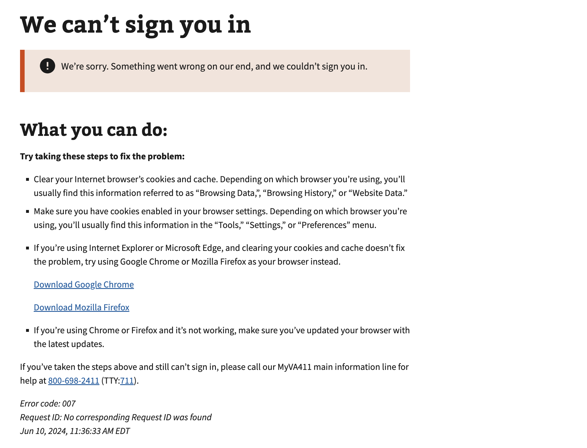

# Default / Unknown Error

## Error code
`007`

## Title
Default / Unknown Error

## Why it happens
This error can occur for a variety of different reasons. Sometimes we are not sure what the error is and it doesn't match any of our other errors OR we don't want to display the error to the user in certain cases like token theft flag, date of death is set, etc. If the below troubleshooting steps do not resolve the issue they user should contact the help desk.

## How to resolve the issue

1. Ask the user to clear their cookies & cache
2. Ask the user to try to sign in again with their credential provider

## Screenshot

  
View screenshot

  

## Content

[h1] We can't sign you in

[va-alert]

We’re sorry. Something went wrong on our end, and we couldn’t sign you in.

[h2] What you can do:

Try taking these steps to fix the problem:

[list item 1]
Clear your Internet browser’s cookies and cache. Depending on which browser you’re using, you’ll usually find this information referred to as “Browsing Data,”, “Browsing History,” or “Website Data.”

[list item 2]
Make sure you have cookies enabled in your browser settings. Depending on which browser you’re using, you’ll usually find this information in the “Tools,” “Settings,” or “Preferences” menu.

[list item 3]
If you’re using Internet Explorer or Microsoft Edge, and clearing your cookies and cache doesn’t fix the problem, try using Google Chrome or Mozilla Firefox as your browser instead.

[link] Download Google Chrome
[link] Download Mozilla Firefox

[list item 4]
If you’re using Chrome or Firefox and it’s not working, make sure you’ve updated your browser with the latest updates.

If you’ve taken the steps above and still can’t sign in, please call our MyVA411 main information line for help at 800-698-2411 (TTY:711).
