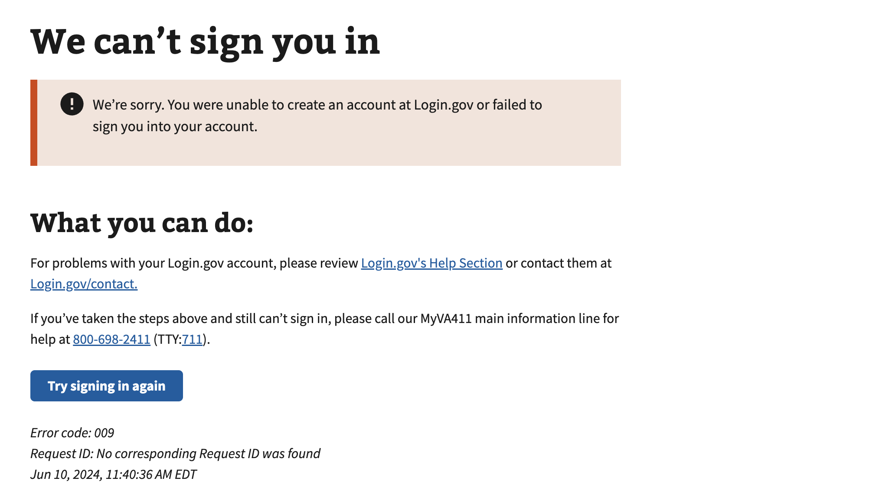

# Failure to Proof (Login.gov)

## Error code
`009`

## Title
Failure to Proof (Login.gov)

## Why it happens
This error occurs only with the Login.gov service provider and happens when a user encounters an error when going through the "identity verification" process on Login.gov. This error can occur for several reasons listed below:

- Users might navigate to this page if they don’t have a valid state-issued ID or Social Security number.
- The Failure to Proof URL is available for users who are not able to capture or upload photos of their ID.
- Users see the Failure to Proof URL when they encounter errors verifying their ID, personal information, or phone number. Examples of this include:
    - Users who enter valid information, but are not able to pass Login.gov’s proofing process because we cannot verify their information.
    - Users who have run out of attempts to verify their information.

## How to resolve the issue

1. Confirm with the user the Login.gov's workflow that was previously attempted (verifying phone number, SSN, etc.)
2. Re-attempt to perform the verification process on Login.gov to determine if the updated/corrected information resolves the issue
3. If the first two steps do not resolve the issue, create a ticket with the contact center to update the users MPI record (requires ICN, SSN) or have them update their own phone number

## Screenshot

  
View screenshot

  

## Content

[h1] We can't sign you in

[va-alert]

We’re sorry. You were unable to create an account at Login.gov or failed to sign you into your account.

[h2] What you can do:

For problems with your Login.gov account, please review [link - Login.gov's Help Section] or contact them at [link - Login.gov/contact].

If you’ve taken the steps above and still can’t sign in, please call our MyVA411 main information line for help at 800-698-2411 (TTY:711).
