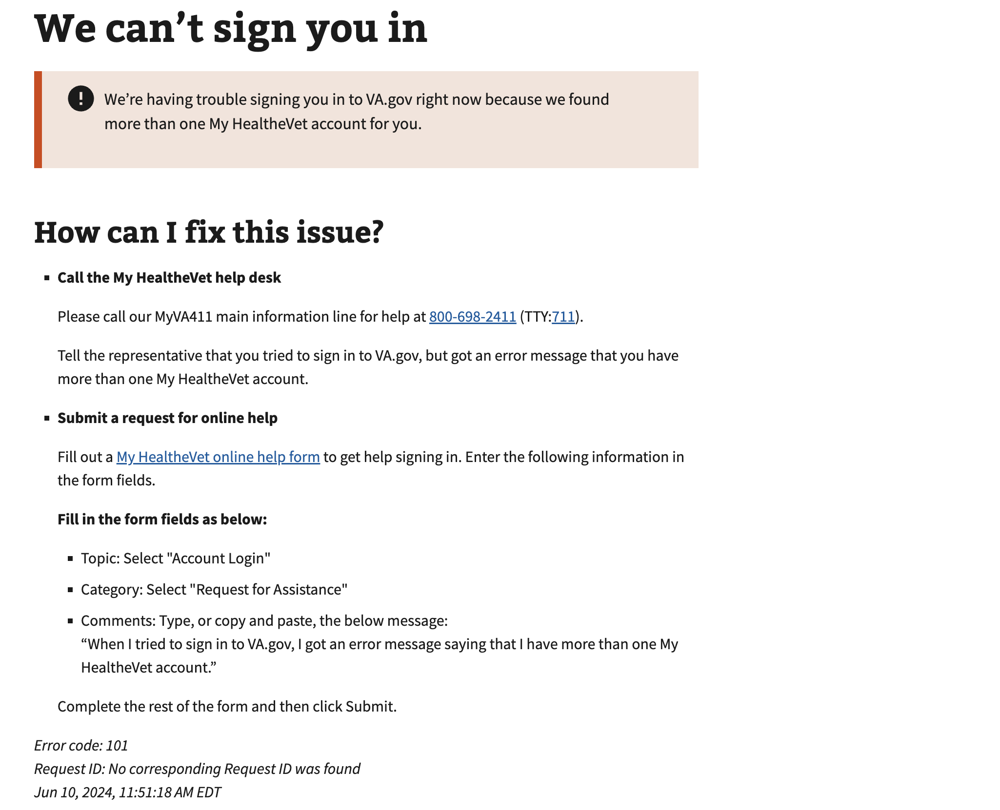

# Multiple MHV IDs

## Error code
`101`

## Title
Multiple MHV IDs / Multiple IENs

## Why it happens
This error occurs when a user signs in with their My HealtheVet credential and there are multiple IDs associated with their account.  This is only an issue on VA.gov and not the My HealtheVet website.  VA.gov's API is unable to compare which MHV ID is the most recent/active ID and is unable to perform lookups against multiple IDs at the same time.

## How to resolve the issue

1. Create a ticket with the help desk

## Screenshot

  
View screenshot

  

## Content

[h1] We can't sign you in

[va-alert]

We’re having trouble signing you in to VA.gov right now because we found more than one My HealtheVet account for you.

[h2] How can I fix this issue?

[list item 1] Call the My HealtheVet help desk
Please call our MyVA411 main information line for help at 800-698-2411 (TTY:711).

Tell the representative that you tried to sign in to VA.gov, but got an error message that you have more than one My HealtheVet account.

[list item 2] Submit a request for online help
Fill out a [link - My HealtheVet online help form](https://www.myhealth.va.gov/mhv-portal-web/contact-us) to get help signing in. Enter the following information in the form fields.

Fill in the form fields as below:

[list item 1] Topic: Select "Account Login"
[list item 2] Category: Select "Request for Assistance"
[list item 3] Comments: Type, or copy and paste, the below message:
“When I tried to sign in to VA.gov, I got an error message saying that I have more than one My HealtheVet account.”

Complete the rest of the form and then click Submit.
