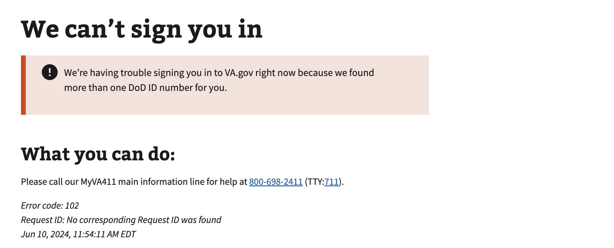

# Multiple EDIPIs

## Error code
`102`

## Title
Multiple EDIPIs

## Why it happens
This is due to an internal VA system reporting multiple identifiers for a user. This must be resolved manually and reported to the help desk.

## How to resolve the issue

1. Create a ticket with the help desk

## Screenshot

  
View screenshot

  

## Content

[h1] We can't sign you in

[va-alert]

We’re having trouble signing you in to VA.gov right now because we found more than one DoD ID number for you.

[h2] To fix this issue:

Please call our MyVA411 main information line for help at 800-698-2411 (TTY:711).

