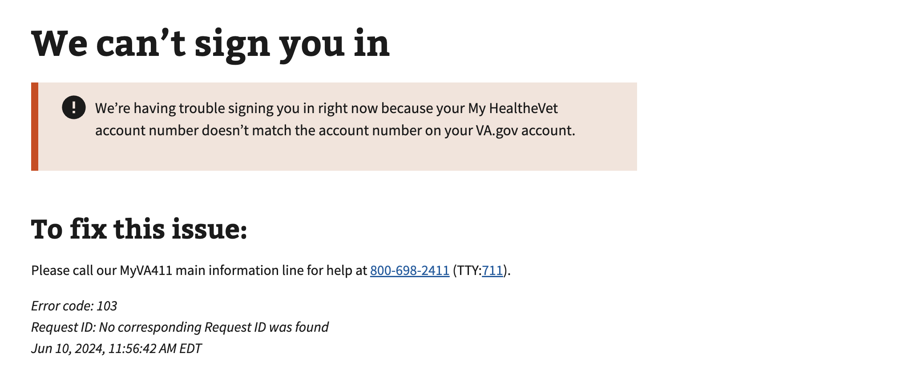

# ICN Mismatch

## Error code
`103`

## Title
ICN Mismatch

## Why it happens
This is due to an internal VA system reporting multiple identifiers for a user. This must be resolved manually and reported to the help desk.

## How to resolve the issue

1. Create a ticket with the help desk

## Screenshot

  
View screenshot

  

## Content

[h1] We can't sign you in

[va-alert]

We’re having trouble signing you in right now because your My HealtheVet account number doesn’t match the account number on your VA.gov account.

[h2] What you can do:

Please call our MyVA411 main information line for help at 800-698-2411 (TTY:711).

