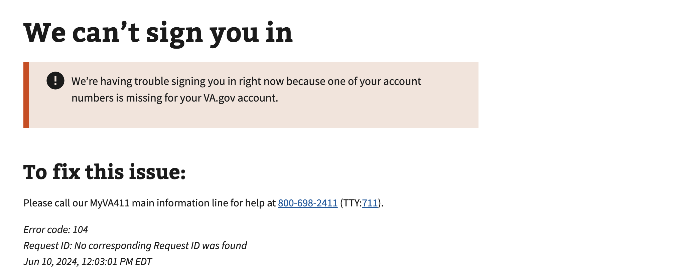

# UUID Missing

## Error code
`104`

## Title
UUID Missing

## Why it happens
This error is encountered when a user attempts to sign in with their credentials for either DS Logon or My HealtheVet.  A UUID is required to lookup the user and is only generated via ID.me or Login.gov. Therefore if a user has never signed in with either ID.me or Login.gov, the API cannot cross-reference and lookup their information in MPI. Attempting a second login on VA.gov should resolve the issue. We do occasionally see the browser obtain a cached response on subsequent logins, if the steps below do not resolve the issue we ask that the user wait 30 minutes and attempt the login again. If this doesn't resolve the issue a help desk ticket should be created.

## How to resolve the issue

1. Ask the user to clear their cookies & cache
2. Ask the user to attempt to sign in again with their credential provider
3. If the user still sees the same error, ask them to try signing in again in 30 minutes
4. If the user is still unable to sign in, create a help desk ticket and tag Identity PMs/Engineers

## Screenshot

  
View screenshot

  

## Content

[h1] We can't sign you in

[va-alert]

We’re having trouble signing you in right now because one of your account numbers is missing for your VA.gov account.

[h2] To fix this issue:

Please call our MyVA411 main information line for help at 800-698-2411 (TTY:711).

