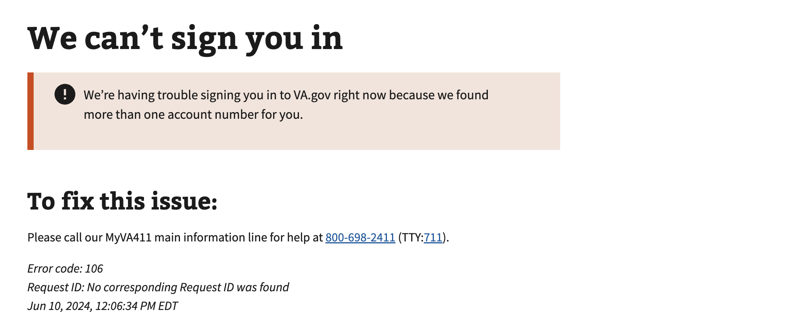

# Multiple Corp IDs

## Error code
`106`

## Title
Multiple Corp IDs

## Why it happens
This occurs when there is an error in MPI data and two records of the Corp ID is used instead of one.

## How to resolve the issue

1. Create a ticket with the help desk
2. Manually fix the record in MPI data after obtaining verifiable information from the user.

## Screenshot

  
View screenshot

  

## Content

[h1] We can't sign you in

[va-alert]

We’re having trouble signing you in to VA.gov right now because we found more than one account number for you.

[h2] To fix this issue:

Please call our MyVA411 main information line for help at 800-698-2411 (TTY:711).

