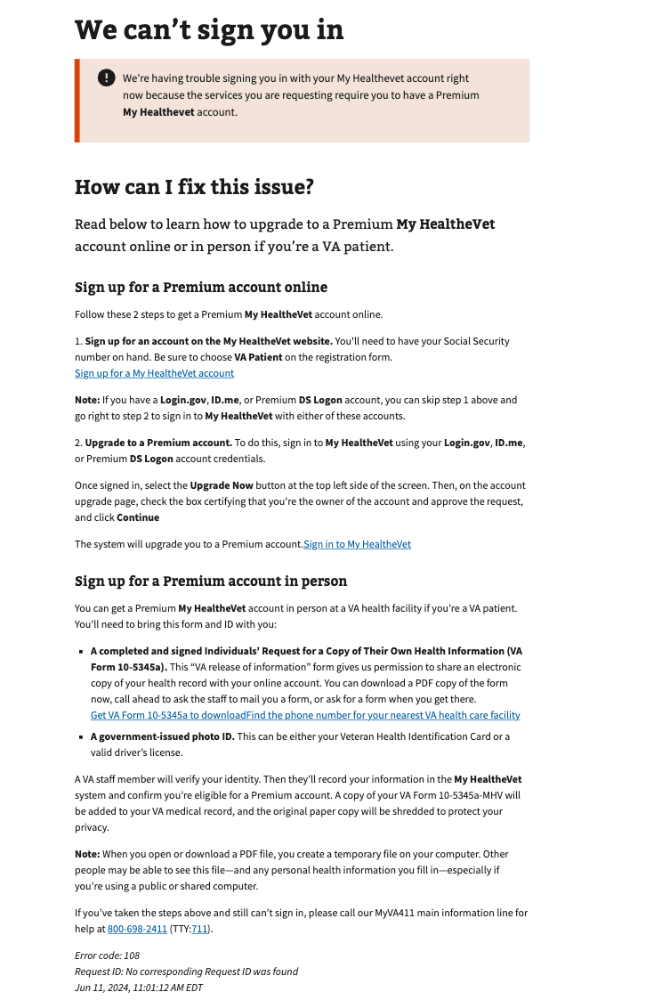

# MHV Verification Error

## Error code
`108`

## Title
MHV Verification Error

## Why it happens
This occurs when a My HealtheVet Basic user is requesting access to a service that requires a My HealtheVet Premium account.  This error usually occurs when using the Sign in Service on the Unified Sign in Page for any application with a `client_id=mobile`.

## How to resolve the issue

1. Create a ticket with the help desk
2. Manually fix the record in MPI data after obtaining verifiable information from the user.

## Screenshot

  
View screenshot

  

## Content

[h1] We can't sign you in

[va-alert]

We’re having trouble signing you in with your My Healthevet account right now because the services you are requesting require you to have a Premium My Healthevet account.

[h2] How can I fix this issue?

[va-introtext]
Read below to learn how to upgrade to a Premium My HealtheVet account online or in person if you’re a VA patient.

[h3] Sign up for a Premium account online

Follow these 2 steps to get a Premium My HealtheVet account online.

1. **Sign up for an account on the My HealtheVet website.** You'll need to have your Social Security number on hand. Be sure to choose VA Patient on the registration form.
[Sign up for a My HealtheVet account](https://www.myhealth.va.gov/mhv-portal-web/user-registration/)

**Note:** If you have a **Login.gov, ID.me,** or Premium **DS Logon** account, you can skip step 1 above and go right to step 2 to sign in to **My HealtheVet** with either of these accounts.

2. **Upgrade to a Premium account**. To do this, sign in to My HealtheVet using your Login.gov, ID.me, or Premium DS Logon account credentials.
Once signed in, select the **Upgrade Now** button at the top left side of the screen. Then, on the account upgrade page, check the box certifying that you're the owner of the account and approve the request, and click **Continue**

The system will upgrade you to a Premium account. [Sign in to My HealtheVet](https://www.myhealth.va.gov/mhv-portal-web/web/myhealthevet/user-login?redirect=/mhv-portal-web/user-registration/user-login)

[h3] Sign up for a Premium account in person

You can get a Premium My HealtheVet account in person at a VA health facility if you’re a VA patient. You’ll need to bring this form and ID with you:

- **A completed and signed Individuals’ Request for a Copy of Their Own Health Information (VA Form 10-5345a).** This “VA release of information” form gives us permission to share an electronic copy of your health record with your online account. You can download a PDF copy of the form now, call ahead to ask the staff to mail you a form, or ask for a form when you get there.Get VA Form 10-5345a to downloadFind the phone number for your nearest VA health care facility
- **A government-issued photo ID**. This can be either your Veteran Health Identification Card or a valid driver’s license.

A VA staff member will verify your identity. Then they’ll record your information in the My HealtheVet system and confirm you’re eligible for a Premium account. A copy of your VA Form 10-5345a-MHV will be added to your VA medical record, and the original paper copy will be shredded to protect your privacy.

Note: When you open or download a PDF file, you create a temporary file on your computer. Other people may be able to see this file—and any personal health information you fill in—especially if you’re using a public or shared computer.

If you’ve taken the steps above and still can’t sign in, please call our MyVA411 main information line for help at 800-698-2411 (TTY:711).

