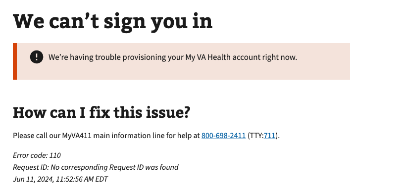

# My VA Health (Oracle Health) Provisioning Error

## Error code
`110`

## Title
My VA Health (Oracle Health) Provisioning Error

## Why it happens
This error occurs during the VA's terms of use workflow resulting in a My VA Health user to not be provisioned correctly. Usually this is due to a network failure with either the `/update_provisioning` or a failed call to the accept/deny action if user had not previously accepted terms.

## How to resolve the issue

1. Have the user clear cookies and cache on both VA.gov
2. Have the user retry the workflow in 5 - 10 minutes to allow processing time between the different VA systems
3. If the user still receives that same error, set up a call with OCTO Identity

## Screenshot

  
View screenshot

  

## Content

[h1] We can't sign you in

[va-alert] 
We’re having trouble provisioning your My VA Health account right now.

[h2] How can I fix this issue?

Please call our MyVA411 main information line for help at 800-698-2411 (TTY:711).
