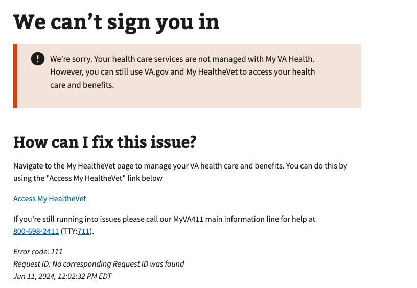

# My VA Health (Oracle Health) ineligble user account

## Error code
`111`

## Title
My VA Health (Oracle Health) ineligble user account

## Why it happens
This error occurs during the VA's terms of use workflow when a non-My VA Health (Oracle Health) user attempts to go to the My VA Health portal and they are not provisioned access for it.

## How to resolve the issue

1. Verify the user is a My VA Health user and has access to the My VA Health portal
2. Have the user navigate to the https://www.va.gov/my-health and confirm they have the My VA Health link
3. Document how the user go into

## Screenshot

  
View screenshot

  

## Content

[h1] We can't sign you in

[va-alert] 
We’re sorry. Your health care services are not managed with My VA Health. However, you can still use VA.gov and My HealtheVet to access your health care and benefits.

[h2] How can I fix this issue?

Navigate to the My HealtheVet page to manage your VA health care and benefits. You can do this by using the "Access My HealtheVet" link below

[Access My HealtheVet](https://www.va.gov/my-health)

If you’re still running into issues please call our MyVA411 main information line for help at 800-698-2411 (TTY:711).
