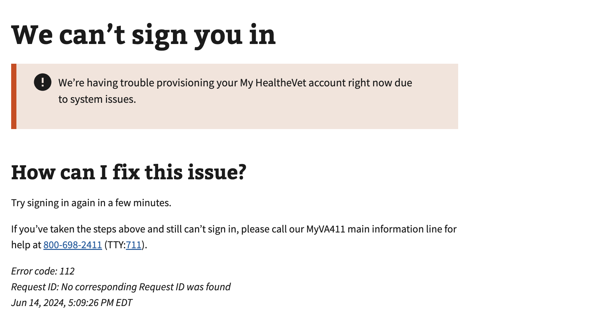

# My HealtheVet (MHV) Provisioning Error

## Error code

`110`

## Title

My HealtheVet (MHV) Provisioning Error

## Why it happens

This error occurs during the VA's terms of use workflow resulting in a My HealtheVet user to not be provisioned correctly. Usually this is due to a network failure with a call to the accept/deny (usually a timeout or failed response).

## How to resolve the issue

1. Have the user clear cookies and cache on both VA.gov
2. Have the user retry the workflow in 5 - 10 minutes to allow processing time between the different VA systems
3. If the user still receives that same error, set up a call with OCTO Identity

## Screenshot

  
View screenshot

  

## Content

[h1] We can't sign you in

[va-alert]
We’re having trouble provisioning your My HealtheVet account right now.

[h2] How can I fix this issue?

Try signing in again in a few minutes.

If you've taken the steps above and still can't sing in, please call our MyVA411 main information line for help at 800-698-2411 (TTY:711).
