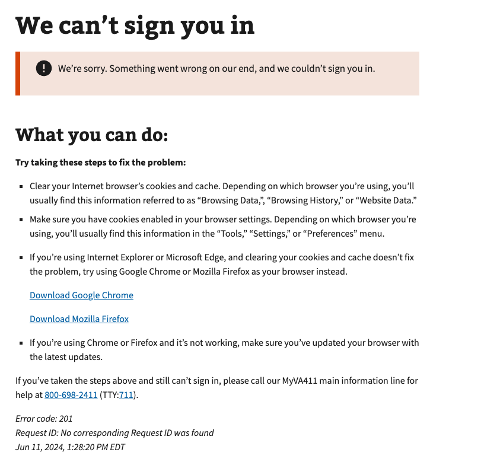

# Generic OAuth Errors

## Error code
`201`

## Title
Generic OAuth Errors

## Why it happens
This is a catch-all for OAuth (Sign-in Service) authentication errors. Sometimes we are not sure why the error occurs OR we don't want to display the error to the user in certain cases like identity theft flag, date of death, etc.

## How to resolve the issue

1. Ask the user to clear cookies & cache in their browser
2. Ask the user to sign in again with their credential provider

## Screenshot

  
View screenshot

  

## Content

[h1] We can't sign you in

[va-alert] 
We’re sorry. Something went wrong on our end, and we couldn’t sign you in.

[h2] What you can do:
**Try taking these steps to fix the problem:**

- Clear your Internet browser’s cookies and cache. Depending on which browser you’re using, you’ll usually find this information referred to as “Browsing Data,”, “Browsing History,” or “Website Data.”
- Make sure you have cookies enabled in your browser settings. Depending on which browser you’re using, you’ll usually find this information in the “Tools,” “Settings,” or “Preferences” menu.
- If you’re using Internet Explorer or Microsoft Edge, and clearing your cookies and cache doesn’t fix the problem, try using Google Chrome or Mozilla Firefox as your browser instead.

[link] Download Google Chrome

[link] Download Mozilla Firefox

- If you’re using Chrome or Firefox and it’s not working, make sure you’ve updated your browser with the latest updates.

If you’ve taken the steps above and still can’t sign in, please call our MyVA411 main information line for help at 800-698-2411 (TTY:711).
