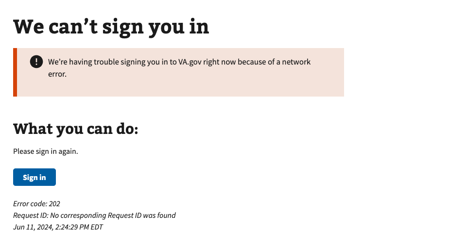

# OAuth State Mismatch

## Error code
`202`

## Title
OAuth State Mismatch

## Why it happens
This error occurs when the state in the initial OAuth `/authorize` request **DOES NOT** match the API response `state` parameter. This should not happen often as it is an indicator of bad actors.

## How to resolve the issue

1. Ask the user to clear cookies & cache in their browser
2. Ask the user to sign in again with their credential provider

## Screenshot

  
View screenshot

  

## Content

[h1] We can't sign you in

[va-alert] 
We’re having trouble signing you in to VA.gov right now because of a network error.

[h2] What you can do:

Please sign in again.

[button] Sign in
