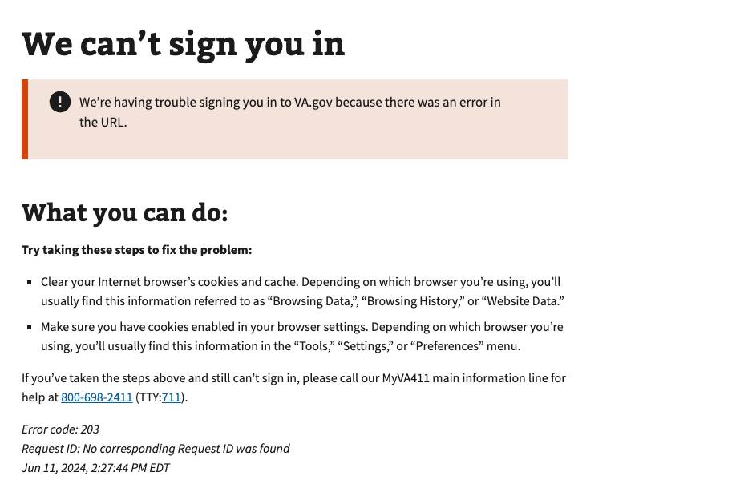

# Invalid OAuth Request

## Error code
`203`

## Title
Invalid OAuth Request

## Why it happens
This error occurs when one or more of the required query parameters for OAuth-enabled routes is either missing, undefined, or incorrect. This error can be an indicator of bad actors.

## How to resolve the issue

1. Ask the user to clear cookies & cache in their browser
2. Ask the user to sign in again with their credential provider

## Screenshot

  
View screenshot

  

## Content

[h1] We can't sign you in

[va-alert] 
We’re having trouble signing you in to VA.gov right now because of a network error.

[h2] What you can do:

**Try taking these steps to fix the problem:**

- Clear your Internet browser’s cookies and cache. Depending on which browser you’re using, you’ll usually find this information referred to as “Browsing Data,”, “Browsing History,” or “Website Data.”
- Make sure you have cookies enabled in your browser settings. Depending on which browser you’re using, you’ll usually find this information in the “Tools,” “Settings,” or “Preferences” menu.

If you’ve taken the steps above and still can’t sign in, please call our MyVA411 main information line for help at 800-698-2411 (TTY:711).
