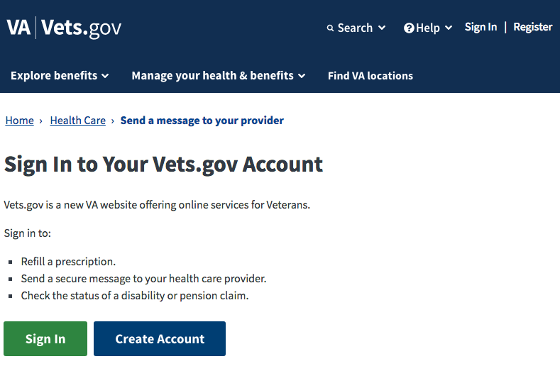
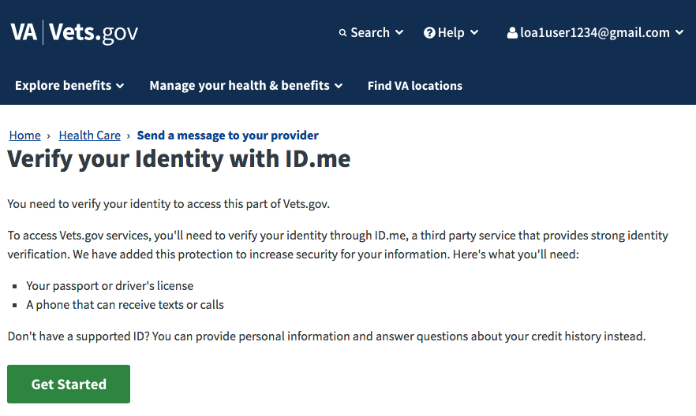
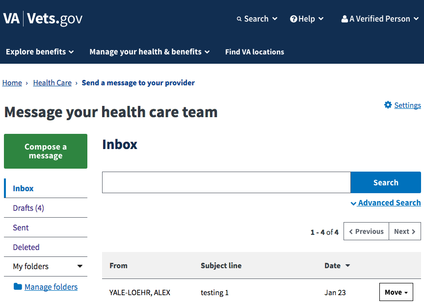
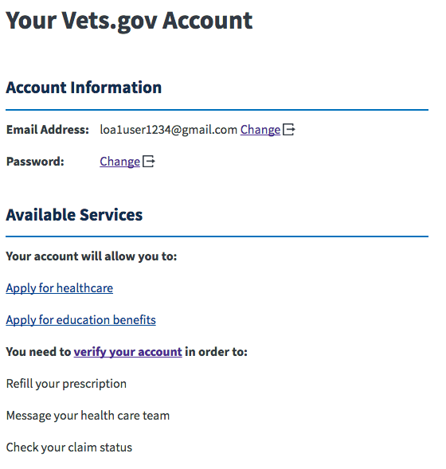
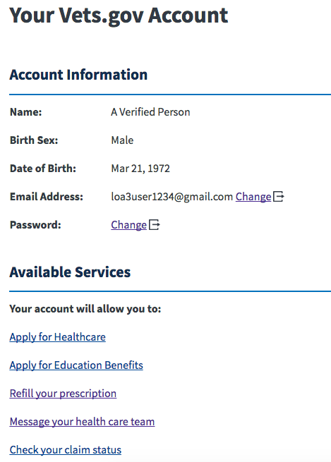

# Front-End Components

Screenshots and React component hierarches for login-related `vets-website` code

See also [FE login/logout flow](FE_login_and_logout.md)

## Login app main component

   [`src/js/login/containers/Main.jsx`]()

### Not logged in  
    
  ```
  <Main>
    <SearchHelpSignIn>
      <SearchMenu />
      <HelpMenu />
      <div>
        "Sign In" link
        "Register" link
      </div>
    </SearchHelpSignIn>
  </Main>
  ```
### LOA1 logged in 
  
  ```
  <Main>
    <SearchHelpSignIn>
      <SearchMenu />
      <HelpMenu />
      <SignInProfileMenu />
    </SearchHelpSignIn>
  </Main>
  ```
### LOA3 logged in 
  
  
  (same component hierarchy as for LOA1)
  
## RequiredLoginView component (secure messaging example)

   [`src/js/common/components/RequiredLoginView.jsx`](https://github.com/department-of-veterans-affairs/vets-website/blob/main/src/js/common/components/RequiredLoginView.jsx) (included from [`src/js/messaging/containers/MessagingApp.jsx`](https://github.com/department-of-veterans-affairs/vets-website/blob/main/src/js/messaging/containers/MessagingApp.jsx)
   
### Not logged in
    
  ```
  <MessagingApp>
    <RequiredLoginView>
      <LoginPrompt>
        "Sign In" button
        "Create Account" button
      </LoginPrompt>
    </RequiredLoginView>
  </MessagingApp>
  ```
### LOA1 logged in
  
  ```
  <MessagingApp>
    <RequiredLoginView>
      <VerifyPrompt>
        "Get Started" button
      </LoginPrompt>
    </RequiredLoginView>
  </MessagingApp>
  ```
### LOA3 logged in
  
  ```
  <MessagingApp>
    <RequiredLoginView>
      <AppContent>
      </AppContent>
    </RequiredLoginView>
  </MessagingApp>
  ```
  
## User profile

[`src/js/user-profile/containers/UserProfileApp.jsx`](https://github.com/department-of-veterans-affairs/vets-website/blob/main/src/js/user-profile/containers/UserProfileApp.jsx)

### Not logged in
Similar to `MessagingApp.jsx` above

### LOA1 logged in

```
<UserProfileApp>
  <RequiredLoginView>
    <UserDataSection />
    <AuthApplicationSection>
      "verify my identity" link
    </AuthApplicationSection>
    <AccountManagementSection />
  </RequiredLoginView>
</UserProfileApp>
```
### LOA3 logged in


(same component hierarchy as LOA3)
