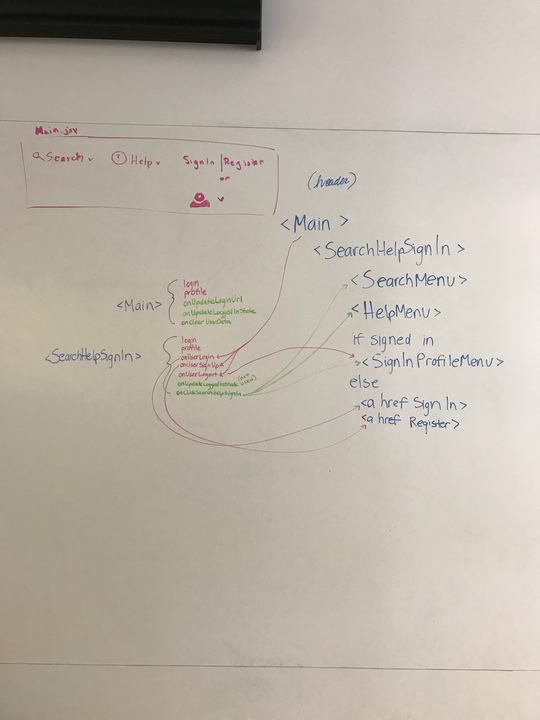
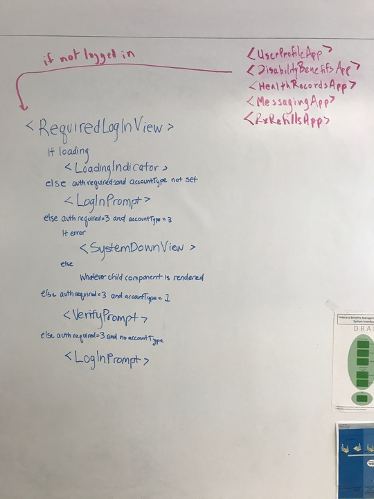

# Login Application

The Login React app allows users to authenticate themselves via ID.me to access Vets.gov features that require authenicated user data.

This project has a [version 1 requirements document]() from which the initial solution was built.

## How it Works

### Login

**Steps with Related Files:**

1. [Vets.gov Codebase](https://github.com/department-of-veterans-affairs/vets-website)
2. Fetch unique signin url: [`getLoginUrl()`](https://github.com/department-of-veterans-affairs/vets-website/blob/main/src/js/login/containers/Main.jsx#L43)
3. Receive signin url response: [`getLoginUrl()`](https://github.com/department-of-veterans-affairs/vets-website/blob/main/src/js/login/containers/Main.jsx#L45-L49)
4. Render SearchHelpSignIn: [`render()`](https://github.com/department-of-veterans-affairs/vets-website/blob/main/src/js/login/containers/Main.jsx#L136)
5. [Trigger for Signin action](https://github.com/department-of-veterans-affairs/vets-website/blob/main/src/js/login/components/SearchHelpSignIn.jsx#L31)
6. Child window opens and we navigate to the single login url: [`handleLogin()`](https://github.com/department-of-veterans-affairs/vets-website/blob/main/src/js/login/containers/Main.jsx#L81)
7. Login credentials UI is inside the ID.me infrastructure.
8. [Trigger for Register action](https://github.com/department-of-veterans-affairs/vets-website/blob/main/src/js/login/components/SignInProfileButton.jsx#L30)
9. Child window opens and we navigate to the single register url: [`handleSignup()`](https://github.com/department-of-veterans-affairs/vets-website/blob/main/src/js/login/containers/Main.jsx#L96)
10. Account creation UI is inside the ID.me infrastructure.
11. [Trigger on level up action](https://github.com/department-of-veterans-affairs/vets-website/blob/main/src/js/common/components/RequiredLoginView.jsx#L91)
12. [Fetch LOA3 url](https://github.com/department-of-veterans-affairs/vets-website/blob/main/src/js/common/helpers/login-helpers.js#L19-L21)
13. [Response with LOA3 url](https://github.com/department-of-veterans-affairs/vets-website/blob/main/src/js/common/helpers/login-helpers.js#L22-L25)
14. [Child window opens and we navigate to the LOA3 url](https://github.com/department-of-veterans-affairs/vets-website/blob/main/src/js/common/helpers/login-helpers.js#L26)
15. This is inside the ID.me infrastructure.
16. [This is inside of vets-api](../Auth/authentication_and_authorization.md)
17. [This is inside of vets-api](../Auth/authentication_and_authorization.md)
18. [This is inside of vets-api](../Auth/authentication_and_authorization.md)
19. [Login url callback returned with token as param](https://github.com/department-of-veterans-affairs/vets-website/blob/main/src/js/auth/containers/AuthApp.jsx#L78)
20. [GET request to /users endpoint + Token in the header](https://github.com/department-of-veterans-affairs/vets-website/blob/main/src/js/auth/containers/AuthApp.jsx#L42-L46)
21. [This is inside of vets-api]()
22. [User data returned](https://github.com/department-of-veterans-affairs/vets-website/blob/main/src/js/auth/containers/AuthApp.jsx#L48-L50)
23. [Fetch LOA3 url](https://github.com/department-of-veterans-affairs/vets-website/blob/main/src/js/auth/containers/AuthApp.jsx#L51-L58)
24. [Response with LOA3 url](https://github.com/department-of-veterans-affairs/vets-website/blob/main/src/js/auth/containers/AuthApp.jsx#L59-L63)
25. This is inside the ID.me infrastructure.
26. This is inside the ID.me infrastructure.
27. This is inside the ID.me infrastructure.
28. [User data returned](https://github.com/department-of-veterans-affairs/vets-website/blob/main/src/js/auth/containers/AuthApp.jsx#L66)
29. [GET request to /users endpoint + Token in the header](https://github.com/department-of-veterans-affairs/vets-website/blob/main/src/js/common/helpers/login-helpers.js#L32-L36)
30. [This is inside of vets-api](../Auth/authentication_and_authorization.md)
31. [User data returned](https://github.com/department-of-veterans-affairs/vets-website/blob/main/src/js/common/helpers/login-helpers.js#L37-L40)
32. [User data updated in commonStore](https://github.com/department-of-veterans-affairs/vets-website/blob/main/src/js/common/helpers/login-helpers.js#L41-L52)
33. [Logged in view](https://github.com/department-of-veterans-affairs/vets-website/blob/main/src/js/login/components/SignInProfileButton.jsx#L21-L27)

### Logout

**Steps with Related Files:**

1. [Trigger for signout action](https://github.com/department-of-veterans-affairs/vets-website/blob/main/src/js/login/components/SignInProfileButton.jsx#L25)
2. [Fetch single signout link by hitting sessions endpoint + sending token in header](https://github.com/department-of-veterans-affairs/vets-website/blob/main/src/js/login/containers/Main.jsx#L54-L59)
3. [Signout url is sent back in response](https://github.com/department-of-veterans-affairs/vets-website/blob/main/src/js/login/containers/Main.jsx#L60-L65)
4. [Child window opens and we navigate to the single logout url](https://github.com/department-of-veterans-affairs/vets-website/blob/main/src/js/login/containers/Main.jsx#L79-L83)
5. This is inside the ID.me infrastructure.
6. [Tokens are removed from sessionStorage in parent window](https://raw.githubusercontent.com/department-of-veterans-affairs/vets-website/main/content/pages/logout.md)
7. [Tokens are removed from sessionStorage in parent window](https://raw.githubusercontent.com/department-of-veterans-affairs/vets-website/main/content/pages/logout.md)
8. [Signin link re-appear](https://github.com/department-of-veterans-affairs/vets-website/blob/main/src/js/login/components/SignInProfileButton.jsx#L28-L33)
