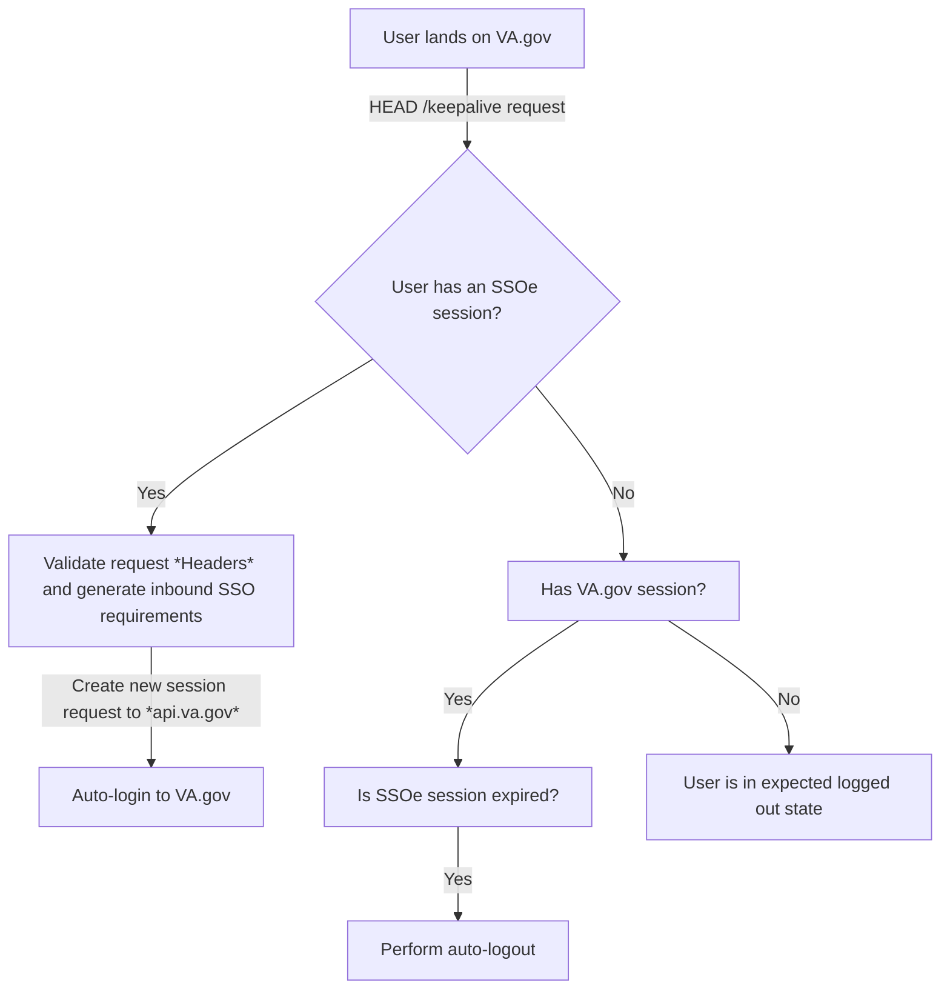

# SSO Client-side Overview

This document summarizes a number of key aspects pertaining to SSO from the perspective of `vets-website` code

## Challenges in maintaining session synchronicity from the client side

The current session establishment model for SSO is bifurcated:

1. `vets-api` establishes the VA.gov session, which is kept alive via consistent interactions with `vets-website`.
   * Authenticated requests made from `vets-website` extend the session expiration by 30 minutes. This is maintained via parsed response headers on the client side (see the `fetchAndUpdateSession` method in the [platform api utility functions](https://github.com/department-of-veterans-affairs/vets-website/blob/master/src/platform/utilities/api/index.js#L7) to see this in greater detail.
2. As part of this login flow, an SSOe session is established in a chain of SAML requests through `vets-api` before getting sent back to VA.gov.

The main problem introduced by this model is the burden of keeping those sessions synchronized by VA.gov. Furthermore, there isn't a great way to do this server side, so the responsibility of keeping the VA.gov session in sync with the SSOe session falls on `vets-website` code. 

The current mechanism for maintaining the SSOe session is via a `/keepalive` endpoint provided by the IAM team.

## `/keepalive` Endpoint

The `/keepalive` endpoint itself is a `HEAD` request with no response body. All the logic for session continuity is derived from headers on the Response object:

| Header | Description |
| --- | --- |
| `session-alive` | Source of truth for whether a current SSOe session exists (just a "true" or "false" value) |
| `session-timeout` | The amount of time left in a session in seconds. This value should be `900` in seconds (about 15 minutes) for active sessions or `0` for inactive sessions. |
| `va_eauth_authncontextclassref` | The level of assurance that is returned from IAM based on the request. |
| `va_eauth_transactionid` | For shared computers, such as a public computer at a VA facility, it's possible for a user to log out of an SSOe site without logging out of VA.gov, since SSOe does not do any tracking of VA.gov sessions. Because of this, VA.gov uses `va_eauth_transactionid` to make sure that any existing VA.gov session matches the corresponding SSOe session. If it doesn't, then the user is quickly logged out and logged in again to match the proper SSOe session. |
| `va_eauth_csid` | This is mapped to track which credentials service provider is used for auto-logins (Login.gov, ID.me, and DS Logon) |
| `va_eauth_csp_method` | This is used to determine which AuthnContextClassRef is to be used with dependents credential service provider. LOA for ID.me and DS Logon. IAL for Login.gov |

## User flow

## Other things to note
- Sending an authenticated request to `eauth.va.gov/keepalive` occurs for every authenticated request to an API endpoint `api.va.gov`
  - This automatically renews the session for 15 minutes (2x 15 minute session (IAM) = 30 minute VA API session)
- Caveats with local development
  - Due to CORS issues, the keep-alive endpoint can't currently be reached when developing locally. This is currently circumvented with a mocked keep-alive call that returns null values (avoiding any code failures, while also not triggering automatic logins or logouts). For minor debugging locally, `mockKeepAliveSSO.js`  still accepts `keepalive-ttl`and `keepalive-authn` query parameters on any URL to test different values, in lieu of `session-timeout` and `va_eauth_csid`.
- In local storage
  - `sessionExpiration` = VA API authenticated session
  - `sessionExpirationSSO` = IAM authenticated session
  - `hasSession` & `hasSessionSSO` = Client-side session is set up

