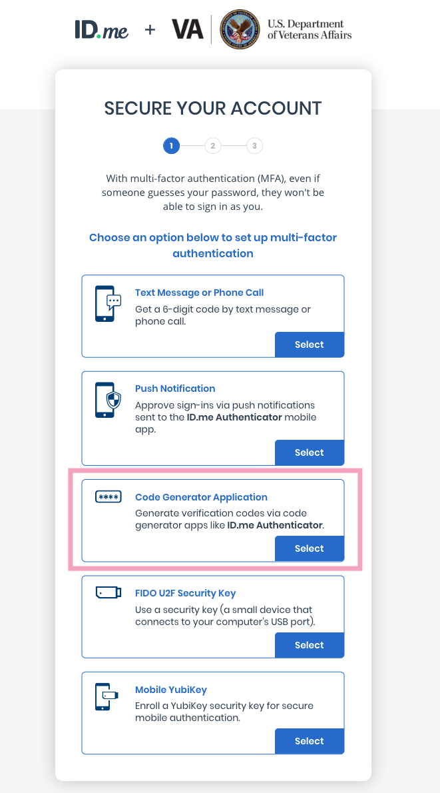
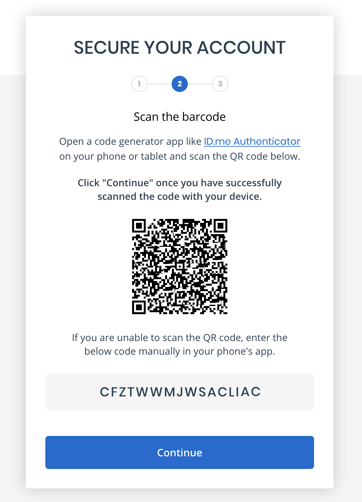
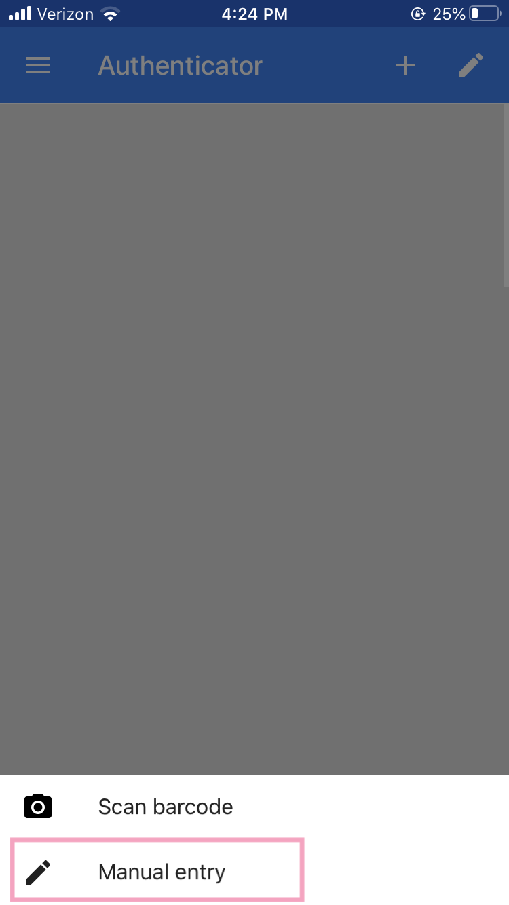
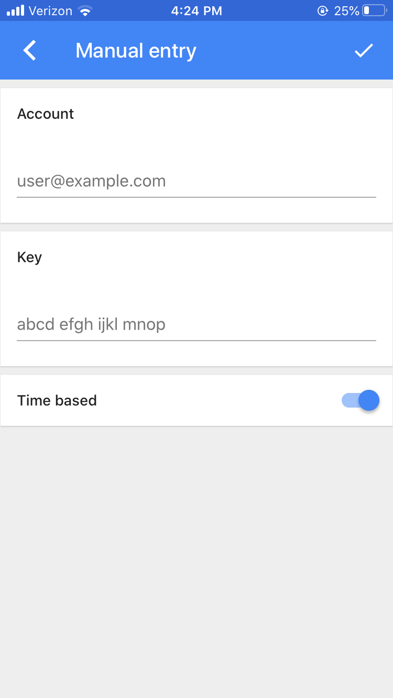
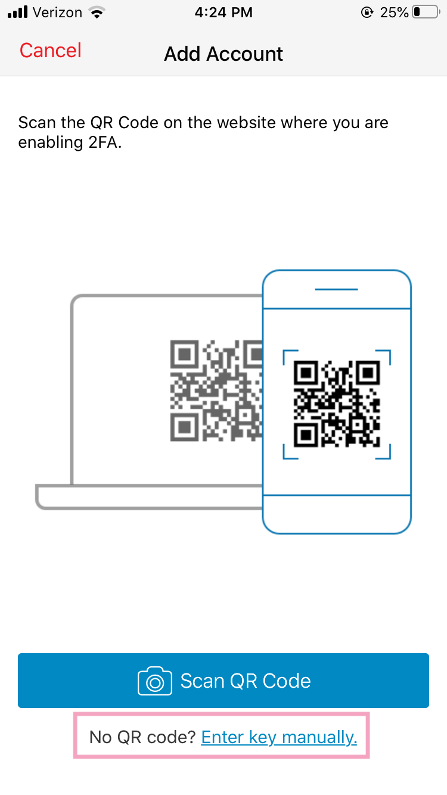
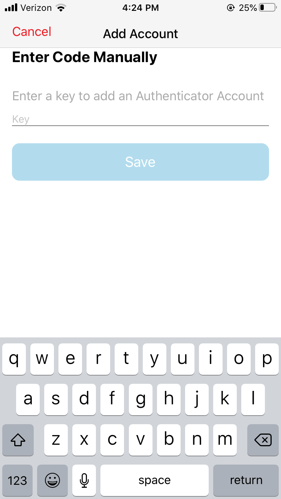

# Shared 2FA for Test Accounts

### Background

People working on and around VA.gov use test accounts during development and QA in both non-prod and prod environments. These test accounts are a shared resource. Two-factor authentication (2FA) by its nature is not easy to share, since it's meant to ensure that one and only one person controls a credential. 

This document describes how to enable shared 2FA for production test accounts. 

### Non-production test accounts

At present, shared 2FA is simple for non-production accounts, at least when 2FA is powered by ID.me. ID.me's sandbox environment doesn't require verification of phone numbers when enrolling on 2FA, and it auto-populates the SMS one-time code when signing in. This means that any phone number can be entered when enrolling, and anybody can click through the 2FA prompt when signing in.

If at any point a different identity provider is integrated that has 2FA and doesn't have these conveniences in their non-prod environments, then the steps described below may be necessary for non-production test accounts.

### Production test accounts

ID.me's production environment needs to enforce its security guarantees across the board; there is no way to relax 2FA requirements for certain accounts even if they are known to be shared test credentials. This applies to both ID.me native credentials, and MHV/DSLogon credentials that are brokered through ID.me in order to add 2FA. 

When enrolling such an account in production, the key step is to **not use SMS as the second factor mechanism**. Doing so ties 2FA to one person's phone number.

Instead:

1. Select the "Code Generator Application" mechanism. ID.me suggests their own authenticator app but you can use any app such as Google Authenticator, Authy, or desktop tools such as 1Password. 

2. Don't scan the QR code. Instead, note and _securely_ store the alphanumeric code at the bottom of the screen (e.g. the "CFZTWWMJWSACLIAC" value in the screenshot below. Treat this value like a password, since it is in effect a secondary password for this test account. The value can be used by multiple people at any point in time now or in the future to configure authenticator apps, thus enabling shared 2FA. 

#### Setting up Google Authenticator with a manual code

To use the alphanumeric code in Google Authenticator, tap the + icon to add an account, and then select "Manual Entry". Type the code into the "key" section and enter the username in the Account section so you know which shared test account this code is for.

&nbsp;&nbsp;

#### Setting up Authy with a manual code

Similarly for Authy, tap the "Add Account" button, then the "Enter key manually" option, and type in the alphanumeric code. 

&nbsp;&nbsp;

