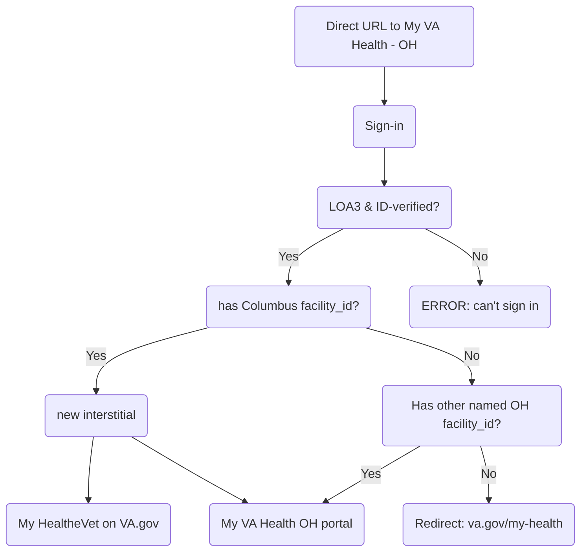

# Feature Brief: My VA Health (Oracle Health) USIP Interstitial & Access Control

## Overview

As part of the My VA Health (Oracle Health) transition to VA.gov, the frontend now enforces **facility-based routing logic** for users authenticating through the **My VA Health Unified Sign-in Page (USIP)** at:

`https://patientportal.myhealth.va.gov`

This work introduces a **post-authentication interstitial** and **explicit access rules** that determine whether a user:

1. Sees the new My VA Health interstitial  
2. Proceeds directly to the legacy My VA Health portal  
3. Is redirected to My HealtheVet on VA.gov (`/my-health`)  

The goal is to ensure that **only users associated with specific Oracle Health facilities** can access the My VA Health portal experience, while safely routing all other users to VA.gov.

## High-Level User Routing Rules

After successful authentication via the **My VA Health USIP**, the frontend evaluates:

- Is this a My VA Health sign-in?
- Is the user a VA patient?
- Does the user have one or more approved Oracle Health `facility_id`s?

## Facility Definitions

### Active interstitial facility for initial rollout

- Columbus, OH → `VHA_757`

### Approved Oracle Health facilities (no interstitial)

- Roseburg, OR → `VHA_653`
- Walla Walla, OR → `VHA_687`
- White City, OR → `VHA_692`
- Spokane, WA → `VHA_668`
- North Chicago (James Lovell), IL → `VHA_556`

---

## User Journey

### 1. Users with VHA_757 (Columbus, OH)

- Authenticate via My VA Health USIP
- See the new interstitial
- Can choose to:
  - Continue to the legacy My VA Health portal
  - Go to My HealtheVet on VA.gov

### 2. Users with any of the other 5 approved facilities

- Authenticate via My VA Health USIP
- Do NOT see the interstitial
- Proceed directly to:
  - `https://patientportal.myhealth.va.gov`

### 3. Users with any other facility or no approved facility

- Authenticate via My VA Health USIP
- Never see the interstitial
- Are redirected to:
  - `https://va.gov/my-health`
- These users cannot access the My VA Health portal.

## Important Constraints & Design Decisions

- This logic applies only to the My VA Health USIP sign-in experience
- Feature flags cannot target by facility, so:
  - Facility eligibility is enforced in code
  - Feature toggles only control rollout percentage for eligible users
- Users will never see more than one interstitial per sign-in  
  Priority order:
  1. My VA Health interstitial
  2. Email prompt interstitial
 
## Resources
- [Original MHV team ticket](https://github.com/department-of-veterans-affairs/va.gov-team/issues/119600)
- [Identity team ticket](https://github.com/department-of-veterans-affairs/identity-documentation/issues/878)
- [Implementation PR for redirect](https://github.com/department-of-veterans-affairs/vets-website/pull/40232)
- [Implementation PR for landing page](https://github.com/department-of-veterans-affairs/vets-website/pull/40294)
- [#identity-suppport slack thread](https://dsva.slack.com/archives/CSFV4QTKN/p1769551119709939)

