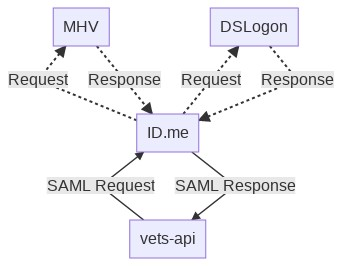
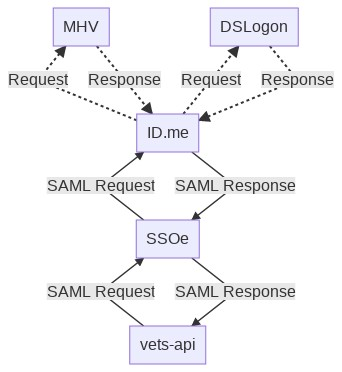
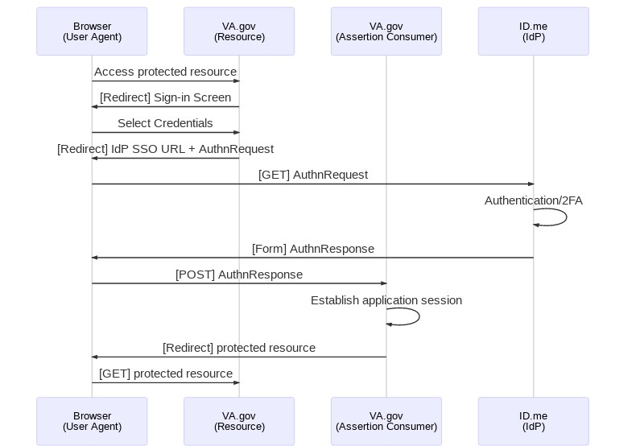
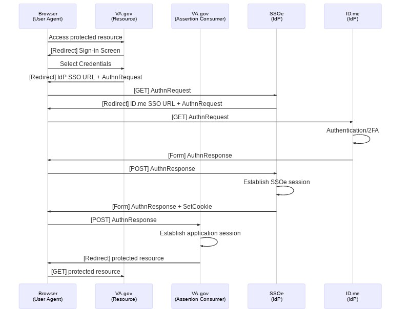

## Background
The SSOe Integration project updates vets-api and vets-website with the following capabilities:
* Outbound SSO - when a user signs in, the SAML interaction will flow through the SSOe system operated by the IAM team, and at the end of the sign in process, a user will have a VA.gov session (as before) and also an SSOe session. The latter will allow them to navigate to another VA site in a logged-in state.
* Inbound SSO - when a user navigates from another site to VA.gov, VA.gov will detect the presence of an SSOe session and use it to establish a VA.gov session without the user needing to re-authenticate.

## An architecture diagram, showing involved systems + data flows

### Component Roles

In the current/before state:
* ID.me acts as the sole Identity Provider (IdP) for VA.gov in SAML protocol terms. It's also referred to as an identity broker because it acts as the intermediary for additional credential types.
* ID.me itself provides one of the credential options that users may authenticate with. It also enables two additional credential service providers (CSPs): MHV and DSLogon.

In the proposed/after state:
* In SAML terms, SSOe will be VA.gov's sole IdP. All SAML assertions that VA.gov receives will be issued by SSOe, signed using its key, etc.
* However, all VA.gov-initiated authentications will continue to flow from SSOe to ID.me, and then in turn be brokered to the correct CSP (same menu of options - ID.me, MHV, DSLogon). So ID.me continues to be a (second-degree) identity broker for VA.gov.
* VA.gov may accept and receive inbound SSO session established on other SSOe-enabled VA websites. In these cases the authenticated session is not necessarily brokered by ID.me.

### Architecture Diagrams

The diagrams below show before and after architecture of SSOe-integrated sign-in. They are simplified by not showing that each request/response is mediated by the user's browser. Each "northbound" request is really a 302 redirect to the browser that results in a GET to the upstream system. Each "southbound" request is really a hidden form that auto-submits a POST request to the downstream system. These are standard SAML GET and POST bindings.

Before:

After:

### Sequence Diagrams:

The sequence diagrams show in more detail the set of requests/responses that are made for a typical authentication event. Note that the additional proxying of requests from ID.me to other credential providers (MHV,DSLogon) is omitted for clarity.

Before:

After:

## Description of any new publicly-exposed endpoints (vets-api or otherwise)
This work adds a new version of the sessions controller (v1/sessions) that exposes the following resources:
* **v1/sessions/metadata** - exposes the SAML SP metadata required by SSOe in its role as VA.gov’s Identity Provider. 
* **v1/sessions/{idme/mhv/dslogon/verify/mfa}/new** - Invoked by vets-website in response to users clicking one of the sign in buttons, or requesting to verify their account or enroll in multifactor. This method crafts a SAML request with the right contents to trigger the requested action in SSOe/ID.me/MHV/DSLogon and redirects the user’s browser to SSOe with that request.
* **v1/sessions/callback** - This is the Assertion Callback Service (ACS) URL to which SSOe sends the SAML response (aka assertion) after a user signs in. Vets-api parses the response, validates it (correctly signed by expected counterparts, encrypted, not expired, etc) and uses the attributes in the assertion to establish a user session.
* ~~**v1/sessions/logout** - A SAML single-logout endpoint. This would be used to parse an incoming SAML logout request from an IdP and terminate the VA.gov user session. However SSOe does not currently implement SAML-bassed logout (see below).~~ This endpoint was observed to be dead code and is removed in a PR out for review. SSOe logout uses the endpoint below. [2020/03/26]
* **v1/sessions/ssoe_logout** - A non-SAML logout endpoint. Since SSOe does not support SAML logout, this endpoint will be used by vets-website to terminate the VA.gov session and then trigger SSOe’s “PKMS Logout” endpoint to terminate the SSOe session.

Additionally, to support some of the intended outbound SSO use cases for EHRM, we have updated the existing v0/user controller response as follows:
* Addition of an "isCernerPatient" parameter, indicating whether the user is a patient at a Cerner site, based on data received from MVI.
* Addition of a "VHA facilities" list indicating at which VA facilities a user is a patient, again based on data received from MVI.

## Description of any new interactions with dependent services (i.e. vets-api —> ???)
### SAML
As described above, SSOe now becomes VA.gov’s immediate identity provider. As such VA.gov sign-in has a hard dependency on SSOe’s availability. 

The overall sign-in interaction model is largely unchanged, just substituting the expectation that SAML requests and responses previously to/from ID.me will now be to/from SSOe, which in turn proxies them on to ID.me.

### Keepalive
SSOe provides a “keep alive” endpoint, to be used by the *vets-website frontend* for two purposes:
1. Detecting whether an SSOe session is present - to be used for inbound SSO, to determine whether to automatically establish a VA.gov session.
2. Extending the duration of the SSOe session while a user is active on VA.gov - to ensure that the SSOe session does not expire during the interval when a user is interacting with VA.gov

The keep alive endpoint returns a status code indicating whether an SSOe session is present, and an expiry time, based on the presence or absence of an SSOe session cookie in the user’s browser. 

### Data changes
From a security and privacy perspective the other change to be aware of is that while the substitution of SSOe for ID.me as the immediate protocol-level IDP is pretty straightforward,  we do receive a  different SAML payload from SSOe. The primary difference is that the SSOe SAML payload includes information that we would otherwise need to perform a separate MVI query for.
* During rollout, we are not dispensing with the separate MVI query that occurs  during sign-in.  That work can be done as a follow-on as described in [this RFC](https://github.com/department-of-veterans-affairs/va.gov-team/blob/master/platform/engineering/request-for-comment/2020-01-08-ssoe-removing-implicit-mvi-queries.md) and [this epic](https://github.com/department-of-veterans-affairs/va.gov-team/issues/5760).
* The SSOe SAML payload only contains MVI attributes for authenticated users with a sufficient LOA - just as vets-api only queries MVI for high-assurance users.
* SSOe is capable of issuing a successful SAML response when MVI (which is a separate system operated by the same team) is down. In this scenario vets-api will receive a “CSP-only” SAML assertion equivalent to what we get from ID.me/MHV/DSLogon today.

Another change to be aware of is that SSOe’s integration with MVI means that new-to-VA users (if identity proofed) will be added to MVI as a side-effect of authenticating through SSOe. This is existing/standard SSOe functionality that VA.gov gets to take advantage of via this integration.

## Description of any other security hotspots you’re concerned about / want extra attention on

n/a
