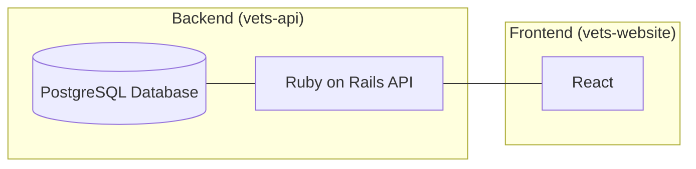
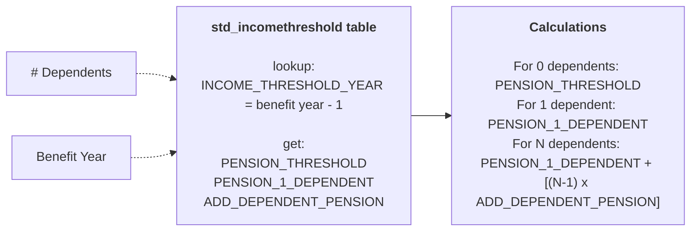
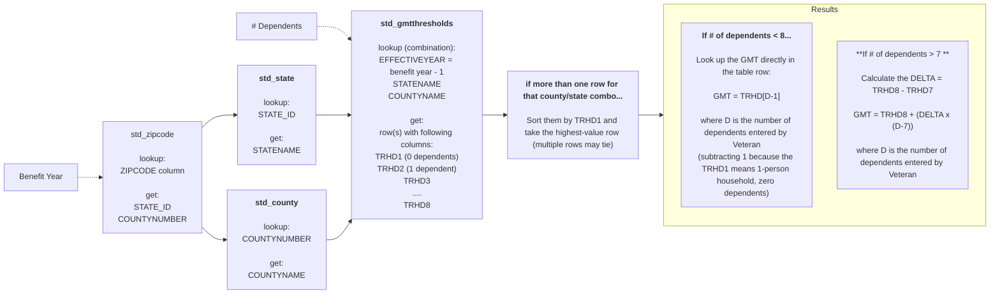

# Income Limits Technical Architecture

## Background
Income is one aspect that determines a Veteran's eligibility for benefits from VA. The Income Limits application, an API in [vets-api](https://github.com/department-of-veterans-affairs/vets-api) and a [vets-website](https://github.com/department-of-veterans-affairs/vets-website/) application, allows Veterans, their caregivers, family members, and others to look up the financial thresholds based on location and number of dependents. This document will describe in detail the various components that make up the Income Limits application as it is used on VA.gov, as well as how those components interoperate.

## Architecture Overview
The Income Limits application on VA.gov is a typical decoupled web application with two primary components: the frontend application (React in vets-website), and a backend API (Ruby in vets-api).

## Backend

### Overview
The Income Limits API is built in [vets-api](https://github.com/department-of-veterans-affairs/vets-api) which uses Ruby on Rails (RoR). The API will always return valid JSON unless errors (such as out-of-band errors) or internal failures occur, in which case the correct HTTP status code will be returned.

### Authentication
Authentication is not necessary to access the API; data used and presented by the API is not proprietary or personalized, so authentication is unnecessary.

### Storage
The Income Limits API utilizes the [PostgreSQL](https://www.postgresql.org/) (postgres) database. Postgres is the native database storage backend for vets-api. Income Limits will only leverage the built-in ORM provided by Rails to interact with the database.

### Data
The Income Limits API purpose is to calculate and return income 'thresholds', which dictate the income limits for various veteran benefits. These thresholds are calculated for a given tax year, number of dependents, and zip code.

Data models are represented using RoR's [Active Record](https://guides.rubyonrails.org/active_record_basics.html) modeling pattern. By using Active Record for data models, data can be safely read and written to the postgres database without directly interacting with it.

#### Data Sources
Income limits source data is collected and maintained by the Veteran Enrollment System which is owned and managed by the VHA. The VES system utilizes an Oracle database on the VA network which is accessible by vets-api applications.

#### Data Migration
How data is imported and migrated into postgres is detailed [here](../data/README.md).

#### Threshold Calculations

##### Pension Threshold

##### National Means Test (NMT) Threshold

##### Geographic Means Test (GMT) Threshold

### API Documentation
The API is self-documented in Swagger format. The API documentation can be viewed in the [Swagger UI for vets-api](https://department-of-veterans-affairs.github.io/va-digital-services-platform-docs/api-reference/).

## Frontend
The [Income Limits application](https://github.com/department-of-veterans-affairs/vets-website/tree/main/src/applications/income-limits) on Va.gov is built a React application within the [vets-website repository](https://github.com/department-of-veterans-affairs/vets-website).

The application walks the veteran through several input screens which request the number of dependents, zip code, and tax year. This workflow uses the [sub-task Design System pattern](https://design.va.gov/patterns/help-users-to/complete-a-sub-task).
