# Local Nav Research Report
## Research overview
This usability study was meant to evaluate how the user experience of VA.gov could be improved with a redesign of the local, or “left column” navigation component. A new local navigation component was designed as a part of the redesign of VAMC websites, beginning with Pittsburgh’s VAMC system of websites. 
[Existing local navigation design]
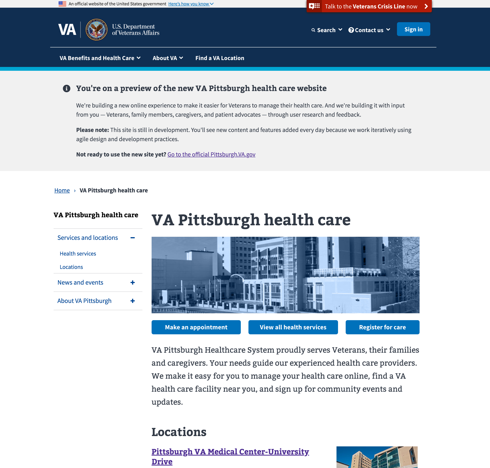
[New local navigation design]

### Problem statement

**Veteran users of VA.gov should be able to navigate to their desired content or functionality without the need to navigate deep (2 levels or more) within one section of the site to understand its contents.** The sub pages within a section — also known as the page’s “children” — provide additional context that helps a Veteran way find to the right information or services. By introducing a new design for local navigation that exposes these children, it may provide valuable additional context without requiring a user to leave the parent page.  

The current local navigation design displays

* Children pages (one level) when children pages are present
* Sibling and parent pages when children pages are not present

[Existing local navigation design examples]
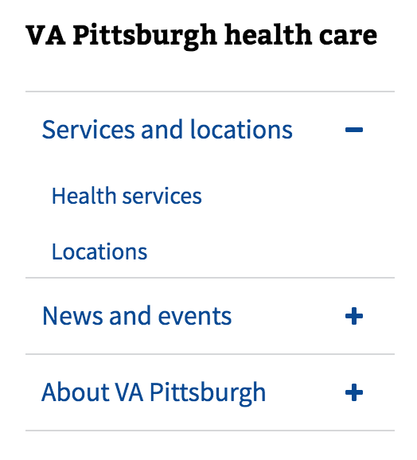
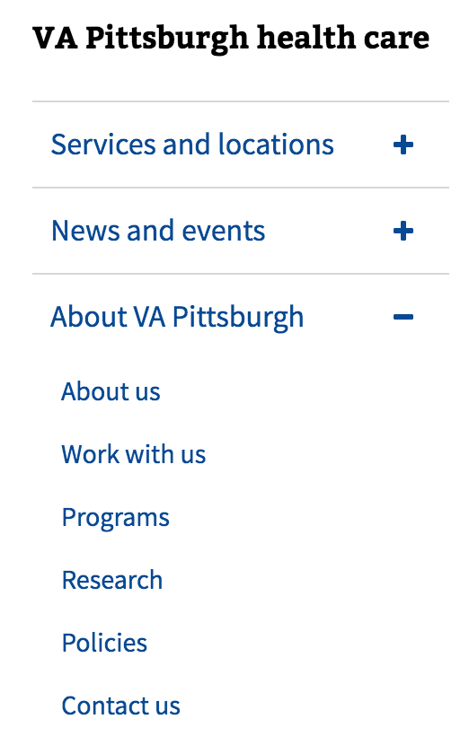
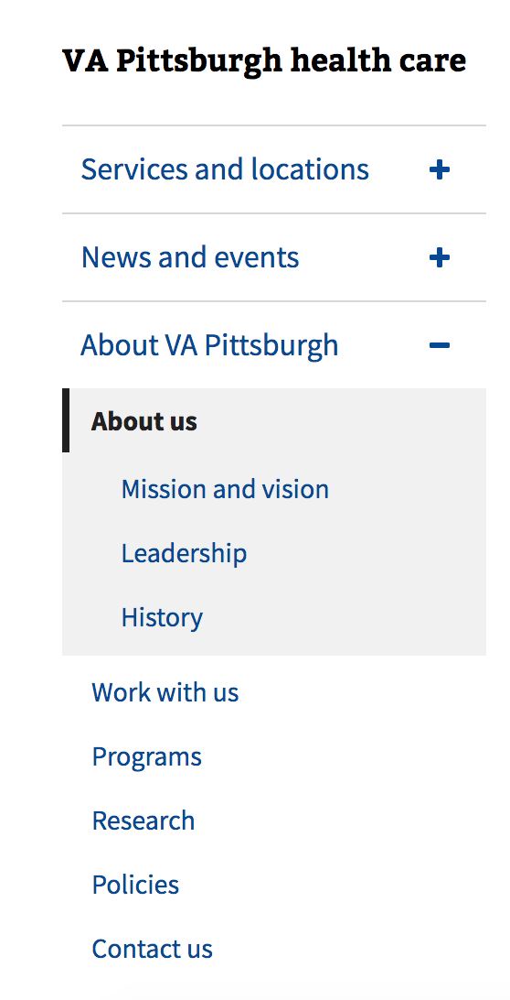
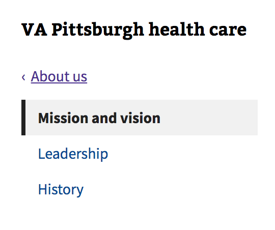

This research sought to answer two larger questions, with many related sub-questions:

1. Is the new local navigation design more effective at facilitating user navigation than the current navigation design?
	* Do users currently have a hard time finding content in subsections on VA.gov?
	* Does this approach to the design make it easier to find content in subsections on VA.gov?
2. Does the user sufficiently understand the new navigation design to interact with it the way the designer intended?
	* Do users of this design understand how to browse the children of a section without navigating to that section?
	* Do users of VA.gov use the local navigation element as a method ascertaining where they are in the information architecture of VA.gov?
	* Does the new design do a good job of helping users of the design ascertain where they are in the information architecture of VA.gov?

Hypotheses include the following: 

* Users of the current local navigation design can not easily find content deeper within the site without engaging in “pogo-sticking” behavior, meaning they will click into a third level (or deeper) and then click back out if it’s not what they were looking for.
* Users of the current local navigation design cannot make deep lateral moves across parent level sections easily.
* Users of the redesigned local navigation will find this design helpful in browsing a subsection of a site without going to that subsection and reading the page (engaging in “pogo-sticking” behavior).
* Users of the redesigned local navigation will make deep lateral moves across parent-level sections without using the back button or breadcrumbs.
* Users of the redesigned local navigation will (or will not) understand how to interact with the navigation elements for “parents,” which in this design has the parent replicated as a “child” heading beneath the parent upon expansion.

### Methodology
A brief ethnographic interview was combined with remote moderated usability observation. The usability observation had two stages: a first stage that was lightly moderated and customized for that user based on their ethnographic interview responses, and a second stage that was moderated where all test subjects followed the same task sequence.

The ethnographic interview helped identify content on the site that the user was likely to seek. The first stage of the usability observation used tasks identified through that ethnographic interview that were important to the user. The moderator did not guide the user beyond the initial task framing. The second stage consisted of three to five information seeking tasks that required deep navigation and parent-section-to-parent-section lateral movement.

This method allowed us to address the two primary questions this research: whether or not the new approach was more effective than the current approach, and whether or not users of VA.gov fully understand the design of the new approach.

The current site was tested to establish a baseline of behaviors, and a live prototype of the site currently in the staging environment to test the new design. Current: [https://www.va.gov/pittsburgh-health-care](https://www.va.gov/pittsburgh-health-care) Prototype of new design: [https://staging.va.gov/pittsburgh-health-care](https://staging.va.gov/pittsburgh-health-care) 

### About the participants
Veterans that have used a Pittsburgh VAMC before were recruited to ensure familiarity with the content. There were a total of five participants. Geographically they were all located within or near Western Pennsylvania

One of the four users was observed using the current site to establish baseline behaviors for comparison, while the other four users were observed using the staging site with the new local navigation design. 

Veteran ages ranged from 25 to 74. There was a two Veterans who identified as female, and three who identified as male. 

### Research limitations

#### Number of participants
Four or more participants are sufficient to detect patterns that indicate evidence of usability issues. However, different kinds of users behave differently. For example, older and/or less computer savvy users tend to double click their mouse more often than other users. The users in this study represented a range of ages and computer ability, but it is possible that certain subsets of users, particularly older Veterans, might encounter unique challenges with this design that would be discovered from further research. For this reason, findings are separated into two categories: common issues and observed issues. Common issues definitely merit improvement via further design or development efforts. Observed issues are issues that may correlate with certain user types, and weren’t observed in all users, but may be significant enough to merit improvement based on the judgement of the designers, or further research with a specifically recruited subset of users, such as older Veterans. 

#### Methodological limitations
Usability research is not a method that is effective at assessing what knowledge a group of people have (e.g. “Do Veterans know how what health care services are and are not available at our Pittsburgh VAMC?”) In this study, we’ve noted where certain topics and insights would be worth further research via the appropriate method, such as empathy interviews or surveys.

## General navigation behaviors
The success of failure of a site navigation element’s design should be considered in the context of common web navigation behaviors. No user will depend on any single element for navigation, nor should they. Successful designs combine different approaches to minimize user effort and at the same time accommodate common web navigation behaviors such as 
* Frequent use of the back button.
User quote: “Most people intuitively hit the back button (to navigate through a site).”
* “Pogo-sticking” behavior (users will click into a third level (or deeper) page and then back out if it’s not what they were looking for)
* “Satisficing” (combination of satisfy and suffice: users will choose links that are the most easily found on the page with closest possible wording to what they are looking for, as opposed to seeking an exact match )
* Scanning of page content before moving to a new page
* Expecting a full breakout of the site’s navigation to be found in the footer as a fallback

## Findings
### Findings by Hypothesis
* Users of the current local navigation design can not easily find content deeper within the site without engaging in “pogo-sticking” behavior, meaning they will click into a third level (or deeper) and then click back out if it’s not what they were looking for.
	* Finding: True
When asked to find content, users of the existing site navigation element would make a “best guess” given the elements in the left navigation. The only way they could confirm their guess was by going to the page in question. 
* Users of the current local navigation design cannot make deep lateral moves across parent level sections easily.
	* Finding: Partially true
Although the new element provides more options for lateral, or “child to child” navigation, the back button and breadcrumbs were more commonly used to move within a section than the local navigation element. 
* Users of the redesigned local navigation will find this design helpful in browsing a subsection of a site without going to that subsection and reading the page (engaging in “pogo-sticking” behavior).
	* Finding: True
Users of the new site navigation element would scan the left menu after expanding a subsection to inform navigation decisions.
* Users of the redesigned local navigation will make deep lateral moves across parent-level sections without using the back button or breadcrumbs.
	* Finding: Partially false
Users did not make these types of moves in this study, and frequently used the back button and breadcrumbs to move throughout the site. 
* Users of the redesigned local navigation will (or will not) understand how to interact with the navigation elements for “parents,” which in this design has the parent replicated as a “child” heading beneath the parent upon expansion.
	* Finding: False
Users were confused by the difference in behavior between the “carat” button indicating children and clicking on the label itself. Users expressed confusion or made false assumptions about parent child relationships based on the design of the page. 

### Observed benefits of the new design vs. the previous design
* Some users were not cognizant of changes in the left navigation element until they tried to use it, then expressed frustration at it being different. Upon comparing the new design to the old design, they said that “This (the new design) is a little more user friendly.” 

[Previous local navigation design]

[New local navigation design]
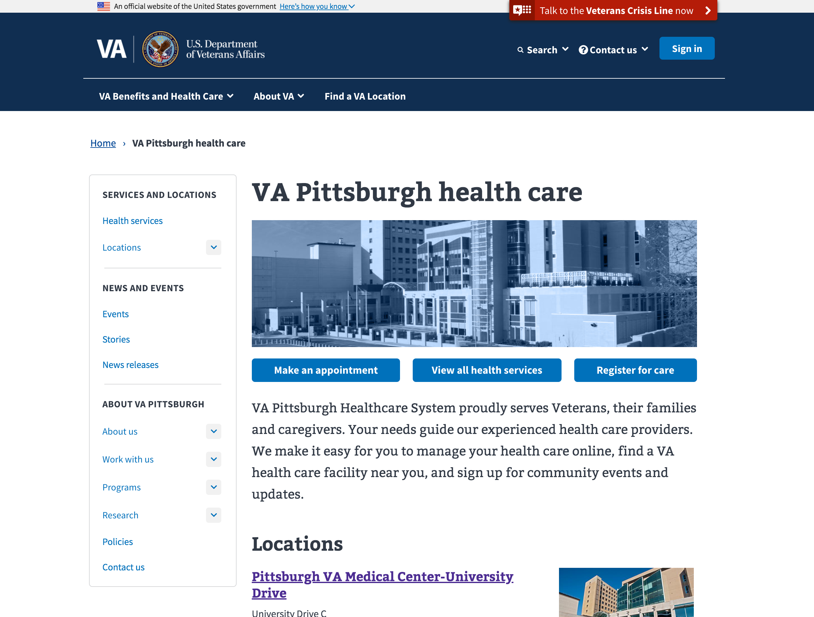

* The new design has increased support for “satisficing” behaviors. Lateral movement across the site using the new design element was observed in multiple users, without the user being led through any specific click path. 

[Work with us/volunteering example]
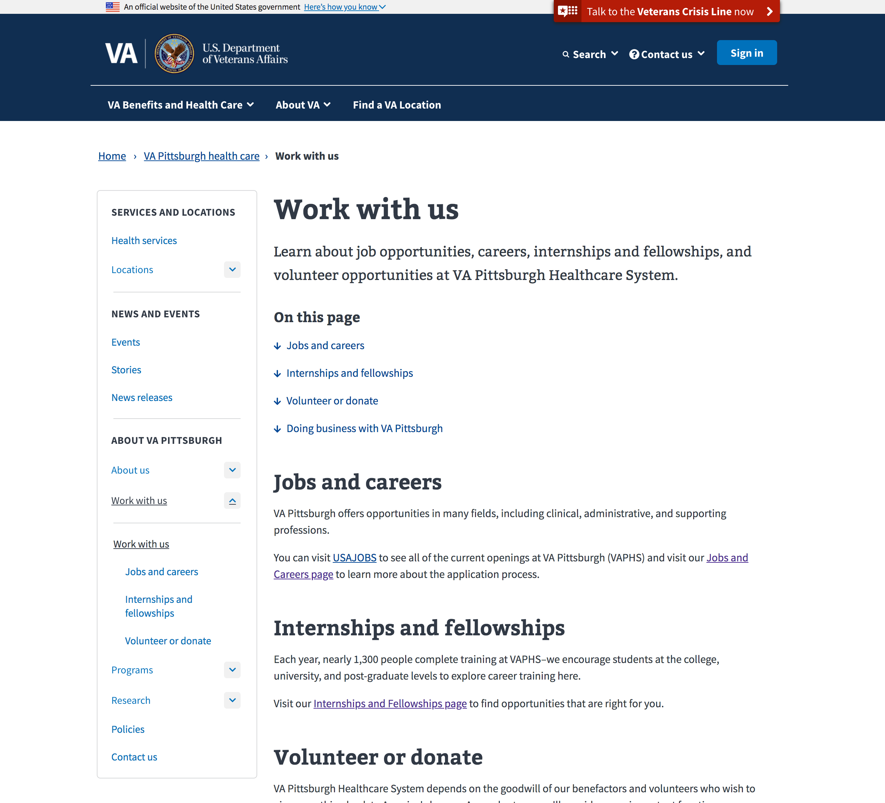
Caption: When asked to learn about volunteering, and then to explore paid work opportunities, users navigated from one place to the other using the navigation without backing out of the page to a higher level parent page. 

* Users were observed moving across deeper levels of the site without relying on or needing any left hand navigation at all, relying on breadcrumbs when the new element is removed. 

[Example of navigation removed]

Caption: Navigation is removed for pages that are designated not to exist in the navigation, such as fourth level pages like news releases and events. 

Part of the navigation redesign is the logic that pages may exist in the information architecture of the site but not be included in the navigation. The reasoning behind this is to support usability: in a case like news releases, which can be dozens and dozens of items, having those items exist in the left hand navigation can be unwieldy, and at the depth of a specific news release, the user’s goal is to read the release, and not to navigate quickly to another page. 

### Common Usability Issues
Common usability issues are problems with using the design observed with two or more users (in multiple occurrences). These behaviors constitutes an observed and likely pattern. It is strongly recommended that these issues be addressed with design revisions or improvements in functionality. 

* The levels of hierarchy and ownership of pages were unclear to multiple users, with users mistakenly assuming sibling level pages were actually child level pages of open navigation menus.
Users were observed assuming that “Policies,” a sibling page to “Research,” was a sub page of research, thinking that they could click on “Policies to get to “Research Policies” because it followed the “Research” item in the navigation sequentially. Based on this behavior, it is possible that they did not realize page parent_child relationships, and_or did not observe the presence of “Policies” before expanding the “Research” item. 

Related to this issue are usability issues around clicking on a top-level parent item to expand a menu, as opposed to taking a user to a page. Users would think they were already on a page, and observe items beneath the expanded menu, assuming all subsequent items were children. 

[“Research” “Policies” example]

* Breadcrumbs are rendered inconsistently, with the “Home” link displaying and disappearing throughout different levels of the Pittsburgh VAMC pages. 
This should be corrected before launching the new local navigation design. Successfully using the design of the new local navigation requires understanding the meaning of the breadcrumbs, especially the “Home” breadcrumb, if it’s present, as together they provide clarity on where a user is located in the site. Nearly all users were observed clicking on “Home” expecting to go to the Pittsburgh VAMC home page, as opposed to the VA home page. 

[Home disappears from the breadcrumbs without reason]
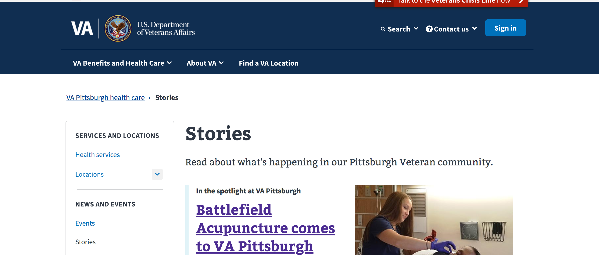
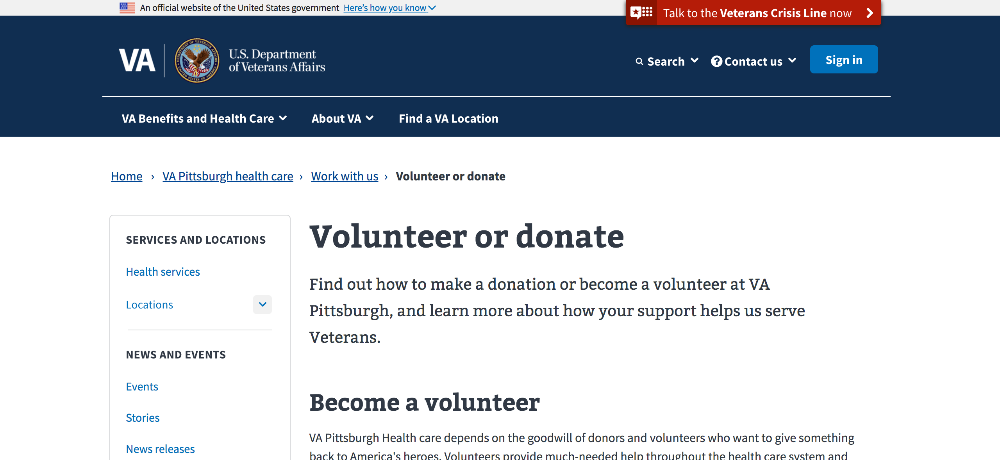

* Breadcrumbs and primary or “site-wide” navigation elements were confused when the “Home” breadcrumb is removed. 
One of the overall navigation improvements of the Pittsburgh VAMC site was the removal of the “Home” breadcrumb for users of this section of the site. When it was removed, the first item in the navigation was “VA Pittsburgh Health Care,” and it was immediately underneath the “VA Benefits and Health Care” item in the primary navigation. Users were observed clicking on one item (the site wide navigation) when they intended to click on the other (the top level breadcrumb). This created confusion when instead of the user being returned to the Pittsburgh VAMC home page, the mega-menu was revealed. 

[Navigation confusion example]

### Observed Issues
Observed issues are usability problems that were observed for enough users that it may constitute a pattern. It is recommended that either these issues be addressed with design revisions or improvements in functionality, or further research be preformed to confirm that these issues are common among enough users to constitute a pattern.
* Users did not detect a change when opening and/or closing menus. 
Some of the users observed engaged in behavior that indicated they did not realize that the menus had changed when the clicked on either a parent item, or the downward carat to open the menu. This was evidenced by behaviors such as 
	* Not scrolling down the page to browse the menu after it was revealed beyond the scroll point/bottom of the window. 
	* Repeatedly clicking on a parent menu item, then expressing confusion why they hadn’t gone to the the page in question (without realizing a menu was opening and closing) 
	* If the menu is open, I observed people closing the menu thinking it was a link
* Related to the previous issue of a detectable change in state, double clicking on this menu design creates confusion for users who are likely to double click. 
Older users tend to either double click by default, or double click when they believe they aren’t getting what they want from a single click. Double clicking on parent items in this menu design does essentially nothing by opening and closing the menu. 

### Other observed issues outside of the scope of this testing
* Information architecture was confusing for some users when they clicked on  “See all Events.”
On event detail pages, there is a link to “See all events.” However prior to that page, there is an ability to change between upcoming events and past events. Users who had clicked on “Past events,” and then gone into an event detail, expressed confusion when they clicked on “See all events,” and were returned to “Upcoming events.” 

[IA confusion example around Events]
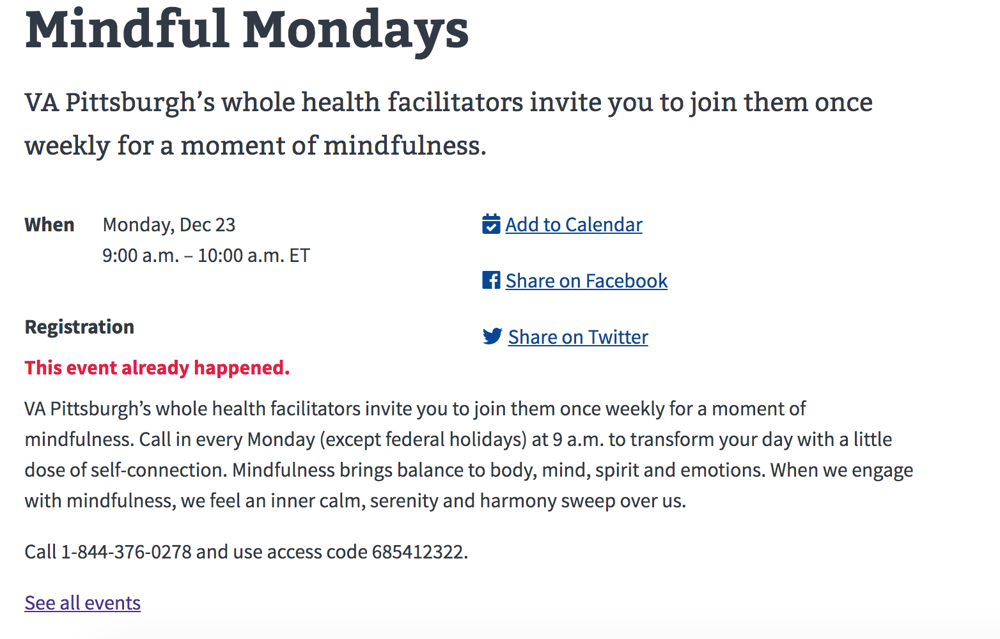
Caption: The “See all events” goes to “Upcoming events” when the user has already filtered on “Past events.” 

* When certain items are not in the left hand navigation, it can be confusing and feel arbitrary. 
Events, Stories and News releases are not listed in the left hand navigation because the number of them would make the navigation’s size become unwieldy. However it seems as though other pages can be found which exist in the navigation, but don’t show up in the local navigation, and this was confusing to some users. This issues seems specific to specialized content, such as reports. 

[IA confusion example around pages missing from local navigation]
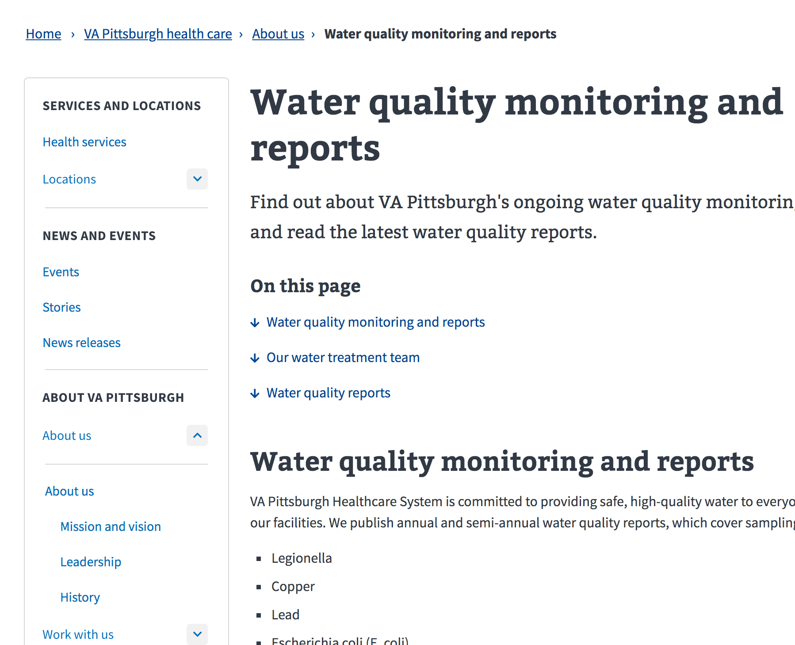
Caption: The user expressed confusion at seeing this report on Water quality monitoring in the breadcrumbs under “About us,” but not in the local navigation. 

## Recommendations
### Common issues
*  The levels of hierarchy and ownership of pages are unclear.
	* Recommenation: Create a more discernible difference between levels in the hierarchy. Design clearer containment of a group of child items, and more clearly distinguish a menu’s open state from the rest of the menu. 
* Breadcrumbs display inconsistently throughout the staging site, with the “Home” breadcrumb appearing and disappearing. 
	* This is a bug, it needs to be fixed, however there are two possible recommendations:  
		* Option 1: Find and remove all occurrences of the “Home” breadcrumb across VAMC sites, such as the Pittsburgh pages. 
		* Option 2: Change the “Home” breadcrumb label to something more accurate or descriptive, such as the following options (should be reviewed by IA and content team for final recommendation):  
			VA.gov > VAMC Pittsburgh > 
                        Veterans Affairs > Pittsburgh Medical Centers > 
			VA > Pittsburgh Medical Home > 
* Breadcrumbs and primary or “site-wide” navigation elements were confused when the “Home” breadcrumb is removed. 
	* Recommendations 
		* Consider more closely integrating breadcrumbs with the page title by moving it above the title, and left aligning it within the title’s container column, moving the local navigation up vertically to fill it’s space. 
		* Be cautious about labelling issues by being sure that the labels used in breadcrumbs can be clearly distinguished from nearby global navigation labels.  
### Observed issues
* Users did not detect a change when opening and/or closing menus. 
	* Recommendations
		* Reset (and animate movement) the page scroll setting to be sure to display anything that has been revealed. 
		* Animate the opening and closing processes for a menu. 
* Double clicking on this menu design creates confusion for users who are likely to double click. 
	* Recommendation: Use javascript to detect a double-click, and treat it as a single click. Combined with a revision to the opening and closing animation and scroll setting, this should address this issue. 
### Other issues
* Information architecture was confusing for some users when they clicked on  “See all events.”
	* Recommendation: if a user is browsing past events, “See all events” should take them back to the listing of all past events, not upcoming events. 
* When certain items are not in the left hand navigation, it can be confusing and feel arbitrary. 
	* Recommendation: display all third level pages in the local navigation except when they are chronologically listed items, such as Events, Stories, or News releases. There is no good reason to hide random pages from navigation that is already hidden by default. 

