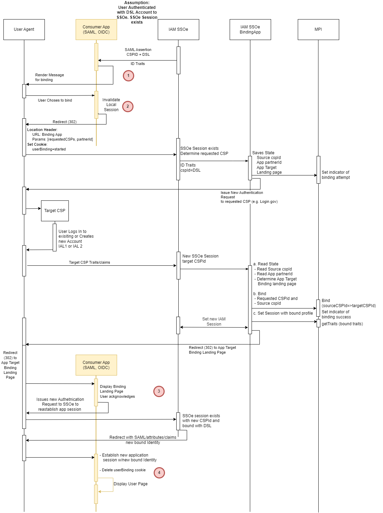
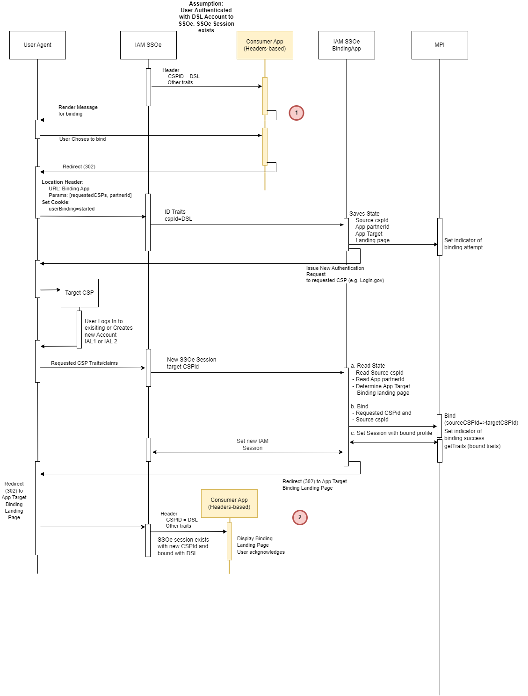

# Legacy CSP deferred identity proofing - Binding of the DSL Accounts to Login.gov or Id.me accounts

## Summary
This solution will enable veterans who have existing DS Logon LOA2 user accounts to set up a Login.gov account without needing to proof or send account data.

## Description
The Office of the CTO  is in process of designing a deferred identity proofing flow to streamline the migration of users from DS Logon to Login.gov. This step will support subsequent removal of DS Logon as a sign-in option for VA.gov, MHV and eBenefits. Deferred identity proofing is meant as the creation of a IAL1 Login.gov account and binding it to an existing LOA2 DS Logon account, and whereby users are provided the same access with the Login.gov account as they have with their DS Logon account.  In other words, the bound Login.gov account would maintain existing permissions at VA, but outside of VA be an IAL1 account that would require identity proofing. The goal is that users will eventually identity proof at a later time to upgrade their Login.gov account to IAL2.
Note: This pathway assumes we would not have identity data from DoD to share with Login.gov that could help with ‘inherited proofing’ of existing accounts. 

Specifically, we are requesting support from IAM with:
 - a flow for users with existing DS Logon LOA2 user accounts to set up a Login.gov account without needing to proof or send account data.
 - binding the DS Logon LOA2 account with a Login.gov IAL1 account and exposing the full trait set associated with the DS Logon account to partner applications when users log in with a deferred identity proofing/bound Login.gov IAL1 account.
 - supporting these accounts if/when users subsequently identity proof and they become an IAL2 account.

## Design
The consumer applications rely on IAM SSOe extended capabilities to bind existing user DS Logon account to a more modern and feature rich Login.gov or ID.me account. The consumer applications must be extended to accommodate the new binding flow. This includes extending user interactions with an application, additional user interface changes and additional redirects that are required to accommodate this flow.
The flow initiation trigger is the user who is authenticated into SSOe with a DS Logon account. The IAM SSOe communicates this information to the application via SAML traits (in case of reassertion partners, like VA.gov) or Identity Headers (in case of header-based integrated applications, like eBenefits or MHV). Depending on the integration patterns, the flow and user interaction will change slightly. SSOe will communicate the set of traits/headers that are needed by the applications to make the binding decision.  
The application reads the returned SSOe traits/headers, primarily CSP Method (va_eauth_csp_method) and use the value to determine that a user is authenticated with DS Logon account. 
The application must keep the state (e.g. use a cookie), once the user chooses to Bind the account. This allows the application to know that the binding has started and if needed restart the process or at least audit the intent in case the flow interrupted due to errors or issues in the middle of the binding process.
The application must be aware of the IAM SSOe published binding APIs endpoints and ensure that the required parameters are communicated to the binding app, so that latter can execute required logic.  

Figure 1. Applications integrated via reassertion pattern

## Design: Reassertion Pattern

Applications integrated with IAM SSOe via SAML 2.0 protocol, are considered reassertion partners. In this flow, the applications receive the identity traits via IAM issued SAML Assertion and this flow follows the standard SAML 2.0 Protocol – Figure 1.
Once the user authenticates into SSOe with DS Logon account, the application displays a message to the user recommending the binding (1). If the user accepts the binding, the application invalidates the local session and redirects the user to binding API endpoint provided by IAM SSOe team (2).
The IAM SSOe Binding API protocol is to be determined, but for the purpose of this design, let’s assume that it requires a minimum of a list of requested CSP(s) the user is allowed to bind the DS Logon account    to. In addition, the Binding API may need to know a partner’s identification (e.g. requesting application id, SAML entity id, etc…) – this will be finalized at the time of IAM SSOe Binding API design and implementation. The thinking behind the above assumption is the following:
 - Requested CSP – this parameter may be needed for the Binding API to limit the options to only CSPs that the application determines as viable for the purpose of binding. E.g. an application may request Binding API to allow the binding to Login.gov, or ID.me, or to allow both.

 - Partner ID – this parameter is needed to determine the application’s metadata, e.g. return URL, binding policies, etc. As Binding API design matures, this value may be made more secure or obfuscated by other means

The details of the binding are irrelevant to the consumer applications; however, it is important to understand how the result of the binding process impacts the consumer application. During the binding process the SSOe DS Logon session gets replaced with requested CSPs based session, and the new user account gets bound with the source DS Logon profile. This successfully creates the binding between source DS Logon and for example, Login.gov account. The values of IAL are determined based on several factors, like how the account was created (IAL1 or IAL2), what level of LOA was the source DS Logon profile, there are other important policies that impact this process and are managed by IAM team.
Once the binding complete, the Binding APIs will redirect the user to pre-defined Post binding application landing page (3), where user acknowledges the completion of the binding. 
At this point, the consumer application requires to reestablish the local session, which was invalidated at the beginning of the binding process. To do this, the reassertion consumer application must initiate the SAML Authentication flow with IAM SSOe. During the binding process, the SSOe has established a valid session with new CSP. As a result, the SSOe SAML posts the SAML Assertion with new bound traits to reassertion application and it establishes the new local session with new traits. The SSOe SAML will contain the attributes (TBD) to indicate the status of the binding (if ever attempted), CSP ID, bound accounts/profiles.

Figure 2. Applications integrated via header-based pattern

## Design: Header-based Pattern 

Applications integrated with IAM SSOe via IAM reverse proxy, are considered header-based applications. In this flow, the applications receive the identity traits via IAM generated server-side HTTP headers – Figure 2.

Once the user authenticates into SSOe with DS Logon account, the application displays a message to the user recommending the binding (1). If the user accepts the binding, the application redirects the user to binding API endpoint provided by IAM SSOe team.

The IAM SSOe Binding API protocol is to be determined, but for the purpose of this design, let’s assume that it requires a minimum of a list of requested CSP(s) the user is allowed to bind the DS Logon account    to. In addition, the Binding API may need to know a partner’s identification (e.g. requesting application id, etc…) – this will be finalized at the time of IAM SSOe Binding API design and implementation. The thinking behind the above assumption is the following:
 - Requested CSP – this parameter may be needed for the Binding API to limit the options to only CSPs that the application determines as viable for the purpose of binding. E.g. an application may request Binding API to allow the binding to Login.gov, or ID.me, or to allow both.

 - Partner ID – this parameter is needed to determine the application’s metadata, e.g. return URL, binding policies, etc. As Binding API design matures, this value may be made more secure or obfuscated by other means

The details of the binding are irrelevant to the consumer applications; however, it is important to understand how the result of the binding process impacts the consumer application. During the binding process the SSOe DS Logon session gets replaced with requested CSPs based session, and the new user account gets bound with the source DS Logon profile. This successfully creates the binding between source DS Logon and for example, Login.gov account. The values of IAL are determined based on several factors, like how the account was created (IAL1 or IAL2), what level of LOA was the source DS Logon profile, there are other important policies that impact this process and are managed by IAM team.
Once the binding complete, the Binding APIs will redirect the user to pre-defined Post binding application landing page (3), where user acknowledges the completion of the binding. Because the application is protected by IAM SSOe reverse proxy, the new CSP user traits combined with source DSL profile traits are sent to the application via HTTP Headers. The SSOe HTTP Headers will contain the attributes (TBD) to indicate the status of the binding (if ever attempted), CSP ID, bound accounts/profiles, etc …

## Error Handling:

Given the complexity of the binding process, especially on the IAM side, there are several ways where the flow may break in the middle of the flow and fail to complete the binding.
Special care must be taken tracking the binding flow.
 - Figure out the break at the CSP, e.g. error creating the account
 - Figure out the break between CSP and IAM SSOe. For example, time taken by the user to complete Login.gov registration exceeds the IAM SSOe inactivity timeout, and by the time the new account is created, the DS Logon session expires and IAM SSOe can’t trace back source account for binding
 - Figure out handling of the errors in the binding application, e.g. it crashes failing to complete the binding
 - Figure out auditing and logging
 - Addition of traits required for the consumer application to determine the binding context
 - We need to determine the process of restarting the process in a user friendly way.

TODO: THINK THROUGH THE BREAKS IN THE FLOW
