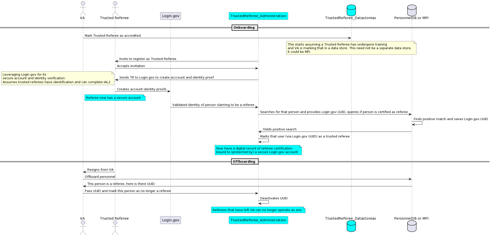
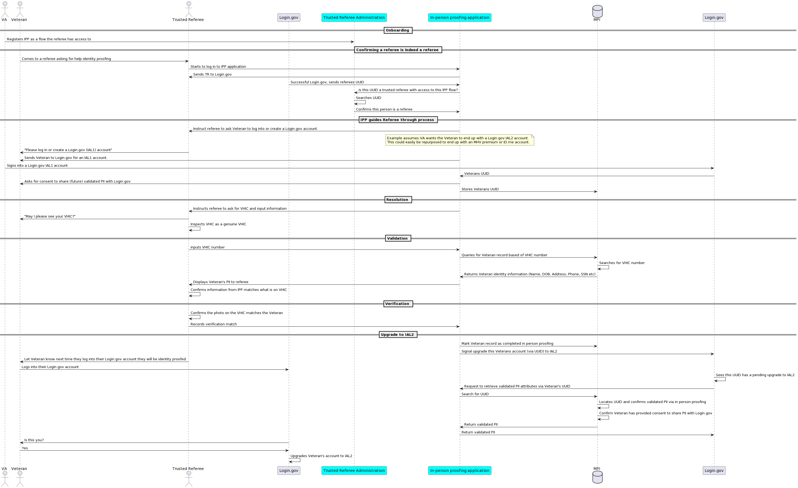

# Product brief: In-Person Proofing

## **Problem statement**

VA has prioritized investment in adoption of Login.gov (as well as continuing support for id.me). While these credential providers offer a shared service, allowing access to VA and other government agencies via a single account, they have the following issues:

* They rely primarily on remote identity verification.  Many folks are uncomfortable, unfamiliar with online services.
* Remote identity verification proofing rates are low given the number of controls required as part of NIST 800-63-3.
    * Of the applicants that tried to submit documentation, only ~55% successfully completed the process.
    * Further, ~20% of applicants abandon the process without even attempting.
* They offer in person support as a backup, not a primary method of identity proofing.
* They have limited capacity to implement and launch any dependencies that VA may have on them.

While NIST guidance provides for in person proofing, it does not provide as much guidance compared to remote proofing. It provides the flexibility and puts the onus on the identity verifier to establish those processes. VA has much more intimacy with Veterans and their community compared to Login.gov and id.me who are targeting the entire US population. VA also has access to information that facilitates identity proofing for Veterans.

**How might we leverage VA’s intimacy with Veterans to provide simple, secure, and privacy preserving in person verification (and support) for Veterans (and their community)?**

## **Guiding principles**

When considering various approaches or solutions, the VA identity teams should keep in mind the following guiding principles. If there is one common thread to these principles it is: **everyone has identity, not everyone has identification.**

### **Prioritizing identity over a standard**

NIST 800-63 is a document NIST has published providing guidelines for authentication, identity verification and federation. While they have been titled guidelines, they have de facto become specifications that have agency authorizing officials use to authorize services going to production.

However, regardless of whether 800-63 are guidelines or specifications, meeting a specification is not the primary mission of our service.** Our mission is to enable simple, secure digital identity assurance for Veterans so they can access services they are entitled to.**

When we prioritize meeting 800-63, we narrow our lens to strict guidelines; and may sacrifice access for those that struggle to meet the normative guidance in 800-63. 

When we prioritize digital identity assurance for Veterans, we strive to leave no Veteran behind. This does not mean we disregard 800-63-3; it does mean that we exercise more of the exception scenarios (compensating controls etc) that are afforded in the 800-63 guidance. This is likely a longer path from a policy perspective, but one we should be willing to take.

### **Identity in the context of community**

The normative guidance in 800-63 assumes availability / ready access to government identification and access to authoritative sources to validate information on government identification. Yet, if we come back to the primary principle of “everyone has identity, not everyone has identification”, one can see how the normative guidance contains gaps.

So, again, we ask ourselves: how might we not leave any Veteran behind?

Identity is a concept that only has significance within the context of a community[^1]. Without community, an individual’s identity is meaningless. Government identification such as passports or driver’s licenses are a testament of an individual’s identity within the context of that community; in the above cases, the community is a country or state. A person can literally have a different identity based on the community they are in. The concept of name changes is one example. An individual can change their name with SSA, but omit changing it within their state.

Further, government identification is not identity itself. **We readily accept government identification** **as a proxy for identity, because we readily accept and recognize the community (country, state) that has issued the document**.

How might we leverage these philosophical insights towards actionable benefits for Veterans and their communities?

Let us consider what communities Veterans belong to. For example, a medical provider that has frequent interactions with a Veteran as they treat them for a chronic condition? Or a counselor working with homeless Veterans? These folks can act as trusted representatives of the VA (trusted referees, in NIST parlance) that can assert this Veteran’s identity. They can do this, even absent government identification because they are asserting their identity via a different community than the government.

“But how can we rely on these trusted referees to be 100% sure of the Veteran’s name?”  Let’s ask ourselves two questions:

1. What is more important, knowing their name, or knowing that this individual has a demonstrated track record of encounters with the trusted referee who can attest they are not some actor in a foreign country?
2. What is harder to do for a bad actor looking to defraud the VA? Forge a government ID or an established record of human interaction with a trusted referee?

There is no 100% solution to ensure no fraud takes place. When we let go of the notion that possessing a government ID is fraud proof and consider both the risk of fraud and denying legitimate Veterans access to services, we see the value of identity assertion by other communities.

### **Differentiating between identity verification and an identity credential**

When evaluating paths for in-person identity verification (and support) it is important to distinguish between identity verification and an identity credential.

Identity verification is an interaction in time where a user’s identity is verified, but it is not lasting until that verified information is bound to an identity credential.

The identity credential is what enables that information to be reused, shared with downstream systems.

Login.gov, id.me are identity credentials that offer identity verification paths such as USPS in person proofing or supervised remote verification.

This distinction will become important as we map out the various migration paths for the VA identity credentials.

## **Vision**

### **Enabling a platform over standalone flows**

With those guiding principles in mind, it becomes evident that in person proofing (and support) is much more than a single flow, it’s several.

The most straightforward is a flow that performs, in person, the normative guidance in 800-63 of identity resolution, validation and verification. Doing so in person has the added advantage of providing a human touch (and thus comfort) for Veterans that struggle to do so remotely. It also has the added benefit that the trusted referee need not have a long established relationship with the Veteran trying to assert their identity.

On the other side of the spectrum is leveraging in-person proofing (trusted referees) to ensure Veterans that struggle to meet the normative guidance (ex. Lack of an ID to meet identity resolution, limited authoritative records) have a path to completing identity verification and putting them closer in their journey to secure services from VA.

There are multiple other flows in between (the flows vary for a counselor vs. MHV coordinator, vs TAP coordinator vs. medical professional. However if we zoom out, and see in-person proofing as a **framework (or platform), over a single path, **we see how we can build towards this greater vision.

The framework would need to provide for administration of trusted referees such as initial certification (onboarding), keeping current (training), and offboarding. This framework could then map the trusted referee to the appropriate flow(s) they are accredited to use. Of course there’s also administration of the individual flows themselves; managing updates to flows as additional capabilities are implemented (ex. Supporting a new identification type).

### **Standalone process as well as a complement / fallback**

Now that we have this framework in mind, we can see how we can leverage that to provide modular flows for in-person proofing. We can have flows that encompass the full normative controls (or equivalent) so a Veteran can start from nothing to a fully verified identity. 

Conversely, we can have in-person proofing complete specific steps/controls that could be bolted onto other processes or credentials enabling those to “step up” in levels of assurance. For example, a trusted referee inspects a VHIC card and confirms it as genuine, after (or before) a Login.gov experience that validates the information on the VHIC card against authoritative sources. Conversely, Login.gov could authenticate the document as genuine, but VA provides validation of the information on the card.

### **A path for all, regardless of starting point (credential)**

Closely related to modularity of flows is being able to connect those flows to any starting point (or credential). Certain modules could be applied both to a grandfathered DS-Logon credential or an MHV premium account (that had not yet gone through in-person proofing so couldn’t be inherited). 

The most beneficial outcome of the ability to connect those flows (modules) to any starting point is it results in ensuring that there is a path for all Veterans to get from wherever they are in terms of identity credentials, towards a Login.gov IAL2 account. This flow management and modularization allows VA to reuse flows (or modules) over needing one for each starting point. This minimizes the variance in experiences for Veterans as well as maintenance costs for VA.

### **Iterate over time**

Identity is continually fluctuating. We only need to look at differences between 800-63. Rev 2 used Levels of Assurance (LOA). Rev 3 broke assurance down into Authentication, Identity, and Federation Assurance levels. Rev 3 also strongly opined on use of remote biometric, whereas Rev 4 creates more space for equity and access considerations.

With so much change, in person proofing should account for iterations over time. Whether through the use of graduated accreditations for trusted referees, version controlling flows/modules, ensuring auditable records of credentials (what version of flow was used?); the in person proofing framework should keep those in mind.

## **Breaking it down**

This vision sounds fine and dandy, but it also sounds like a lot. Given that **delivery is the strategy, how might we take this lofty (and lengthy) vision and break it down into shippable increments?**

### **MVP of trusted referee administration**

This increment is meant to kick-off perhaps the piece that is least present in the current VA.gov identity portfolio. To date, the identity portfolio supports, buys services that deal mostly with credentialing the user (the Veteran). There is little (that our team has seen) that provides the ability to manage personnel that can attest, aid, Veterans in managing sensitive information such as identity.

Creating an MVP of a trusted referee administration will establish the fundamental plumbing to support the first in-person proofing flow, but can act as a launchpad for additional support for Veterans.

So how might we approach this MVP?

* An application where users are:
    * Asked to assert their identity with Login.gov (i.e. a new SP connected to Login.gov)
        * This ensures trusted referees’ identities are established and there’s strong authentication for these folks when they are acting as trusted referees during in-person proofing.
        * For purposes of this brief, Login.gov was used as the identity verification and authentication service. Other credential providers that offer AAL2 and IAL2 could be used as well. 
    * Basic access (active/inactive) is provisioned
        * This could be as simple as querying a parameter on VA’s personnel database (trusted referee Y/N)
* The future in-person flows can now use this application to ensure that only trusted referees are asserting identity for a Veteran.

Below is a depiction of a potential interaction. 

If unable to zoom into this image, an online version is available on the [plantUML server](https://www.plantuml.com/plantuml/png/PLJ1Rkis4BppAnRf9G5I7teiu29kZHO6d3P8am0z5Mjg9HELI8UaNEJltt0ZHtpo9P59pkpEp98FANFCuz0RjZb4UjiG9_oTVjwyn35bQUXPMeaYDsNtvTcS07BMdTXdseVE-LKNpcLl_yTtUnDyGl-xQGRdNSgHimk-dDSL-e7VHpODPpvmaYLgY_M4ReHJWMn_NPw_UPAOWlVIOmzTFpxjj57yDsQzfh_y8N1idEzelJQG-EClXULdUkJu7oqa5Y1R6wLnM3N6XomKpX81CIz7bqWjAwsaSIYSV4Ln1CVe6ubTy4AGwtmvQDWtnM5m3AXSblAHCpaFZgA6LEQAj8mNCA8w7OIm8_2LirJdxicuJ3QCVLFEGEtAY5UC6AFEGYdYWjATFpk0Sw0e7HA074xBlWsE0g18O3RMoWb2NS5gOWlIlr4jbSySgYd03xXNMeMDwCvdAhfT8pwx_46d648x-TfBcyrUu2u3tbKiBN9qA6wIs34grpKLSAvrLdjRcKq9H1BbILNyL9KGnracqEMqybZsi6yuzO9MTflzJvLzQWN66J9_KpNfqi92IQf71AZFsPmS1Td_EWrC2nrLAHIfN7_ZtY5ZgMI6bauwuMHxTZfpEUXON3JEmM0AD1cEzYX9RTGPKmALNTe-WpjLRh--xhRtz3x2JwoxhtekaPLOR4C_dBxAeSfSx7TNnk0KaiiEHW-SxL4B9JvVLL5e9VSV9tsDJjhvh4S_fgkQFgMC2KxVdXqlgE_qwYxZh-EfNvi_DHbKP6fSvpBtGDWG6zXzmHRnyyoO0v9hYlMti32BBLKE7tTpk7C_KynpoleEjMtr44qZzhQ1kcT9hlE8AuO1AtYZPdilg2aJB_taeKBrhPZZcaVYdexuLvQoVgZvG5IUFd5AkgvfbIU9SiN62QrJ7tmdSUQzZcOhR96TtX6jSkruVIUc58ltUl-B3Ck-gXNG0DXA0y7BxE43liQX_mO0).

### **First flow - following normative guidance**

Again, perhaps the most straightforward in-person experience to build is one that follows the normative guidance of 800-63 (resolution, validation, verification)[^2]. With VA being an authoritative source for VHIC may be a strong candidate as a starting point. 

Note: VA is also an authoritative source for CAC, however the burden to support authenticating to the CAC via PIN and tracing the certificates back to the root PKI is a significant effort.

From a Veteran and Trusted referee perspective it would go as follows: 

* Resolution - Trusted referee authenticates document as genuine.
* Validation - 
    * Trusted referee “logs in” to in person proofing flow (which confirms this individual is indeed a trusted referee)
    * Trusted referee inputs PII from document
    * In person proofing flow “application” validates information against authoritative records (ex. MPI)
* Verification - Trusted referee performs verification (given they are in person)

How might we build out that flow? 

* Build out on top of trusted referee administration a bank that will keep record of flows. It will also keep an association of a flow and what trusted referees are able to log into those flows.
* Each flow will be its own “application”
* Interaction of this flow application and the administration app will look like: 
    * Veteran appears in person proofing
    * Trusted referee looks at an identity document (ex. VHIC)
    * Trusted referee logs into Flow application
        * Flow application looks up Trusted Referees access against the Administration application
    * Trusted referee 
        * Enters VHIC information into Flow application which validates it against authoritative source

Visually the flow looks like this:

If unable to zoom into this image, an online version is available on the [plantUML server.](https://www.plantuml.com/plantuml/png/RLPHR-Cs37xtho2wXxL0Ms1xBDRriklGCv3sihGri4VLOcAXjkIJgEJoxozKBCjg_HP9vCUFv4V6Nnm9Ixvh2r6JiL0juWyaj4A3S50DLsSlrZj22MlSe4KyuyUNTT4BIwfMlT04IxDL-dfhTlosVCZUFlh3GdPAAqTMa38wm8Kh-4tyy2BtBVLLZzOP3RqrPgFq5aJVjwfElkLgDNXAGU9DE8J7LLaKjxVmNRyPOILxtTuMHRM0gx-7M3UmngroX3OWC920JMlsG0s27QWsV5tNw1oG2P1VZTuesmKYevboeBH4b9Ex493ZlQpXvkZM8MDC38HxPvIDiT1WsuEIg4dHOSoqU5cpFxExWMTkM41epHQKvb-1Twf6mUSOy1crTFoJJEfEiNoO8FgGsCQtoU0I7Fj5ZWvUNylxY1iBLpgWHftUG00DxOrvxHKrgMZ1D4JaujuL0IIXCL5XwmO7kFGUICPo3n47AIYNoXYQmhPRhoIwKMJKMEEt3HUJcN0xilgKsf7rDOsqoN17uW2aGfC1Ow6sA0X1f59nYiPhkYwA9qC8PeUMYHJ__XHTtt9_dUUcLmlO2qsS0axXKKlmVIXNXbikbd-Eu52ySEB7Goi1XLFj0TvOdxstlN4eFo5fUFnMGM-nKxvZwkNzTOU9BHjhGrWCyghW1ivMBGg7KLhp-PuVYVrn4O7EOZMhKMmfj-J5ycPEx9iuX45CHeoWjjg5QcSnfsv5kexoY25pdJAZXNjt8NPjj4DDJCermYASRpnvYnUm4wsIWfMxAijGl1HuWE954cRFM7HvC0Z2MwCphUVXOu7DwSjz51YJghwLNq5e2Khtda3fusKNPdZQb4TnW1BwKsiS8XoCF_dUdGMx5Af7ZXHWmoBRelPAOxW9HAkGx40qMonC8VfgtxsXpPF_pwDL68evTjXYRQm4thKIp2PpPg_ed8OxUETMYS8QoLkT11GtuRGmSFuaEho4--__NC92IelENSAgCVfu-Vpy14ZrHTQ1U-NwLXn6sDzTQ3IPs95KmxHdif0RQxf0yNWEMUmRGRnzZ9vK5gtQg3hM5cPHUVJxnf1XLpwm-m2RBOQiDUjGPWUxQOZW52A_zbih90ihx0nkRDwwHs7VF_PCy3BX_KJ8yeCF_wuCC3UReWKVmpKgpK8SJZZVAH46uoBoAIhuw-fKXoNIoEDTcpre_4b0gcCqF8oRba_AVjwn9wkzQbjUVlaV9ShZFWcK7-26NTqirFmMoT94dFwnDM6GUjJXyy7djSvHOhT-U7Hq4XXPXJlyi6C4aLLldj01LolfCcslV71uRC9ZFbLBKml2WIUlaJhgB8l7GUPQdB2IH2CPJfijTqgY_BGyPpRbt2JdDEOaDMStV9nKwGk35zxTfBd_enkC-1ZrdmOygJ6swGjgwRls5m00)

So at the end of this flow, the Veteran has been able to complete identity verification, which can then be bound to any credential supported by VA. 

### **Next flow - trusted referee within a community**

**There are fairly minimal technical challenges** between supporting a flow above that follows 800-63 normative guidance and a flow that leverages trusted referees that have an existing relationship with a Veteran in a communal setting; if VA has implemented capabilities to administer trusted referees and varying in person proofing flows.

The primary difference between the two types of flows is as follows.

* When following an in-person proofing flow that sticks to the normative guidance of 800-63, the need for a pre-existing relationship between the trusted referee and the Veteran is minimal given the controls rely on community being established by the identification (state ID, VHIC) instead of the relationship with the trusted referee.. With a flow involving a trusted referee in an alternative communal setting, there is more policy, documentation and training involved. 

So from a technical perspective this will likely spur the need to add capabilities to the administration system to validate (or keep record) of trusted referees staying current with relative training.

Where the effort and challenges really lie in supporting these additional types a flow is:

* Identification of what in-person touchpoints the Veteran currently has that establishes that communal setting that VA should leverage
* Documenting, establishing policy and training for those folks to become trusted referees that can assert identity on behalf of a Veteran.
* Working with credential service providers (Login.gov, ID.me) to ensure those policies will be reciprocated.

Support for these flows will require more in depth research to bring them to fruition and are more ambiguous in nature. However, we can see how investment in a framework over single standalone flows enables VA to achieve economies of scale from a technical viewpoint while being able to scale out capabilities to ensure Veterans aren’t left behind when they struggle to meet normative guidance of 800-63-3. 

### **After - beyond a point in time**

To this point, we have treated in-person proofing as a singular event in time. As a result, all controls become compressed together leading that effort, friction to be compressed together. 

How might we spread that effort, friction out over time to make identity verification feel more seamless, more in the background; thus reducing the cognitive burden on the Veteran?

If we look at normative guidance of resolution, validation and verification; those events ostensibly could be occurring naturally as a Veteran applies for services.

* A Veteran submits an application, they likely present ID and VA collects information from them. (Resolution).
* VA then takes that information and validates the Veterans records to confirm eligibility for that service (Validation).
* Finally the Veteran goes into a VA facility to receive the service (medical appointment, closes on a loan etc). (Verification)

Today, this may be perceived as a chicken and egg scenario: is VA validating identity to provide the benefit or is VA providing the benefit to validate identity?

However, that viewpoint assumes validating identity and providing the benefit need to occur sequentially. Instead, let’s pivot and view those two as occurring in parallel over a period of time.

If we can tie together the various touch points above, **we can weave in identity verification with benefit delivery as opposed to treating it as a separate process, further reducing the cognitive burden on a Veteran.**

How might we tie those various touch points together? We can build a new or on top of a system (ex. MPI) that would start with an empty skeleton for identity verification. As events/touch points occur, that skeleton can then be fleshed out and once all the steps are hit, the Veteran has now undergone all the controls to be identity verified while they were in process of working to secure benefits. Think of it as starting with a blank bingo card, and as each number is called (touch points), a Veteran is filling out that card and eventually hits Bingo!

There are several risks to be mindful of in this approach:

* Ensuring this is built in a privacy preserving method which includes consent from the Veteran; we need to avoid this from becoming viewed as a tracker of a Veteran’s movements.
* Avoid adding excessive burden on VA personnel as they are executing processes for folks that have not yet been fully identity verified (and as a result, some may be fraudulent).
    * Research to see how much incorrect service delivery occurs today may provide valuable insight to the relative risk this approach introduces.
    * Remembering that this is an investment in reducing the cognitive burden for a Veteran, so it may have to be “paid” via this burden on VA personnel.

We can see how VA can iteratively establish an in-person proofing framework that will close out gaps, provide in-person support for Veterans who need to establish their identity as part of their journey in securing services from the VA.

## **Shouldn’t Login.gov (and ID.me) be doing this?**

Frankly: Yes, they should.

Identity verification is a necessary control for VA as part of benefit delivery, but identity verification is not VA’s stated mission. On the other hand, identity verification is the stated mission of identity credential service providers such as Login.gov. 

Login.gov has publicly committed Technology Modernization Fund investment towards in-person proofing[^3]. However, Login.gov has not committed to a timeline to provide additional capabilities on top of USPS in-person proofing. USPS in-person proofing only addresses remote failures when authenticating the image of the Veteran’s state ID. It does not address other failures a Veteran may face.

Further, VA has relationships, intimacy with Veterans that Login.gov will never have. They will not be in a position to single-handedly leverage VA personnel as trusted referees.

So how might we approach in-person proofing to ensure timely delivery of capabilities to Veterans while not taking on the onus (at least indefinitely) of capabilities that should be owned (and maintained) by credential providers such as Login.gov?

* We can leverage the power of the earlier pattern of having a framework upon which various flows/modules are built upon. We can view the framework as a platform and the specialized flows / modules as applications running on the platform. 

Using this mental model, had Login.gov and VA’s priorities / timelines on in-person proofing aligned; **Login.gov would own the framework (platform) upon which VA would build the in person proofing flows (applications) that leverage the intimacy it has with Veterans. **Further VA would administer its trusted referees on that platform. Zooming out, other agencies such as SSA, DOL, HUD, SBA could then build on that platform, adding even more paths for a Veteran (ex. the owner of a SDVOSB obtaining a loan from SBA) to obtain a reusable IAL2 credential outside of VA.

Unfortunately, the reality is that Login.gov’s priorities and timelines for additional in-person proofing do not currently align with VA’s. There are various approaches to resolve this: \

1. Align Login.gov priorities and timelines to meet VA’s. This would require significant discussions between Login.gov and VA executives; but would also be the ideal approach of all presented.
2. Align VA’s priorities and timelines with Login.gov. Thus would essentially delay in-person proofing work until it becomes a priority for Login.gov. Given Login.gov has not publicly committed to a timeline, this may result in a delay of a year or more.
3. Treat Login.gov as a future dependency and VA begin’s work on the specialized flows.
    1. Given this would be the first release (MVP) of in-person proofing across agencies, there is risk of “[building a bridge starting at the two ends and missing to meet in the  middle](https://www.treehugger.com/copenhagens-kissing-bridge-still-cant-kiss-4857203).”
    2. This approach has been used for MHV inherited proofing and due to misalignment of priorities/schedules and [gaps around criteria for launch](https://docs.google.com/document/d/1TWCSslF8_96Xzqw-F282C4RHShDF_YF8Zh1ag3I937o/edit#heading=h.uw1cj6809jfh), has put the MHV inherited proofing launch at risk.
4. VA makes the decision to own the platform (framework) and in-person proofing flows. This would put VA in full control of priorities and timelines, dependencies, and ensure the service meets VA’s needs. Note, this approach makes the assumption that lessons learned from the MHV inherited proofing pilot result in ensuring Login.gov would accept this identity verification path to create a Login.gov IAL2 credential.  However it would also result in:
    3. VA taking on long term ownership of the platform (and allocating the budget to do so).
    4. Potentially duplicative efforts to Login.gov’s efforts (when it becomes their priority). 
5. VA and Login.gov leverage their commitment to open source development. With that in mind, VA initially builds and operates the framework and flows. VA then transitions the framework to Login.gov over time. This approach also assumes that lessons learned from the MHV inherited proofing pilot result in ensuring Login.gov would accept this identity verification path to create a Login.gov IAL2 credential as part of that transition.
    5. While this addresses concerns enumerated in approach #4, there may be concerns using VA’s budget to benefit Login.gov. A counter perspective is that: by avoiding the long term maintenance and operating cost of the framework; VA is not building something for Login.gov. **Rather VA is using its budget to manage the risk to Veterans of not addressing an immediate need and then eliminating future maintenance and operating costs from the books**. Further, while operated by VA, the framework and flows are designed to benefit any identity credential that VA supports, not just Login.gov.

In conclusion, we reiterate that the ideal approach is to influence Login.gov to prioritize development of in-person proofing such that it aligns with VA’s. However, while this product brief may be used to influence that, we have to acquiesce that this approach may not be feasible.

With that in mind, approach 4 and 5 are the next best approach. Trying to decide whether VA should pursue approach 4 or 5 need not be determined now, given both approaches have the same initial stance: VA builds and operates the framework and flows. The decision to own or transition it to Login.gov can be made at a later date; given additional data from production as well as future directions Login.gov may take could influence whether it is in the best interest of VA to transition or not.

## **Appendix**

### **PlantUML code for MSCs**

#### Administration of Trusted Referees

@startuml

actor VA as VA

actor "Trusted Referee" as TR

participant Login.gov as LG

participant TrustedReferee_Administration as Admin #aqua

database TrustedReferee_Datastoreas as DB #aqua

database "PersonnelDB or MPI" as MPI

== Onboarding ==

VA -> DB : Mark Trusted Referee as accredited

note over DB

This starts assuming a Trusted Referee has undergone training 

and VA is marking that in a data store. This need not be a separate data store, 

it could be MPI.

end note

Admin -> TR : Invite to register as Trusted Referee

TR -> Admin : Accepts invitation

Admin -> TR : Sends TR to Login.gov to create acccount and identity proof

note left

Leveraging Login.gov for its 

secure account and identity verification.

Assumes trusted referees have identification and can complete IAL2

end note

TR -> LG : Creates account identity proofs

note over TR #aqua

Referee now has a secure account 

end note

LG -> Admin : Validated identity of person claiming to be a referee

Admin -> MPI : Searches for that person and provides Login.gov UUID, queries if person is certified as referee

MPI -> MPI : Finds positive match and saves Login.gov UUID

MPI -> Admin : Yields positive search

Admin -> Admin : Marks that user (via Login.gov UUID) as a trusted referee

note over Admin #aqua

Now have a digital record of referee certification

bound to (protected by) a secure Login.gov account

end note

== Offboarding ==

TR -> VA : Resigns from VA

VA -> MPI : Offboard personnel

MPI -> VA : This person is a referee, here is there UUID

VA -> Admin : Pass UUID and mark this person as no longer a referee

Admin -> Admin : Deactivates UUID

note over Admin #aqua

Referees that have left VA can no longer operate as one

end note

@enduml

#### First in-person proofing flow

@startuml

actor VA

actor Veteran as V

actor "Trusted Referee" as TR

participant Login.gov as LG

participant "Trusted Referee Administration" as Admin #aqua

participant "In-person proofing application" as IPP #aqua

database MPI

== Onboarding ==

VA -> Admin : Registers IPP as a flow the referee has access to

== Confirming a referee is indeed a referee ==

V -> TR : Comes to a referee asking for help identity proofing

TR -> IPP : Starts to log in to IPP application

IPP -> TR : Sends TR to Login.gov

LG -> IPP : Successful Login.gov, sends referees UUID

IPP -> Admin : Is this UUID a trusted referee with access to this IPP flow?

Admin -> Admin : Searches UUID 

Admin -> IPP : Confirms this person is a referee

== IPP guides Referee through process ==

IPP -> TR : Instruct referee to ask Veteran to log into or create a Login.gov account.

Note over IPP

Example assumes VA wants the Veteran to end up with a Login.gov IAL2 account. 

This could easily be repurposed to end up with an MHV premium or ID.me account.

end note

TR -> V : "Please log in or create a Login.gov (IAL1) account"

IPP -> V : Sends Veteran to Login.gov for an IAL1 account.

VA -> Login.gov : Signs into a Login.gov IAL1 account

Login.gov -> IPP : Veterans UUID

IPP -> V : Asks for consent to share (future) validated PII with Login.gov

IPP -> MPI : Stores Veterans UUID 

== Resolution ==

IPP -> TR : Instructs referee to ask for VHIC and input information

TR -> V : "May I please see your VHIC?"

TR -> TR : Inspects VHIC as a genuine VHIC

== Validation ==

TR -> IPP : inputs VHIC number

IPP -> MPI : Queries for Veteran record based of VHIC number

MPI -> MPI : Searches for VHIC number

MPI -> IPP : Returns Veteran identity information (Name, DOB, Address, Phone, SSN etc)

IPP -> TR : Displays Veteran's PII to referee

TR -> TR : Confirms information from IPP matches what is on VHIC

== Verification == 

TR -> TR : Confirms the photo on the VHIC matches the Veteran

TR -> IPP : Records verification match

== Upgrade to IAL2 ==

IPP -> MPI : Mark Veteran record as completed in person proofing

IPP -> Login.gov : Signal upgrade this Veterans account (via UUID) to IAL2

V &lt;- TR : Let Veteran know next time they log into their Login.gov account they will be identity proofed.

V -> LG : Logs into their Login.gov account

Login.gov -> Login.gov : Sees this UUID has a pending upgrade to IAL2

Login.gov -> IPP : Request to retrieve validated PII attributes via Veteran's UUID

IPP -> MPI : Search for UUID

MPI -> MPI : Locates UUID and confirms validated PII via in person proofing

MPI -> MPI : Confirm Veteran has provided consent to share PII with Login.gov

MPI -> IPP : Return validated PII

IPP -> Login.gov : Return validated PII

LG -> V : Is this you?

V -> LG : Yes

LG -> LG : Upgrades Veteran's account to IAL2

@enduml

<!-- Footnotes themselves at the bottom. -->
## Notes

[^1]:
     Acknowledgement to Linux Foundation, Public Health and Microsoft Research for this insight

[^2]:
     This product brief assumes folks have a working understanding of NIST 800-63-3. If not, a primer is available [here](https://drive.google.com/drive/folders/1TbZLPEO51wgjfi0Z0EcZicKvbZPDm5ho).

[^3]:
     From the [TMF investment overview of Login.gov](https://tmf.cio.gov/projects/#logingov): “Second, it will add equitable identity verification and in-person options for vulnerable populations.”
