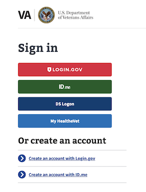

# Login.gov Organic Adoption Product Outline
---

## Overview
The solution aims to consolidate user authentication across all VA products and services by adopting Login.gov as the primary Credential Service Provider (CSP).

## Problem Statement

VA users face a fragmented authentication process across different services, leading to confusion and a cumbersome login experience. Additionally, using multiple login systems presents security risks and challenges for maintaining robust security measures. How might we streamline the authentication process for VA services to improve user experience, enhance security, and simplify access?

## Proposed Solution

The adoption of Login.gov as a primary Credential Service Provider (CSP) for accessing all VA products and services aims to improve the user experience and reduce the burden on users. This solution will enable users to securely access all VA services with a single set of credentials, eliminating the need for multiple logins and associated complexities. This adoption will also improve security measures and protect users' information, by consolidating the login process and simplifying the process of accessing VA products and services.

## User Groups
* Users of VA digital tools

## Key Features
* Implementation of Login.gov (CSP) as a centralized single sign-on solution for accessing all VA products and services
* Integration with existing VA digital tools
* Streamlined login process for users
* Enhanced security measures to protect users' information

## Desired User Outcomes
- A unified and streamlined login experience across all VA services
- Reduced confusion and frustration related to multiple login credentials
- Enhanced security and trust in the VA's authentication process

## Undesired User Outcomes
- Users facing technical difficulties or barriers during the transition to the new CSP
- Negative impact on user experience due to potential system outages or issues

## Desired Business Outcomes
- Increase the speed of implementation of the CX EO, “the deprecation of outdated and duplicative credentials” represented by MHV and DS Logon. 
- Increased security of MFA and compliance with National Institute of Standards and Technology (NIST) guidance for Identity
- The VA will no longer have to pay for DS Logon, MHV will not have to devote personnel to maintaining their credential
- Simplified management of user authentication processes
- Improved security measures across all VA products and services
- Increased user satisfaction and trust in the VA's digital platforms

## Undesired Business Outcomes
- Resistance or pushback from internal stakeholders during the adoption process

---
## Measuring Success

### Key Performance Indicators (KPIs)
| Category | Ease of use | Service completion | Trust/Satisfaction | Health |
|----------|-------------|--------------------|--------------------|--------|
| KPI      | % reduction in login-related support requests            |  % increase in successful logins                  | % increase in user satisfaction regarding the login experience                   | % decrease in security incidents       |
| KPI      | Time spent on the IAL2 account setup process            |  % of organic Login.gov IAL2 accounts successfully set up by users referred from VA.gov & related comms campaigns                 |  % increase in user satisfaction regarding the account creation experience                   | % decrease in droff offs       |

                 
                 

#### Baseline KPI Values
 - Baseline values for the most critical metrics will be collected from existing VA authentication systems and user feedback.

### Objectives and Key results (OKRs)
- Objective: Streamline user authentication across all VA products and services
  - Key result: Increase successful account creation by 20%
  - Key result: Increase successful logins by 20%
  - Key result: Reduce login-related support requests by 30%

## Assumptions
 - The adoption of Login.gov will be accepted by internal stakeholders
 - The integration process will be seamless and not disrupt existing services
 - Risky assumption: Users will quickly adapt to the new authentication process

## Solution Approach
 - Implement Login.gov as the primary CSP for the VA to consolidate user authentication
 - Conduct an assessment of existing VA authentication systems and develop a phased integration plan
 - Align stakeholders, allocate resources, and communicate changes to users
 - Monitor progress and address any technical or user-experience issues
 - Continuously iterate and improve upon the solution based on user feedback and metrics

### Initiatives
 - Initiative: Phased integration of Login.gov across all VA services

## Launch Strategy
 - Outreach through VA newsletters, social media, and targeted communications
 - In-app notifications and prompts to guide users through the transition process
 - Collaboration with veteran organizations and communities to raise awareness

## Launch Dates
 - Target Launch Date: tbd
 - Actual Launch Date: tbd
 - Impact Evaluation Date: tbd

---

## Solution Narrative

### Current Status
 - In the planning and assessment phase

### Key Decisions
 - The decision to adopt Login.gov as the primary CSP for the VA

---
   
## Screenshots

### Before
 - Multiple login options for various VA services

### After
 - A unified login experience using Login.gov as the primary CSP

---

#### Communications

- Team Name: Login.gov Adoption Team
- GitHub Label: login.gov-adoption
- Slack: [#va-identity-product-team](https://dsva.slack.com/archives/C0429DNFN8Y)
- Product POCs: Elizabeth Koch
- Stakeholders: John Rahaghi

#### Team Members

 
 - DEPO Lead: John Rahaghi
 - PM: Elizabeth Koch
 - Engineering: Steve Dickson
 - Research/Design: Tyler Gindraux
 

#### Stakeholders

 
 - GSA/Login.gov
 - VSP Identity Team
 - eBen
 - MHV
 

