# 22-1990e TOE Product Outline

---

## Overview
A veteran can choose to transfer their Chapter 33 entitlements to a dependent, be it child or spouse. Once the veteran has had the Transfer of Entitlement processed, the dependent (claimant) can then submit the 22-1990e form to request their benefits.

This application will update the 22-1990e Transfer of Entitlement (TOE) Form at VA.gov for Authenticated Users

## Problem Statement
Currently, the authenticated experience as a user applying for TOE benefits requires a lot of manual data entry, and no ability to receive a near-real time decision, which results in waiting times of up to 30 days for a decision. This is an opportunity to improve processes for over 120,000 TOE students (14% of all edu beneficiaries) that applied via the 22-1990e (data as of FY2020) by providing an application that pre-fills as more information known from a claimant and automates the claim approval when possible.

## Desired User Outcomes

Veterans and their families should be able to: 
- Apply for TOE education benefits by reviewing data VA has on file for them and adjusting it, instead of providing new data that needs to be manually reviewed
- Obtain an immediate decision about their benefit eligibility (at least for a percentage of user base)
- Receive digital communications with status updates and documentation regarding their elgibility
- Seemlessly notify desired school(s) about their eligibility
- Stay informed of pertinent information being communicated from the school they are attending to VA

## Desired Business Outcomes

- Automation of education benefits application processing, without manual review, which should yield:
  - Shorter education application processing times for veterans so they can use their benefits promptly
  - Lower workload on VCE's thanks to automation of common education benefit applications, allowing them to put resources on higher value tasks
## Undesired Business Outcomes
- Delays on processing of TOE applications.

---
## Measuring Success

### Key Performance Indicators (KPIs)
To measure the effectiveness of the application in accomplishing its objectives, we will track:

- Visitor traffic to the website
- Time spent completing each page and identify any sections that may be making aplicants spend a sizeable amount of time completing
- Abandon rate by page
- Percentage of users that complete a submission after starting an application
- Percentage of users getting an automated approval/denial letter as opposed to requiring a manual review to identify automation improvements

---

## Assumptions
VA.gov environment will be able to communicate with VA-Profile and the Digital GI Bill (DGIB) services environment. DGIB environment will contain services to obtain veteran personal information, contact information, service history, TOE sponsor information, letters, and submitted applications.

## Solution Approach

*What are you going to build now, and why have you decided to start there?*
- We will build an application that pre-fills all information from the claimant and their sponsors and allows us to submit the claim for processing.

*What have you explicitly decided to not include in this initial set of functionality, and why?*
- The updates to the 22-1990e will be primarily for authenticated users. At the current time, we want to prioritize the forms that will facilitate better claims processing and thus a more impactful experience in their education journey.  
- The first version of this application will automatically create a TIMS ticket for review by a Veterans Claim Examiner. Full automation of claims will be added in a subsequent release. 

*How will the solution / approach evolve after this initial build (knowing that this will likely change as you learn from users along the way)?*
- Our My Education Benefits team will analyze the incoming claims to determine where full automation is viable and can have the biggest impact. Based on this information the team will add automation to the cases that can have the most impact.
--- 

## Go-to-market Strategy
How are Veterans and others using this product going to know it exists?

Veterans will be informed about Transfer of Entitlement (TOE) Form through a multi-tiered strategy. From focus groups, we've learned that many Veterans get their updates from the website so information will be posted there, as well as through other means including social media, blogs, media outreach, and more.

What marketing, outreach, or communications are necessary for this product to be successful?

- GI Bill Student Newsletter and SCO Newsletter blog posts
- VAntage Point blog
- Social media posts
- benefits.VA.gov website updates (including a potential DGIB campaign landing page)
- Email comms
- Product Features video walking users through the new My Education Benefits experience
- Media Outreach
- Mentions at the GI Bill School Tour

## Launch Dates
- *Target Launch Date*
  - January 2023

---

## Solution Narrative

### Current Status
Application is under development slated for January 2023 release.

### Key Decisions
- Backend services will live on DGIB environment. The application will use Local vets-api endpoints that will serve proxies that generate jwt tokens to communicate with DGIB services. 
- Support only for Post 9/11 (Chapter 33) GI Bill on first release. Other chapters will be added on future releases.
- Support for fully automated decisions will be added in future release.

---
   
## Application flow and screenshots
The following is the flow for the application with respective screenshots:

1) Claimant navigates to "How to Apply" through navigation menu.
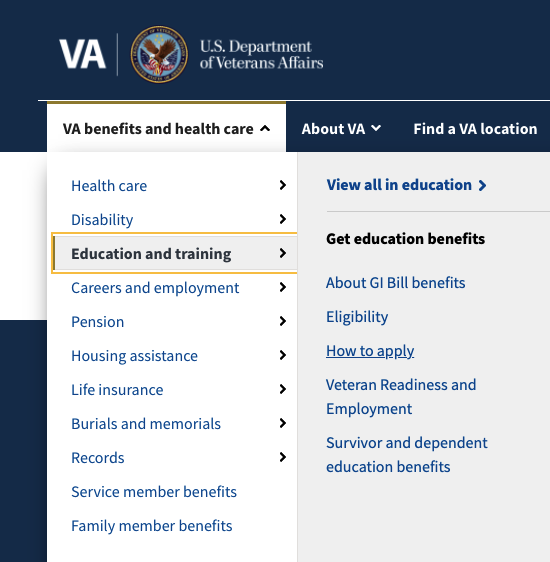 

2) Claimant selects that they want to apply for TOE
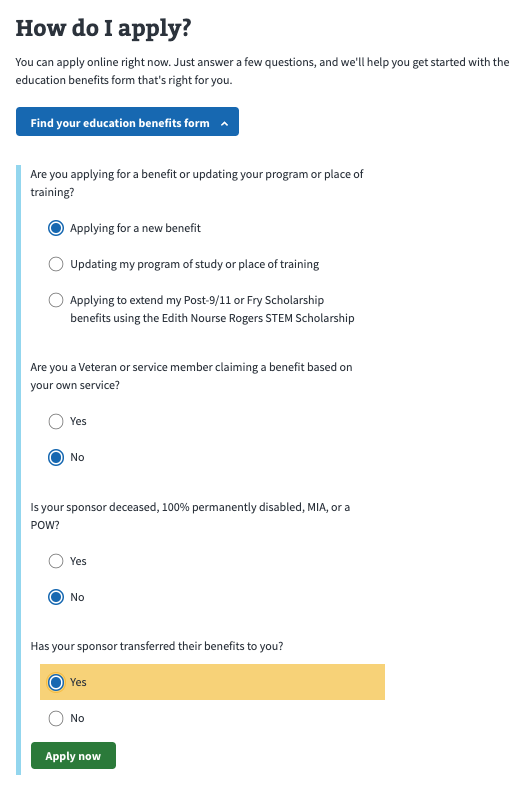 

3) Claimant is presented with Introduction Page
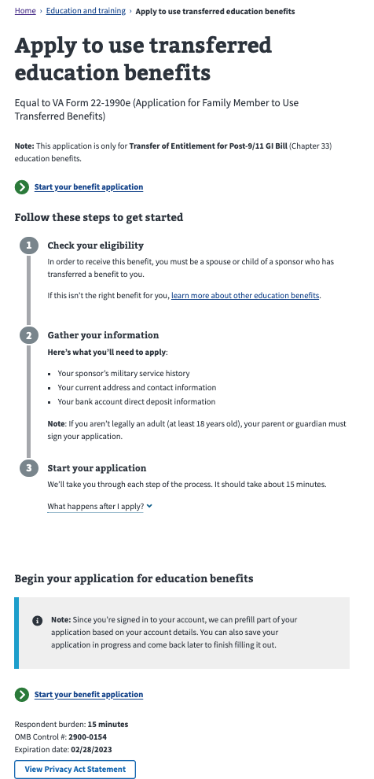 

4) Claimant is presented with preloaded data personal information from VA.gov profile. Absent VA-Profile information, it will be preloaded from VADIR via DGIB services.
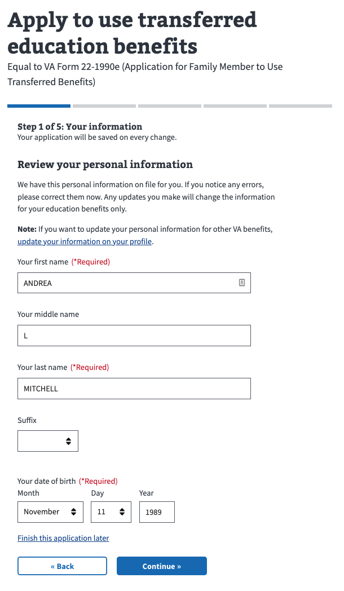

5) Claimant is presented with pre-loaded sponsors if available, to select from them. Claimant is also presente with an option to add a sponsor manually.
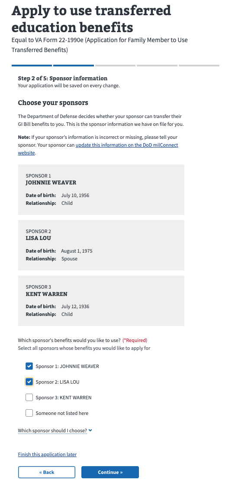

6) If Claimant so chooses, they can enter a sponsor manually.

7) Claimant is presented with preloaded contact information from VA-Profile. Absent VA-Profile information, it will be preloaded from VADIR via DGIB services
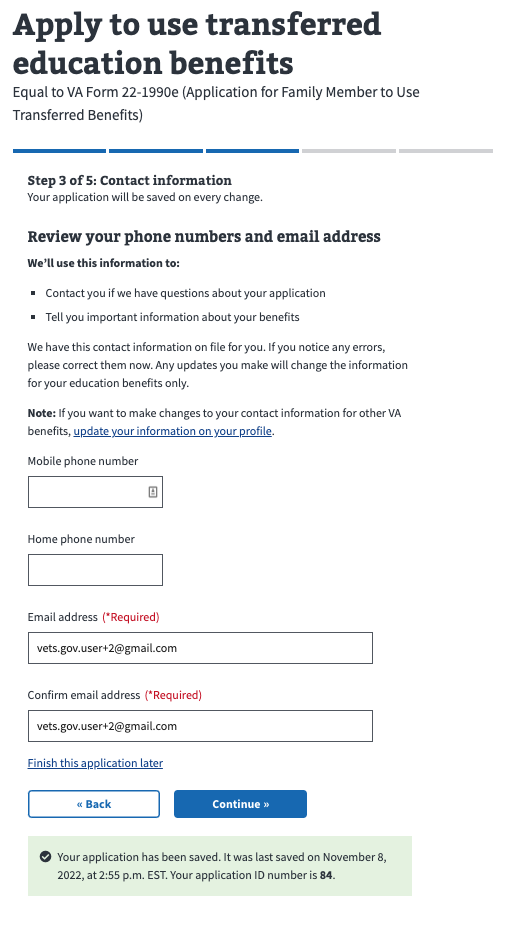

8) Claimant is presented with preloaded addressfrom VA-Profile. Absent VA-Profile information, it will be preloaded from VADIR via DGIB services
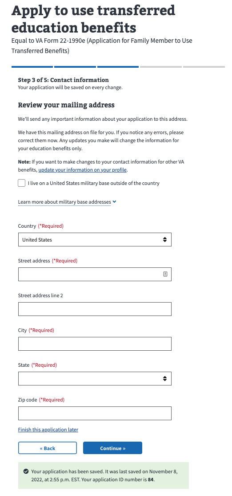

9) Claimant is asked to enter Contact Preferences
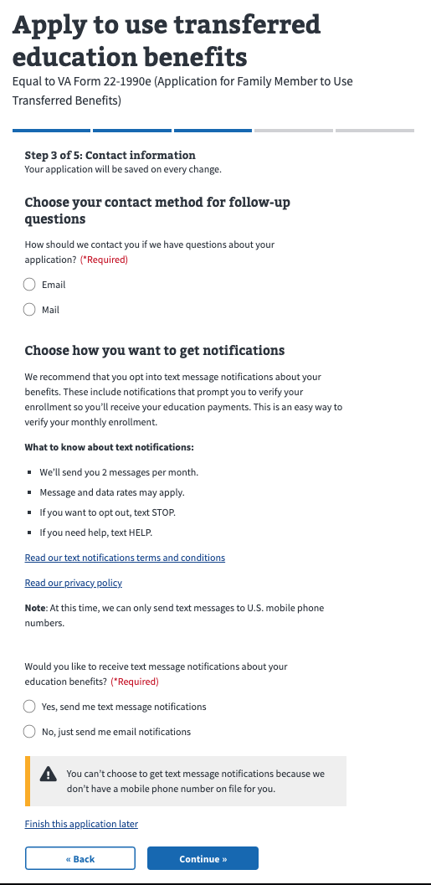

10) Claimant is presented with Direct Deposit information screen. It will be pre-filled with information loaded from VA.gov profile. Absent that, claimant will be required to enter Direct Deposit information directly.
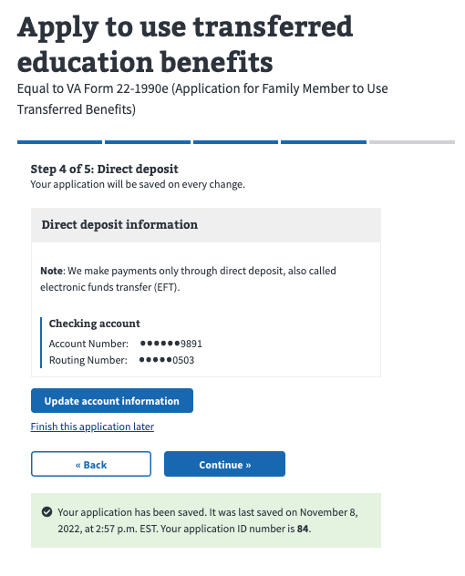

11) Claimant can edit/add Direct Deposit information if needed
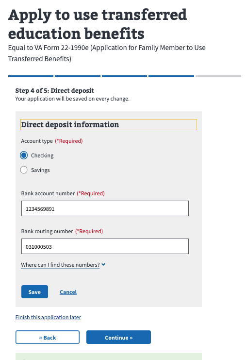

12) Claimant is presented with final review page before submission
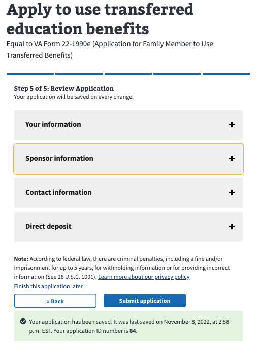

13) Claimant is presented with Wait screen while submitting the claim
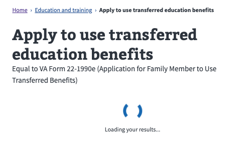

14) Claimant is presented with a screen advising that the submission has been received and is under review
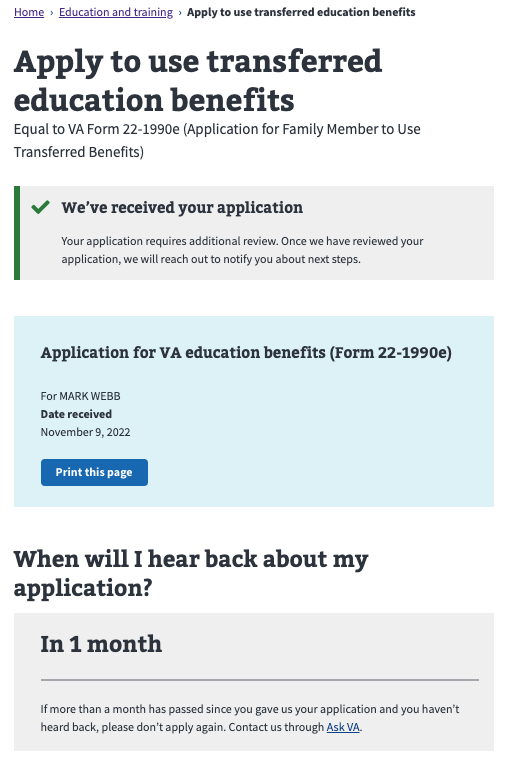

---

#### Communications

Team Name: My Education Benefits
GitHub Label: @department-of-veterans-affairs/my-education-benefits
Slack channel: education-benefits
Product POCs: Cesar Santiago (tech lead), Audra Ayotte(Businesss Lead), Leelah Holmes (Design Lead)
Stakeholders: Tammy Hurley, Robert Holbrook, Ricardo Da Silva

#### Team Members

 
Cesar Santiago: Tech Lead
Audra Ayotte: HCD Lead
Leelah Holmes: Design Lead
 

#### Stakeholders

 
Education Service | Veterans Benefits Administration
 

