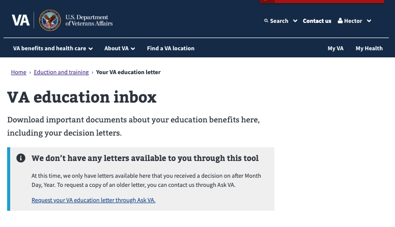
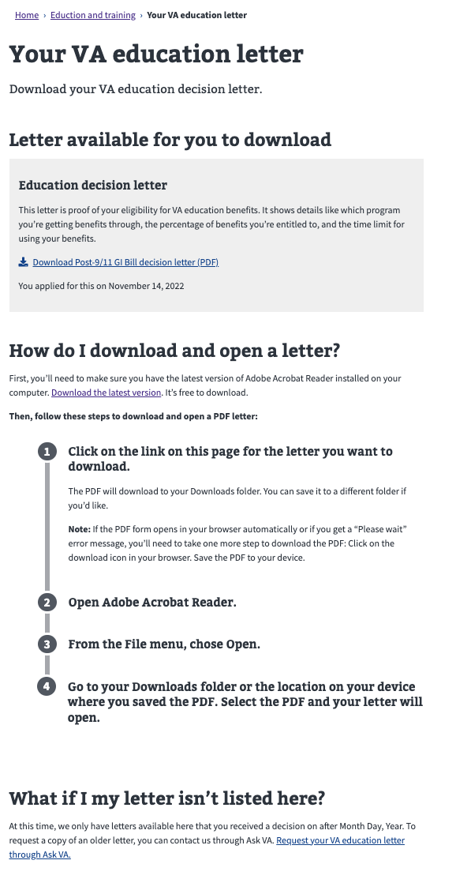
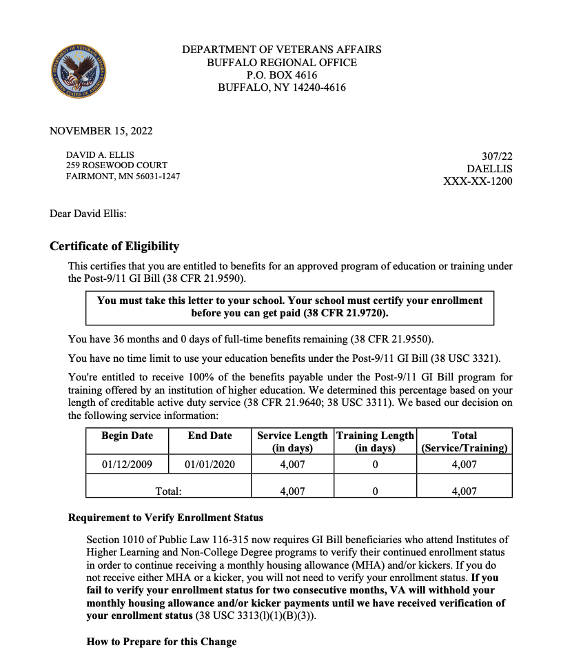
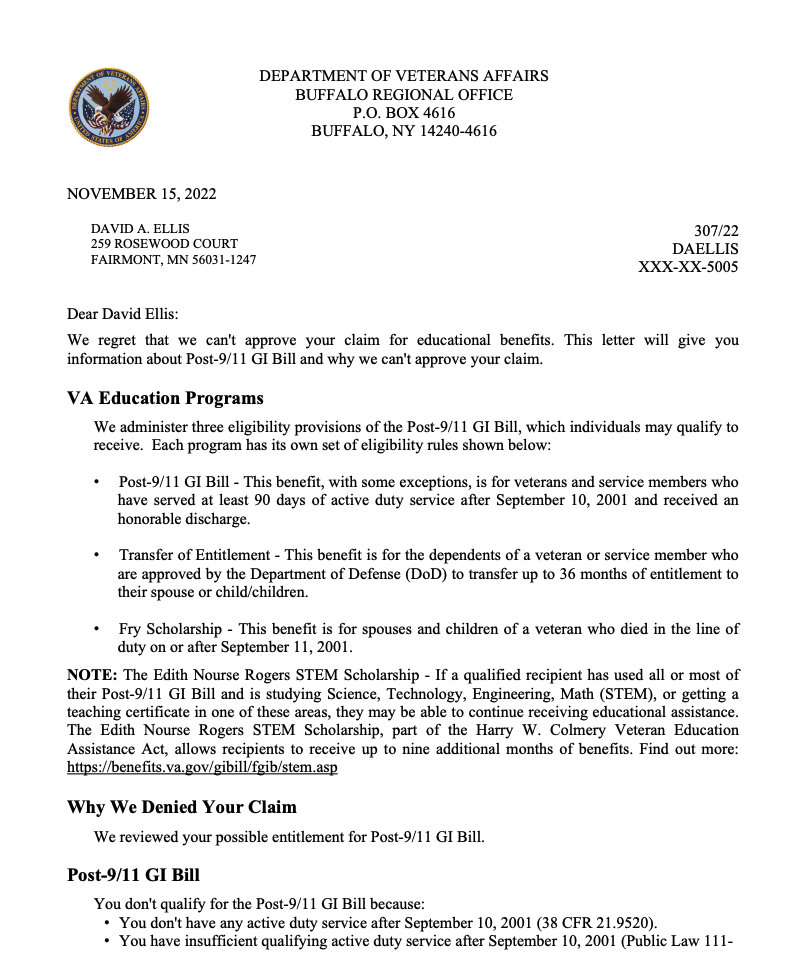

## Overview
The VA Education Letters app will give access to claimants to the latest Post 9-11 decision later that resulted from their claim on the the <a href="https://github.com/department-of-veterans-affairs/va.gov-team/blob/master/products/my-education-benefits/education-benefits-form/product-outline.md">My Education Benefits</a> (MEB) application.

## Problem Statement
At this time, claimants using the MEB application can only see their decision letter online if they receive an immediate decision upon submission. If further review is required, the application advises that they'll get a letter in the mail when a decision is made. 

How can we give access to veterans online to this letter once the review of the claim is completed?
 
## Desired User Outcomes
- A claimant should be able to access their Post911-GI Bill decision letter online.

## Undesired User Outcomes
- A claimant would have to wait until the letter gets to them on the mail.

## Desired Business Outcomes

*Why would your business want this to exist?*
*With this problem solved, what should your business be able to do/achieve that they couldn't before?*

- Prompt feedback to the student will result in higher satisfaction
- Less volume of calls of students inquiring for their final decision.

## Undesired Business Outcomes
- Student frustration for long wait for mail to get to their home
- Call center resources with high volume of calls from students checking on their status

## Assumptions
VA.gov environment will be able to communicate with the Digital GI Bill (DGIB) services environment. DGIB environment will contain services to obtain the decision letter for a student once a final decision is adjudicated for the claim submitted through MEB.

## Solution Approach

*What are you going to build now, and why have you decided to start there?*
- We will build an application in VA.gov that shows to students their latest decision letter for their MEB claim.

*Why this solution / approach over other solutions / approaches?*
- The alternative to this is that the student would have to wait for a decision letter on the mail.

*What have you explicitly decided to not include in this initial set of functionality, and why?*
- Claims not submitted through MEB will not be shown. There are technical limitations to acquiring letters from the DGIB environment without knowing the claim number.

*How will the solution / approach evolve after this initial build (knowing that this will likely change as you learn from users along the way)?*
- In the future, the application will support showing letters for other Post911-GiBill submission apps hosted on VA.gov, for example, <a href="https://github.com/department-of-veterans-affairs/va.gov-team/blob/master/products/my-education-benefits/TOE%2022-1990e%20Updates/TOE%20Product%20Outline.md">TOE</a>.
- Further in the future, we want to present all Post911 GiBill decision letters for a student regardless of whether they were started from VA.gov or not.

## Go-to-market Strategy
How are Veterans and others using this product going to know it exists?

Veterans will be informed about My Education Benefits through a multi-tiered strategy. From focus groups, we've learned that many Veterans get their updates from the website so information will be posted there, as well as through other means including social media, blogs, media outreach, and more.

What marketing, outreach, or communications are necessary for this product to be successful?

- GI Bill Student Newsletter and SCO Newsletter blog posts
- VAntage Point blog
- Social media posts
- benefits.VA.gov website updates (including a potential DGIB campaign landing page)
- Email comms
- Product Features video walking users through the new My Education Benefits experience
- Media Outreach
- Mentions at the GI Bill School Tour

## Launch Dates
- *Target Launch Date*
  - March 2023

---

## Solution Narrative
Application is under development slated for March 2023 release.

### Key Decisions
- Backend services will live on DGIB environment. The application will use Local vets-api endpoints that will serve proxies that generate jwt tokens to communicate with DGIB services. 

---
   
## Application flow and Screenshots

### Scenario 1: No letters present
1) Logged in claimant reaches VA Education Inbox navigating to "Education and training" -> "Manage your benefits" -> "Check your VA education inbox"

2) No decision letter is found. Claimant is shown page advising there are no letters available:
 

### Scenario 2: Approval letter present
1) Logged in claimant reaches VA Education Inbox navigating to "Education and training" -> "Manage your benefits" -> "Check your VA education inbox"

2) A decision letter is found. Claimant is shown page advising there is a letter available:
 

3) Claimant clicks letter link and gets approval letter in pdf form.
 

### Scenario 2: Disallowance letter present
1) Logged in claimant reaches VA Education Inbox navigating to "Education and training" -> "Manage your benefits" -> "Check your VA education inbox"

2) A decision letter is found. Claimant is shown page advising there is a letter available:
 

3) Claimant clicks letter link and gets disallowance letter in pdf form.
 

---

#### Communications

Team Name: My Education Benefits
GitHub Label: @department-of-veterans-affairs/my-education-benefits
Slack channel: education-benefits
Product POCs: Cesar Santiago (tech lead), Audra Ayotte(Businesss Lead), Leelah Holmes (Design Lead)
Stakeholders: Tammy Hurley, Eddie Ricks, Ricardo Da Silva

#### Team Members

 
Cesar Santiago: Tech Lead
Audra Ayotte: HCD Lead
Leelah Holmes: Design Lead
 

#### Stakeholders

 
Education Service | Veterans Benefits Administration
 

