## Overview
The My Education Benefits application will allow applicants to submit a claim for GI Bill benefits, leveraging service data already available on VA systems to automatically determine veteran eligiblity and automatically process claims.

## Problem Statement

There are several challenges with the current education benefit application and enrollment processes. This service offering involves a number of stakeholders: Veteran Claim Examiners (VCEs), School Certifying Officials (SCOs), State Approving Agencies (SAAs), Education Liason Representatives (ELRs), additional VA staff, and of course Veterans and their families. The service involves a lot of manual data entry by all parties, a lack of clear cut guidance on the current status and next step(s) in the process, and legacy IT systems. 

How might we create a more transparent and timely process to apply for and receive education benefits for veterans and their families?
 
## Desired User Outcomes

Veterans and their families should be able to: 
- Apply for education benefits by reviewing data VA has on file for them and adjusting it, instead of providing new data that needs to be manually reviewed
- Obtain an immediate decision about their benefit eligibility (at least for a percentage of user base)
- Receive digital communications with status updates and documentation regarding their elgibility\
- Seemlessly notify desired school(s) about their eligibility
- Stay informed of pertinent information being communicated from the school they are attending to VA

## Desired Business Outcomes

- Automation of education benefits application processing, without manual review, which should yield:
  - Shorter education application processing times for veterans so they can use their benefits promptly
  - Lower workload on VCE's thanks to automation of common education benefit applications, allowing them to put resources on higher value tasks

---
## Measuring Success

### Key Performance Indicators (KPIs)

To measure the effectiveness of the application in accomplishing its objectives, we will track:
- Visitor traffic to the website
- Time spent completing each page and identify any sections that may be making veterans spend a sizeable amount of time completing
- Abandon rate by page
- Percentage of users that complete a submission after starting an application
- Percentage of users getting an automated approval/denial letter as opposed to requiring a manual review to identify automation improvements

---

## Assumptions
- VA.gov environment will be able to communicate with the Digital GI Bill (DGIB) services environment. DGIB environment will contain services to obtain veteran personal information, contact information, service history, letters, and submit applications. 

## Solution Approach

- We are starting with improving the initial eligibility application/claim processing for education benefits. There are clear improvements that can be made for veterans and their families while back end processes and systems remain largely unchanged.
  - Initially we will support only applying for the Post 9/11 (Chapter 33) GI Bill
  - Other chapters (Chapter 30, Chapter 1606) will be phased in on future versions
- We are not including integration between the school officials application and the veteran or VCE applications with our initial build. This will be a later phase of our solution to streamline and bring additional transaparency to all stakeholders during the application and enrollment process.

--- 

## Go-to-market Strategy
*How are Veterans and others using this product going to know it exists?* 
- Veterans will be informed about My Education Benefits through a multi-tiered strategy. From focus groups, we've learned that many Veterans get their updates from the website so information will be posted there, as well as through other means including social media, blogs, media outreach, and more.

*What marketing, outreach, or communications are necessary for this product to be successful?*
 - GI Bill Student Newsletter and SCO Newsletter blog posts
 - VAntage Point blog
 - Social media posts
 - benefits.VA.gov website updates (including a potential DGIB campaign landing page)
 - Email comms
 - Product Features video walking users through the new My Education Benefits experience
 - A video on how to complete your GI Bill application with the new enhancements
 - Media Outreach
 - Mentions at the GI Bill School Tour

## Launch Dates
- *Target Launch Date*
  - March 2022

---

## Solution Narrative

### Current Status
Application is under development slated for March 2023 release.

### Key Decisions
- Backend services will live on DGIB environment. The application will use Local vets-api endpoints that will serve proxies that generate jwt tokens to communicate with DGIB services. 
- Support only for Post 9/11 (Chapter 33) GI Bill on first release. Other chapters will be added on future releases.
- Leverage existing Download VA Letters application on VA.gov to give users permanent access to Certificate of Eligibility and Disallowance letters.
---

## Application flow and screenshots
The following is the flow for the application with respective screenshots:

1) Claimant navigates to "How to Apply"
 

2) Claimant indicates they want to apply for the Post 9/11 bill
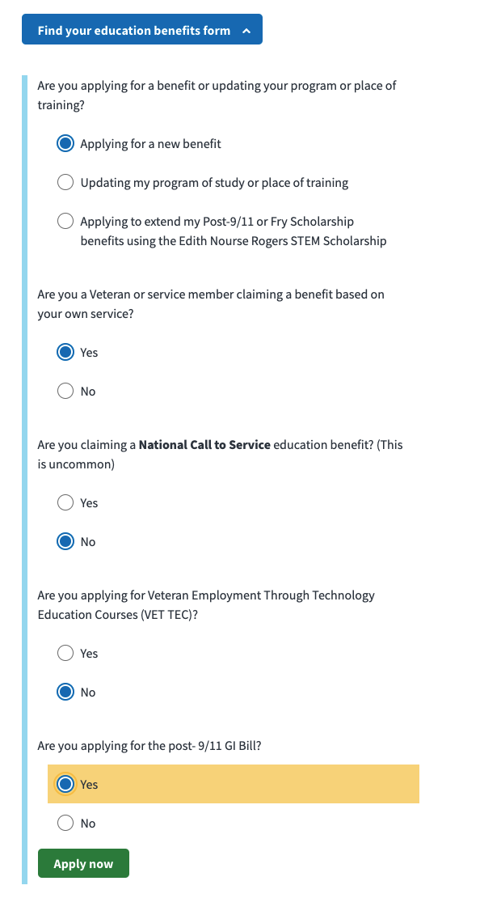 

3) Claimant is presented with Introduction Page
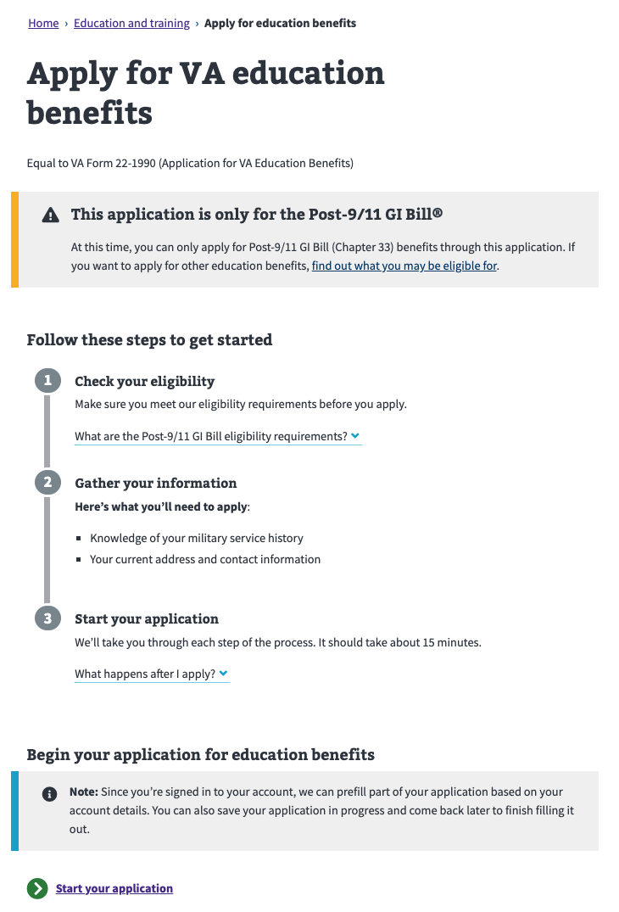 

4) Claimant is presented with preloaded data personal information from DGIB services
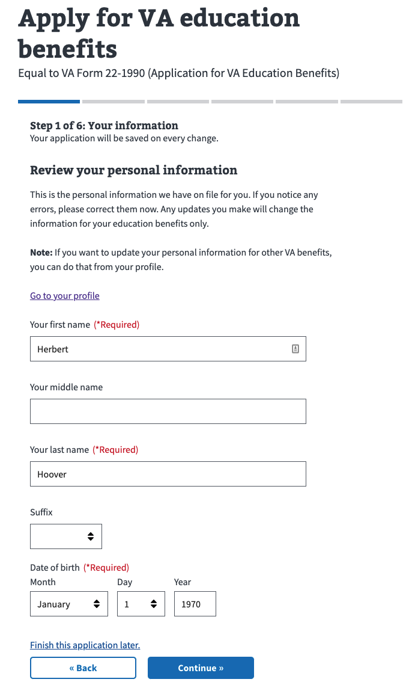

5) Claimant is presented with preloaded contact information from DGIB services
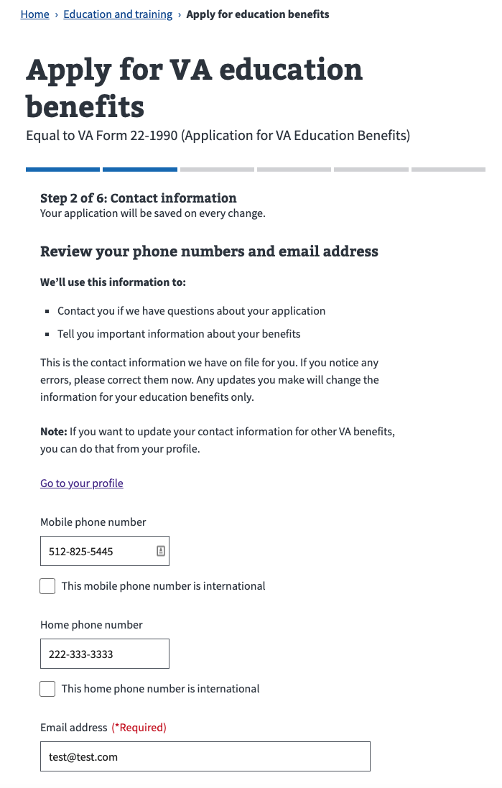

6) Claimant is presented with preloaded address from DGIB services
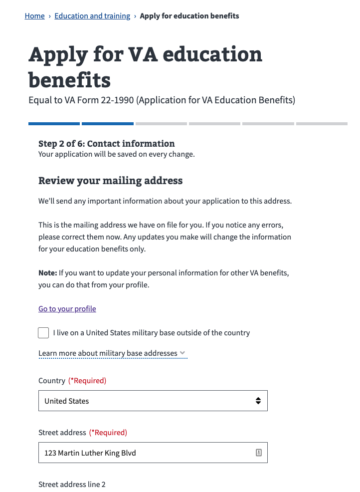

7) Claimant is asked to enter Contact Preferences
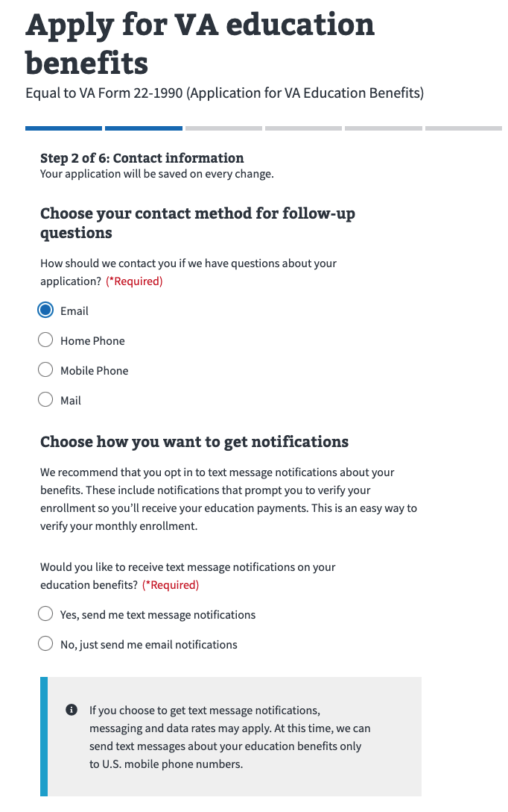

8) Claimant is presented with Service History. The claimant can indicate that there's something wrong with the Service History
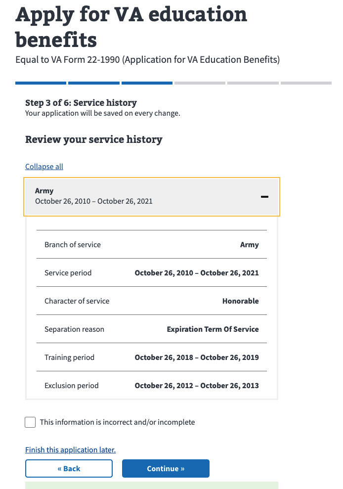
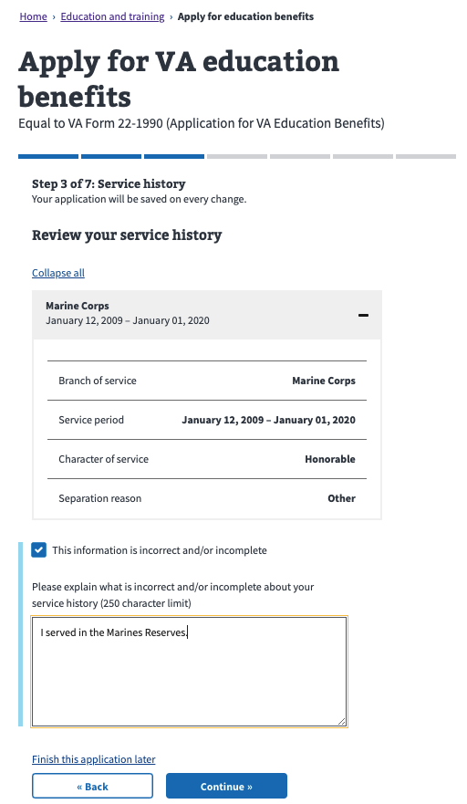 

9) If the claimant qualifies for other benefits, he must relinquish one of them. In such case, they are presented with a page to relinquish the benefit they are eligible for.
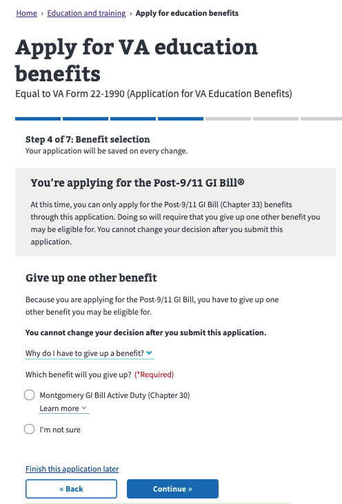 

10) The Claimant is presented next with some additional question pages:

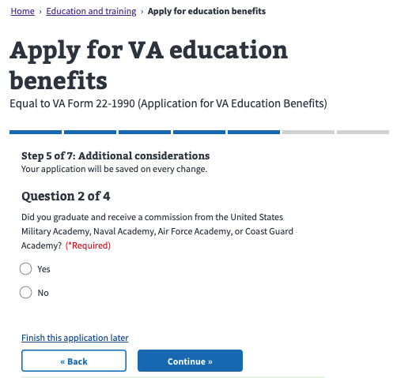
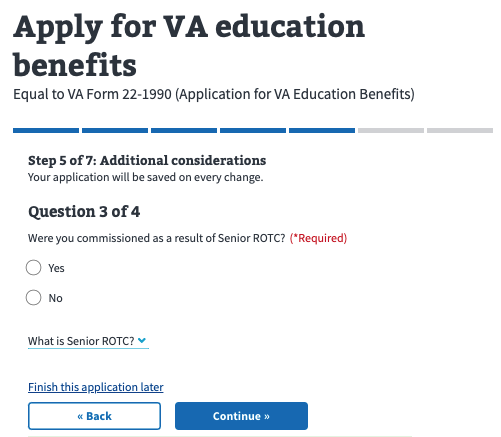
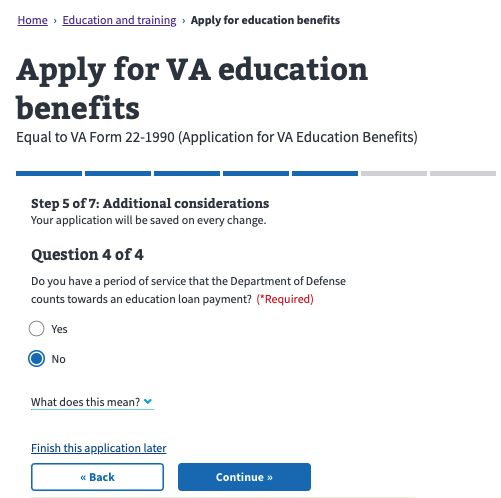

11) The Claimant is presented with a Direct Deposit info page that can be used to enter the information if desired.

12) The Claimant is presented with a final review page. Changes can be made at any section and the application submitted.
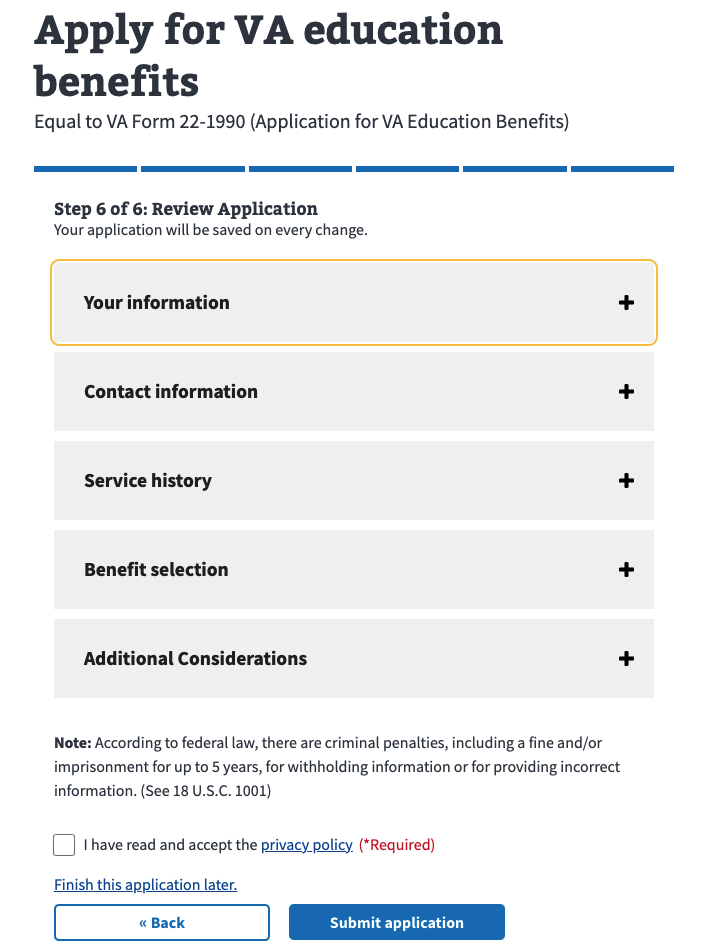

13) When submitting, the claimant will be presented with a loading results page while the rules are run by DGIB. This loading page will be presented for up to 60 seconds.
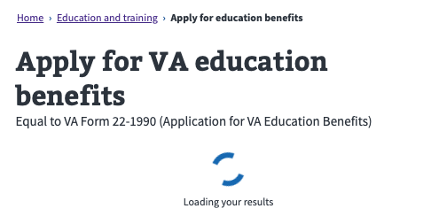

14) Within these 60 sseconds, the Claimant can land in four possible confirmation pages

#### Eligible
This page is shown if the rules engine determines that the claimant has been approved for their benefit.

#### Disallowance
This page is shown if the rules engine determines that the claimant has been denied for their benefit.

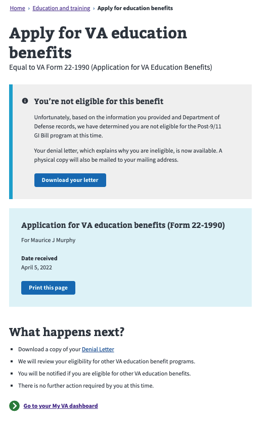

#### Under Review
This page is shown if the rules engine still has a state of INPROGRESS after 60 seconds. It is more than likely that at this point, the decision will take some time and likely requires human review. On this case, we show an Under Review page, with instructions of what to expect next.
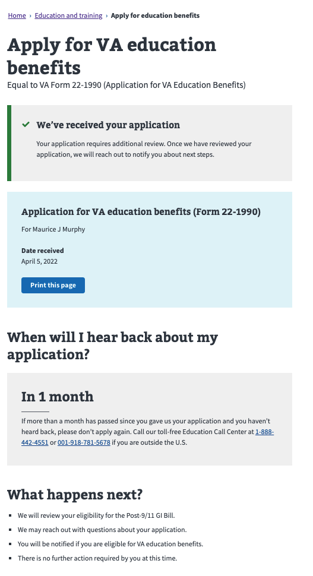

#### Error
This page is shown if the rules engine returns an error state. If this happens, the claimant is advised to retry later.

---

#### Communications

- Team Name: My Education Benefits
- GitHub Label:  @department-of-veterans-affairs/my-education-benefits
- Slack channel: education-benefits
- Product POCs: Cesar Santiago (tech lead), Shamik Desai (PM)
- Stakeholders: Tammy Hurley, Robert Holbrook

#### Team Members

- Shamik Desai: Product Manager
- Cesar Santiago: Tech Lead
- Bradley Bergeron: BE Engineer
- Khansa Ayari Hammmami: BE Engineer
- Sebastian Caso: BE Engineer
- Nathaniel Buck: FE Engineer
- Fernando Boza: FE Engineer
- Ewaz Farang: QA Engineer
- Branden Bartlett: QA Engineer
- Zeki Yaren: QA Engineer
- Liam McCormick: QA Engineer
- Audra Ayotte: HCD Lead
- Russell Lyons: HCD designer

#### Stakeholders

 
Education Service | Veterans Benefits Administration
 

