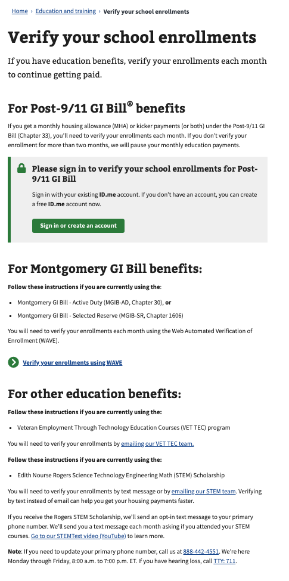
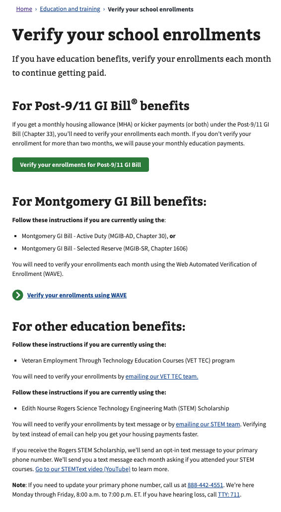
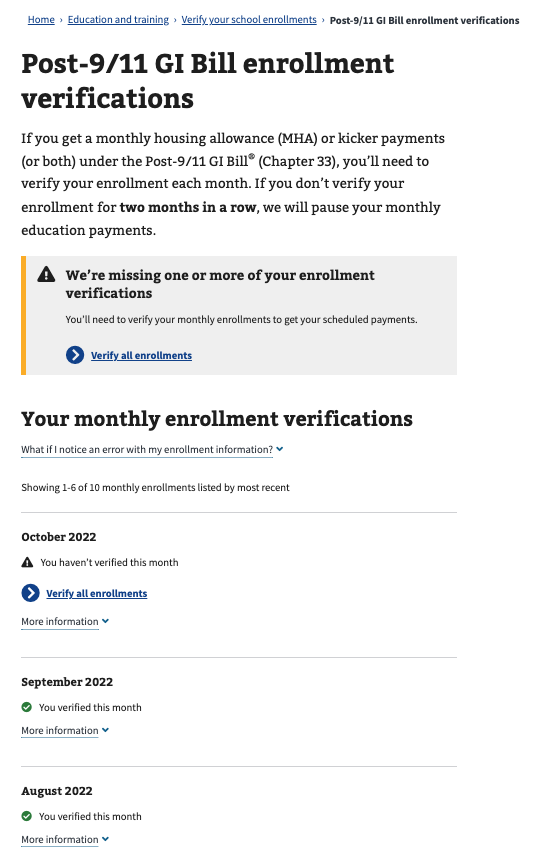
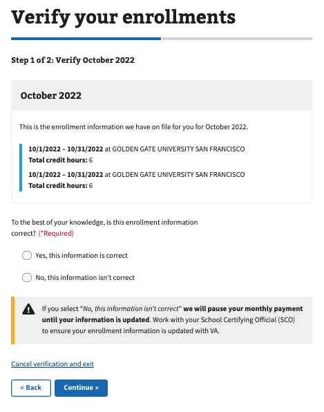
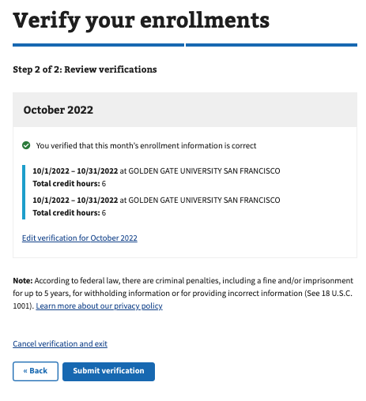
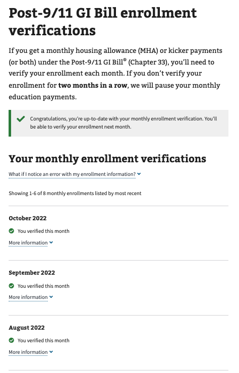
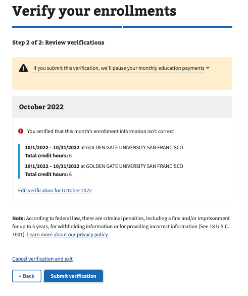
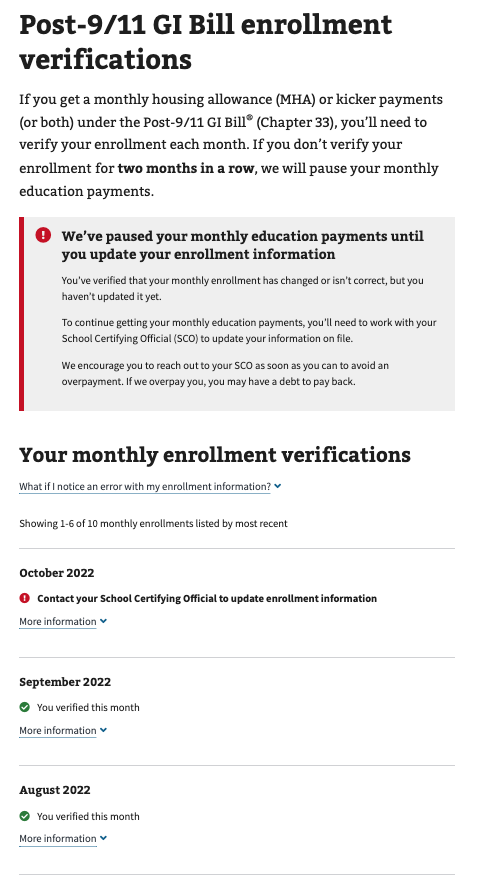

## Overview
The Enrollment Verification application will allow participants of the GI Bill to confirm their education enrollment information monthly. Monthly enrollment confirmation is a requirement to continue receiving education payments from the GI Bill.

## Problem Statement

Making sure that a student is receiving the correct benefits while enrolled in a program is critical for overall GI Bill Program compliance, efficiency, and service delivery to veterans and their families. Today, there is no process in place online for a student to verify that the active enrollment information VA has on record is accurate.

How might we create a transparent and efficient way for veterans to review and confirm their current enrollment information that VA is using to determine the benefit they are receiving? 
 
## Desired User Outcomes

- A student required to verify their enrollment verification every month would benefit from an application that lets them:
  -  View their current enrollment information.
  -  Indicate on a regular basis if their enrollment information is correct or has changed.
  -  Have clear steps on what to do or who to contact to correct any issues with their enrollment information.
- With this problem solved, the student would be able to complete their required monthly enrollment verification conveniently at VA.gov, as opposed to having to call or send responses via phone texts.

## Undesired User Outcomes
- That students fail to send enrollment verification responses and end up with their payments put on hold.

## Desired Business Outcomes

- *Why would your business want this to exist?*
- *With this problem solved, what should your business be able to do/achieve that they couldn't before?*

- Higher percentage of benefits that are accurately paid each month
- Lower number of student complaints related to inaccurate payments
- Less inquiries from students on when they should expect their monthly payments
- Higher satisfaction among students with their education benefit delivery

## Undesired Business Outcomes
- Underpayment or cancellation of student's benefits
- Elevated inquiries to VA staff about enrollment confirmation
- Frustration by students trying to fullfill the requirement of confirming their enrollments

## Assumptions
VA.gov environment will be able to communicate with the Digital GI Bill (DGIB) services environment. DGIB environment will contain services to obtain current enrollments and to submit confirmation for these enrollments.

## Solution Approach

*What are you going to build now, and why have you decided to start there?*
- Enhance the existing statement of benefits page to provide a clear status on whether you are up to date on your enrollment verification.
- Adding a page where a student can review and verify their enrollment information as required and view the payments that are associated with each verification
*Why this solution / approach over other solutions / approaches?*
- Enrollment confirmation on VA.gov is the next logical step in addition to voice call or text messages to confirm enrollments.
*What have you explicitly decided to not include in this initial set of functionality, and why?*
- N/A
*How will the solution / approach evolve after this initial build (knowing that this will likely change as you learn from users along the way)?*
- There are no immediate plans to change the application further.    

## Go-to-market Strategy
How are Veterans and others using this product going to know it exists?

Veterans will be informed about Enrollment Verification through a multi-tiered strategy. From focus groups, we've learned that many Veterans get their updates from the website so information will be posted there, as well as through other means including social media, blogs, media outreach, and more.

What marketing, outreach, or communications are necessary for this product to be successful?

- GI Bill Student Newsletter and SCO Newsletter blog posts
- VAntage Point blog
- Social media posts
- benefits.VA.gov website updates (including a potential DGIB campaign landing page)
- Email comms
- Product Features video walking users through the new My Education Benefits experience
- Media Outreach
- Mentions at the GI Bill School Tour

## Launch Dates
- *Target Launch Date*
  - January 2023

---

## Solution Narrative
Application is under development slated for January 2023 release.

### Key Decisions
- Backend services will live on DGIB environment. The application will use Local vets-api endpoints that will serve proxies that generate jwt tokens to communicate with DGIB services. 

---
   
## Application flow and Screenshots

### Veriying enrollments are valid.
The following is the flow of the application for a claimant with enrollments and they indicate the enrollment is valid.

1) Logged out claimant navigates to Enrollment Verification through navigation menu and reaches enrollment verification page.
 

2) Claimant logs in and reaches page. A button inviting to verify enrollments is presented:
 

3) When pressing button, claimant is presented with list of months for verification. In this case they need to verify the current month.
 

4) When selecting to verify this month's enrollments, they are presented with an enrollment list. They can select that the information is either correct or incorrect. In this case they will select it is correct.
 

5) When selecting to certify the enrollment as correct, they are presented with a final submission screen. In this case they will press "Submit Verification"
 

6) When submitting the enrollment is correct, they are they are taken back to the enrollment months list, and the current month will show as verified.
 

### Marking enrollments as incorrect.
The following is the flow of the application for a claimant with enrollments and they indicate the enrollment is incorrect.

1) Logged out claimant navigates to Enrollment Verification through navigation menu and reaches enrollment verification page.
 

2) Claimant logs in and reaches page. A button inviting to verify enrollments is presented:
 

3) When pressing button, claimant is presented with list of months for verification. In this case they need to verify the current month.
 

4) When selecting to verify this month's enrollments, they are presented with an enrollment list. They can select that the information is either correct or incorrect. In this case they will select it is incorrect.
 

5) When selecting to indicate the enrollment is incorrect, they are presented with a final submission screen and with a warning indicating that this will put their education payments on pause. They will press "Submit Verification"
 

6) When submitting the enrollment is incorrect, they are they are taken back to the enrollment months list. The current month will show as incorrect and a message is presented stating that their payments are on pause and they need to call their SCO.
 

---

#### Communications

Team Name: My Education Benefits
GitHub Label: @department-of-veterans-affairs/my-education-benefits
Slack channel: education-benefits
Product POCs: Cesar Santiago (tech lead), Audra Ayotte(Businesss Lead), Leelah Holmes (Design Lead)
Stakeholders: Tammy Hurley, Eddie Ricks, Ricardo Da Silva

#### Team Members

 
Cesar Santiago: Tech Lead
Audra Ayotte: HCD Lead
Leelah Holmes: Design Lead
 

#### Stakeholders

 
Education Service | Veterans Benefits Administration
 

