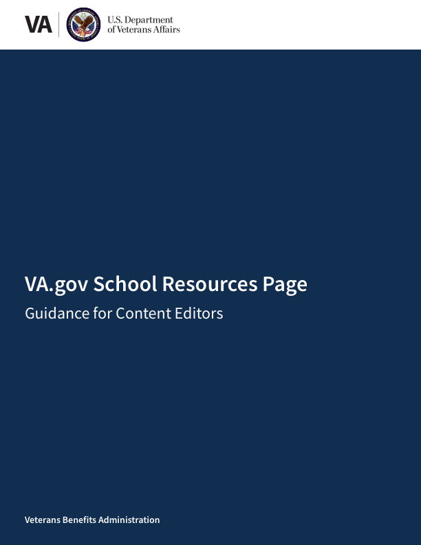

<kbd></kbd>

# VA.gov School Resources Page: Guidance for Content Editors . 

## Table of Contents

[Introduction]()  
[What is a github repository?]()  
[Main page]()  
[What is considered main page content?]()	  
[How do I update content and links on the main page?]()  	 
[Main content considerations]()	  
[Right rail considerations]()  	
[Announcements]() 	 
[What content appears in the "Latest announcements from VA" section?]() 	 
[How do I add an announcement?]() 	
[When do announcements expire?]() 	
[Events]() 	 
[What content appears in the "Upcoming events" section?]()   	
[How do I add an event?]() 	 
[When do events expire?]()  	
[Useful resources]() 	 
 
## Introduction

## What is a GitHub repository?

## Main page

### What is considered main page content?

### How do I update content and links on the main page?

#### Main content considerations

#### Right rail considerations

## Announcements

### What content appears in the "Latest announcements from VA" section?

### How do I add an announcement?

### When do announcements expire?

## Events

### What content appears in the "Upcoming events" section?

### How do I add an event?

### When do events expire?

## Useful resources

