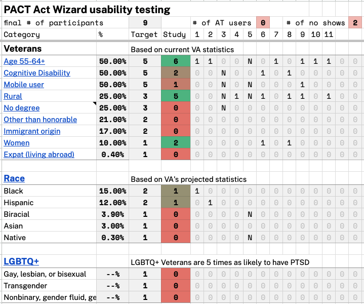

# PACT Act Wizard Usability Testing -- Research Findings 

**Office of the CTO - Digital Experience (OCTO-DE), PACT Act Wizard, Sitewide Public Websites**

Date: 10/20/2023

**Cindy Merrill** [cindy.merrill@adhocteam.us]

[Research readout TBD]()

 

**Jump to:**

[Hypotheses and conclusions](#hypotheses-and-conclusions)

[Key findings](#key-findings)

[Recommendations](#recommendations)

[Appendix (including screenshots of prototype)](#appendix)

[Who we talked to](#who-we-talked-to)

 

## Research Goals
The PACT Act Wizard is an i**nteractive question-and-answer flow to help Veterans understand how the PACT Act may apply to them**. 

There are many potential touchpoints between the Veteran and this application throughout the [Veteran journey](https://github.com/department-of-veterans-affairs/va.gov-team/blob/master/platform/design/va-product-journey-maps/Veteran%20Journey%20Map.pdf):
- Getting out (Engaging VA to access benefits and services)
- Starting up (Attending to health needs)
- Taking care of myself (Recognizing and addressing mental health needs, Managing primary care and chronic health issues, Seeking support for an acute health event, Maintaining my health)
- Retiring (Taking care of my health)
- Aging (Managing my declining health)

The purpose of this research is to **get feedback on the content** in the PACT Act Wizard and find out whether we’ve met these goals: 

- The **questions drafted for the PACT Act Wizard are clear and easy** enough for Veterans (or family members seeking information on behalf of a Veteran) to understand and confidently answer. 

- Veterans (or family members seeking information on behalf of a Veteran) can **understand from the results if they might be eligible** for disability or health care based on the PACT Act. 

- Veterans (or family members seeking information on behalf of a Veteran) can **understand from the results how to apply for benefits** related to the PACT Act based on their situation. 

Learnings will help refine questions and the presentation of results in the wizard.

## Research Questions
1. What feedback do Veterans (and others) have on **individual questions**?

     1.
1. What feedback do Veterans (and others) have on the **entire set of questions**?

     1. 

1. Do Veterans (and others) **know enough about their military service to answer the questions**? If not, what do they need to answer them?
    
     1.

1. What feedback do Veterans (and others) have on the **results**?
    
     1.
     

1. If the tool says that they're eligible, what do they say they would **do next**?

## Methodology 
We conducted **remote usability testing** over Zoom on October 2-6, 2023 to get feedback from research participants using a prototype that presents the questions and results screens in the PACT Act Wizard. The prototype was not a high-fidelity design prototype but instead an **online survey (in Survey Monkey) that presented questions** and branches appropriately to subsequent questions and relevant results screens. In this way, we **tested the *content* of the PACT Act Wizard**—the text and flow of the questions and the logical branching—but *not* the UI design. 

Perigean recruited the participants.

**We talked to 9 Veterans**, one of whom was also a Veteran's family member (spouse).
-  *Most (8 of 9) had NOT applied for VA benefits under the PACT Act*. The one who did had applied just the week before.
- 4 served in *1989 or earlier*, 2 served in *1990 or later*, and 3 served *during both* periods of time.
- *Most (8 of 9) used a computer* during the session; only 1 used a smartphone.

For more details, see [Who we talked to](#who-we-talked-to).

In the wizard, participants were first **asked when they served, and their answer determined which questions were presented** next. Then based on their answers to the questions, a results screen was shown. Below is a high-level summary of the interaction flow (more details can be found in the Wizard branching logic flow in the [Appendix](#appendix)).
- Ask service years question
  - If served *1990 or later*, ask Burn pit questions
  - If served *1989 or earlier*, ask Agent Orange, Radiation, and Camp Lejeune questions
  - If served *during both time periods*, ask ALL of the above questions
- Based on responses to the above questions, show one of the following results screens:
  - *VA benefit eligibility* (can't tell if you're eligible)
  - *Camp Lejeune* (may be eligible but not under PACT Act)
  - *You may be eligible* (may be eligible under PACT Act)

Any participants who didn't see the *You may be eligible* results screen were then shown it, even though it didn't apply to their situation (which was explained by the moderator).

## Hypotheses and Conclusions
1. Veterans (and others) will find the questions to be clear and easy to understand and answer.
     1. LIKELY TRUE: Participants...
     
2. Veterans (and others) will find the number and content of the questions to be relevant to their understanding of the PACT Act and how it applies to them (or the Veteran). 
     1. MAYBE TRUE: Participants...
1. Veterans (and others) won't find the number and content of the questions to be overly burdensome. 

1. The results are simple enough for Veterans (and others) to understand and are not misleading. 

1. Veterans (and others) will understand what "presumptive conditions" mean after reading the plain language description in the results flow. 

    

## Key Findings

1. All participants understood 

## Details of Findings 

### 1. All 9 participants had an overall positive experience using the PACT Act Wizard

Participants called out the following specific features as working well:
- **Questions**, which were simple, straightforward, and flowed well (5 participants)
- **Information provided** concisely that's easy to understand with links for more on intro page and results (5)
- **Accordions on results page** so don't have to go to another page or site (1)
- **Links to apply** for benefits (1)
- **Continue and Back buttons** (1)

> *"I really like the way that they broke down the PACT Act to #1 time and #2 the places" (p4).*

> *"It's pretty concise. There's not a lot of words. It's got a lot of hot links." (p11).*

> *"It follows a logical pattern--if/then. There's a clear button to take me to the next question...There's not a lot of choices. It flows smartly. And if I need to go back a page, that page is available. It doesn't take me someplace else." (p9)*

Participants' positivity towards the PACT Act Wizard wasn't affected by the number of questions that they saw. The **prototype showed between 2 and 10 questions to each participant, based on their responses**. If you answered "yes" to one of the burn pit or Agent Orange questions, you would skip the other questions in that section and might get a followup question. Below is a table showing the range and average number of questions seen by all participants and by service year category. 

Service year group | # of Participants | Range of # Q's seen | Avg # Q's seen | Maximum # of Q's 
------------------|---------------|----|----------- | -----
All groups | 9 | 2-10 | 6 | 10
1990 or later | 2 | 2 | 2 | 4
1989 or earlier | 4 | 5-7 | 6 | 7
Both time periods | 3 | 8-10 | 8.7 | 10

Participants who served in both time periods saw the greatest number of questions, followed by people who served in 1989 or earlier, and then those who served in 1990 or later.

### Something about results...
Based on their responses to the questions, 6 of 9 participants were taken to the "You may be eligible" results page. This page in the prototype contained burn pit content and so wasn't applicable to all of the participants (the real wizard will show content on this page that corresponds to the specific questions to which the user answered "yes"). The other 3 participants saw this same "You may be eligible" page after first looking at the results page more relevant to their responses to the questions. Below is a table showing how many participants landed on each of the results screens based on their answers to the questions about their service.

Results screen | # of Participants
------------------|---------------
*You may be eligible* (under PACT Act) | 6 
*VA benefit eligibility* (can't tell if you're eligible)| 2
*Camp Lejeune* (may be eligible but not under PACT Act) | 1

### Usability Successes
1. **Most participants were able to answer most of the wizard questions easily.**
1. **No comments about too many questions**. Participants were presented with anywhere from 2-10 questions, which varied based on their responses and the branching logic.
1. All participants **understood *presumptive conditions***, but not from the PACT Act Wizard. Most said that they already knew from talking to other Veterans or looking into the PACT Act already.
1. Participants generally **understood the results screens** and figured out what  they should do next.

### Usability Issues
5. Three participants had **difficulty answering the service years question** because they found the options confusing. *ADD DETAILS AND QUOTES*
1. Two participants brought up (unprompted) that they **didn't know what a "C-123 plane" was**, which was mentioned in one of the Agent Orange questions. Two other participants said, *"If it applied to you, you would know" (p9).*
1. Some participants had **beliefs about whether they were eligible for benefits under the PACT Act** before trying the PACT Act Wizard, and some of these beliefs were *incorrect* and not addressed by any content in the wizard.
  RECOMMENDATION: Consider adding more content to the main PACT Act page, and link from there to this wizard.
1. Three participants were **confused by the jump links** at the top of the results page on Staging because they interpreted them as CTA's (i.e., *file a disability claim* or *apply for health care* right now).

## Additional Insights

### Topic

### Topic

## Recommendations
Recommendations are listed below, with team decisions noted in *ITALIC CAPS*.
### For the app design and functionality
1.

### For content in the app
1. 

## Next Steps

- Present readout to project stakeholders and Veteran Digital User Experience Weekly Design Sync meeting.

## Further research needed

- We would like to get feedback from **Veterans who use screen readers**, which we were unable to do this time because our prototype wasn't accessible.
- We would like to get feedback from people who are **family members of Veterans but not Veterans themselves** so that we can find out if they know enough about their family member's service to answer the questions in this wizard.
- When **additional questions about medical conditions** get added to this wizard, it would be helpful to usability test that content before launch.

## Appendix

[Research plan](./research-plan.md)

[Conversation guide](./conversation-guide.md)

[Interview notes](./notes)

### Tools used for synthesis

[Synthesis spreadsheet TBD]()

[Mural board](https://app.mural.co/t/departmentofveteransaffairs9999/m/departmentofveteransaffairs9999/1695248543925/d04d52d1f06a9edb2217447cc526a2b7cef4b613?sender=uff8fa85716c1796ccf022668)

### Content references
[Wizard branching logic flow](https://app.mural.co/t/departmentofveteransaffairs9999/m/departmentofveteransaffairs9999/1692989444688/0044b9825c82d8d23920601f68c41a61d047d681?sender=uff8fa85716c1796ccf022668)

[Content document](https://dvagov-my.sharepoint.com/:w:/r/personal/danielle_thierry_va_gov/Documents/PACT%20Act%20wizard%20content%20for%20usability%20testing.docx?d=wfee483299a674f38ac4ec198c9cca463&csf=1&web=1&e=yCdUBN)

[Link to Prototype](https://www.surveymonkey.com/r/KKVHSFV)

### Screenshots of the prototype screens--TBD

  
Intro page (Click to show screenshot)

  
  

  
Questions (Click to show screenshots)

  
 
  

  
Results page (Click to show screenshots)

  
  
   

## Who we talked to 

**Recruitment criteria**

In order to find research participants for whom the PACT Act Wizard would be relevant, we wanted to talk only with Veterans who had NOT applied for VA benefits under the PACT Act. 

We talked to **9 participants.**

Audience segment:
* Veterans: 9 
* Family members of a Veteran: 1 (also a Veteran)  

Applied for VA benefits under the PACT Act?
* No: 8
* Yes: 1 (applied the week before the session)

VA benefit usage:
* Don't use VA health care: 1 
* Don't have VA disability compensation: 3

Service years:
* Included 1989 or earlier: 4
* Included 1990 or later:   2 
* Included both *before and after* 1990: 3 

Gender:
* Male: 7 
* Female: 2

LGBTQ+: 0

Devices used during study: 
* Desktop: 8 
* Smart phone: 1 

Age:
* 25-34: 
* 35-44: 1
* 45-54: 2
* 55-64: 3
* 65+: 3

Education:
* High school degree or equivalent: 0 
* Some college (no degree): 0
* Associate's degree, trade certificate or vocational training: 3
* Bachelor's degree: 1
* Master's degree: 5
* Doctorate degree: 

Geographic location:
* Urban: 4
* Rural: 5

Race:
* White: 7
* Black: 1
* Hispanic: 1
* Biracial: 0
* Asian: 0
* Native: 0

Disability and Assistive Technology (AT):
* Cognitive: 2
* AT user: 0

## Underserved groups we haven’t talked to 

This research does not include the perspectives of the following marginalized Veteran groups:
- Users of Assistive Technology 
- Identify as Biracial, Asian, Native, or LGBTQ+
- Other than honorable discharge
- Immigrant origin
- Expat (living abroad)

